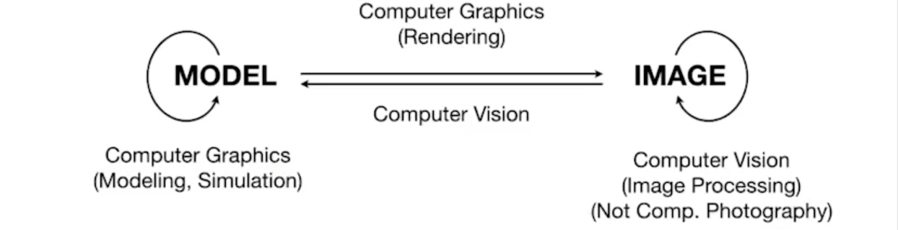
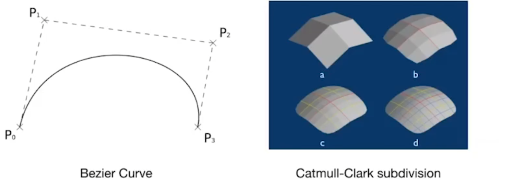

# Overview Of Computer Graphics(15/12/2024)

## What is Computer Graphics

**图形学绝对不是图形学API(`OpenGL`/`DirectX`/`Vulkan`), We Learn Graphics but not Graphics APIs**

## Differences Between Computer Graphics and Computer Vision

图形学与计算机视觉（计算机视觉是理解外部事物，存在**猜测和推导**内容）之间存在关联且没有明显的边界（`AR`，在计算机图形学种使用AI模型）

## Computer Graphics Topics

### 光栅化(Rasterization)

将三维空间的几何体(geometry primitives, such as: `3D triangles` `polygons`)投影到屏幕上，包含`OpenGL`以及`Shaders`

### 曲线(Curves)和曲面(Meshes)

如果在计算机图形学中表示几何体，如果将曲面进行细分得到更复杂的曲面

### 光线追踪(Ray Tracing)

生成质量更高的画面，但是效率慢适合离线应用(`Offline Application`)，这是一种早期的性能取舍(`trade off`)

### 动画(Animation)与仿真(Simulation)

