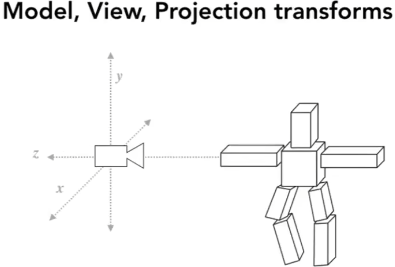
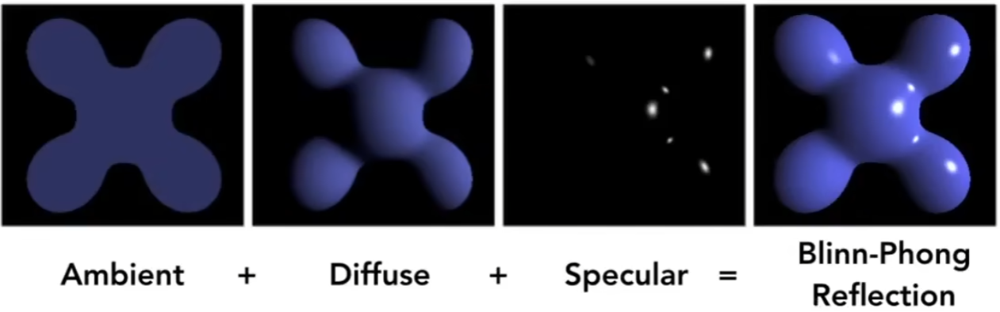
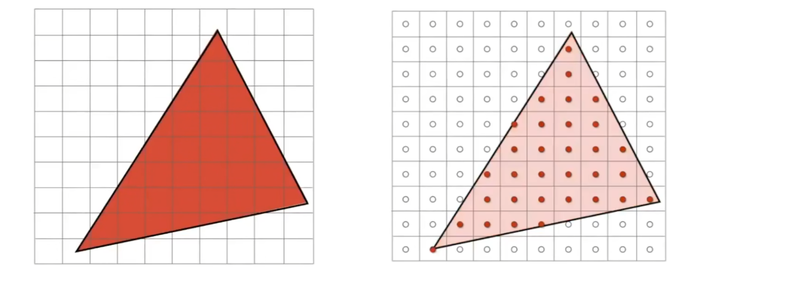
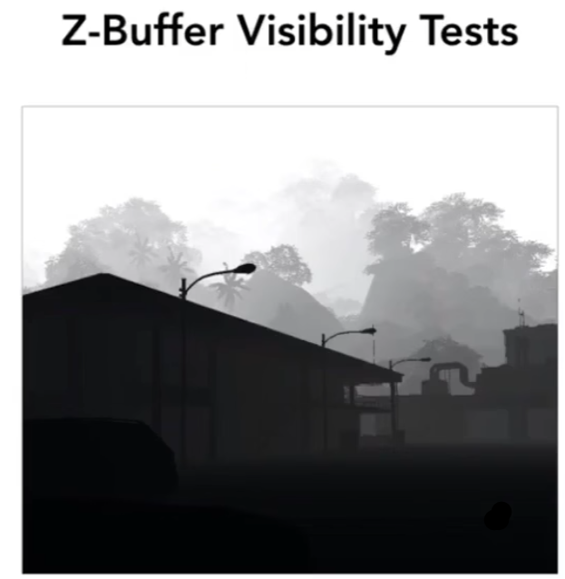

# Real Time Rendering Graphics Pipeline

## 0x00 Graphics Pipeline Basic

### Graphics Pipeline Implementation

#### GPUs accelerate Graphic Processing   

使用`GPU`硬件进行光栅化，随着`GPU`的发展支持越来越多的可编程着色器

#### GPUs Heterogenous, Multi-Core Processor

`GPU`具备高度并行化，支持矢量化运算

### 实时渲染管线完成了那些任务

应用程序想图形`API`输入大量`3D`空间的顶点信息，交由`GPU`硬件进行图形渲染

#### 顶点处理Vertex Processing

1. `MVP`顶点变换：将输入的顶点坐标**先`Model View Projection`的操作发生在此阶段**，然后再放置在屏幕空间中

   

2. 执行顶点着色器**(可编程管线)**：将顶点进行着色以及追加屏幕空间特效等

   

#### 三角形的处理Triangle Processing

根据边的信息进行绘制，将多个三角形绘制到屏幕空间中

#### 光栅化Rasterization

**执行过滤/模糊/超采样，并判断像素是否在三角形内部以及覆盖率如何**，从而将三角形进行光栅化离散为选中像素`Fragment/Pixel`

#### 像素处理Fragment Processing

1. 深度测试：经过光栅化之后需要判断是否可见，需要使用`Z-Buffer`进行深度缓存

   

   

2. 执行像素着色器**(可编程管线)**：将像素进行着色以及追加屏幕空间特效等

   

#### 输出到显示器的Framebuffer

## 0x01 GLSL着色器Shader Programs

### GLSL语言的概述

可以在硬件上执行的语言，可以支持顶点着色器、像素着色器`(fragment shader)`、几何着色、计算着色

### GLSL语言的特性

所有的`GLSL(Shader Code)`仅针对于某一个像素进行操作，可以获取之前像素的数值也可以由程序进行参数传递

