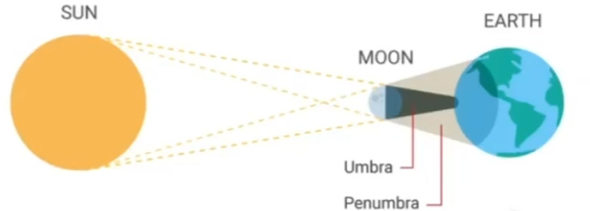

# Shadow

如果有物体位于着色点和光源之间，则会产生阴影

## 0x00 Shadow Mapping

如果有的点不在阴影中，说明光源和摄像机都可以看到该点。**因此至少相机或者光源看不到的地方，则可以是阴影**

~~游戏中的阴影选项实际调整的是阴影图或者深度图的分辨率~~

### 何为"看见"

#### 从光源角度出发

从光源看向场景，记录所能看见场景的深度图`A`

#### 从相机角度触发

从摄像机看向场景得到场景的深度图`B`，对比`A`和`B`两张深度图判断场景像素深度是否一致

**如果深度存在不一致，则存在阻碍物阻挡了光源，导致了Z-buffer不一致**

### 硬阴影和软阴影

#### 硬阴影

如果是点光源，则必然造成锐利的硬阴影；

#### 软阴影

如果是软阴影，则光源一定有一定的大小；否则不可能是软阴影

1. 本影`(Umbra)`
2. 半影`(Penumbra)`
