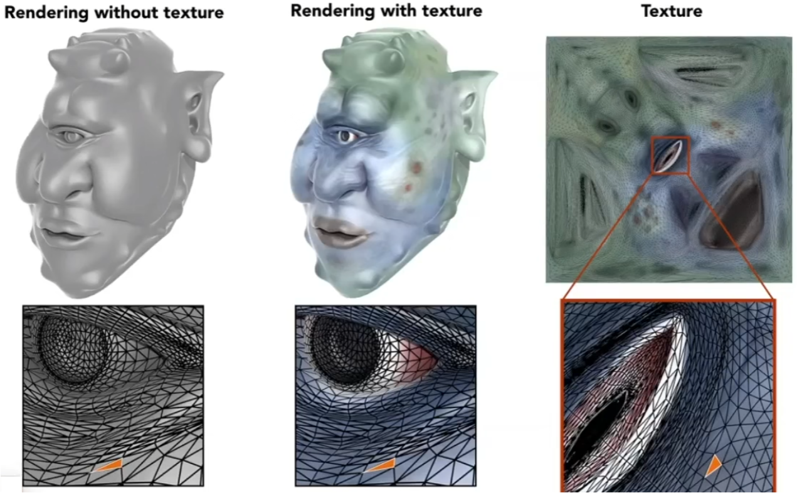
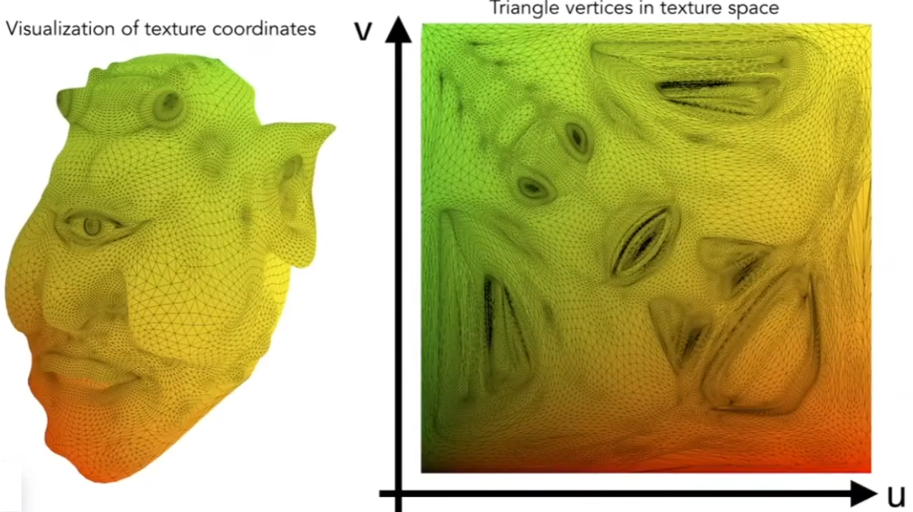
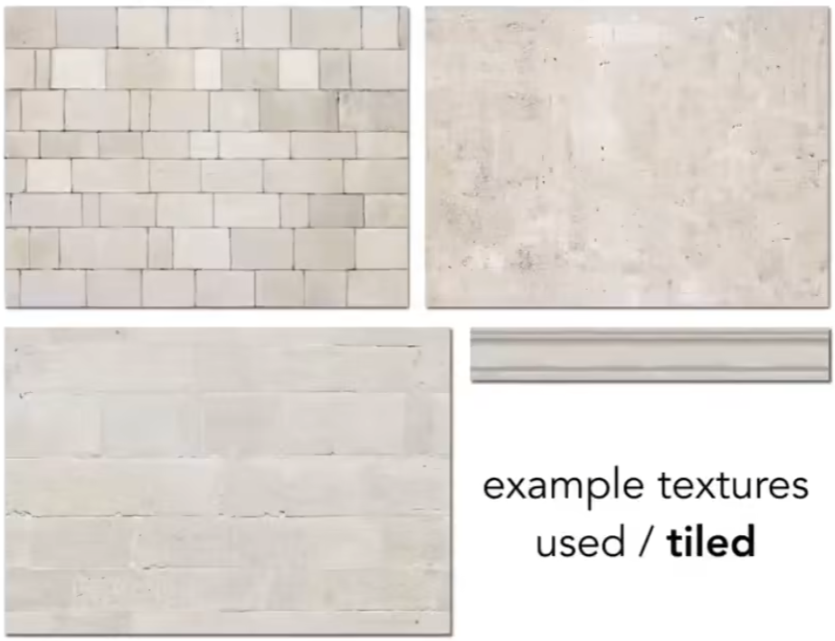
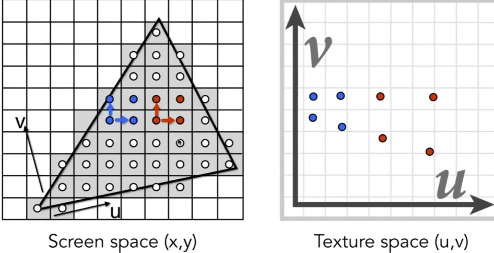
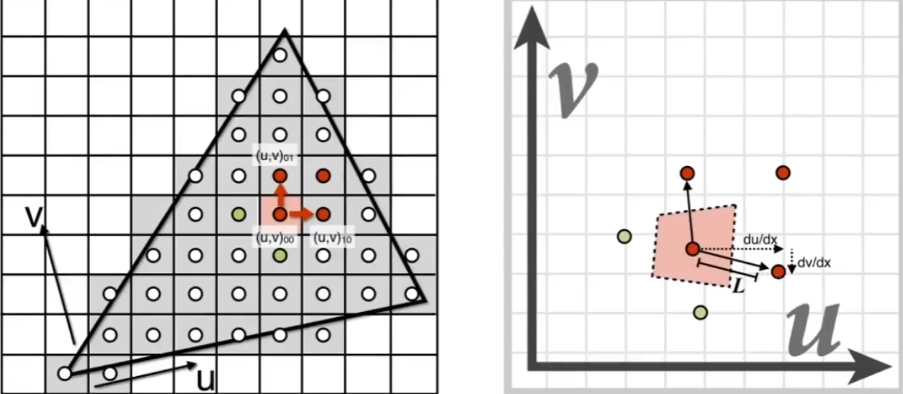
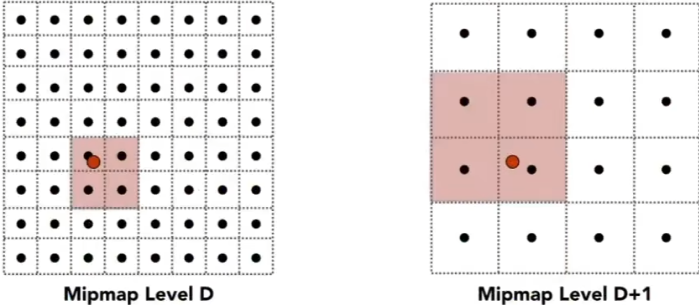
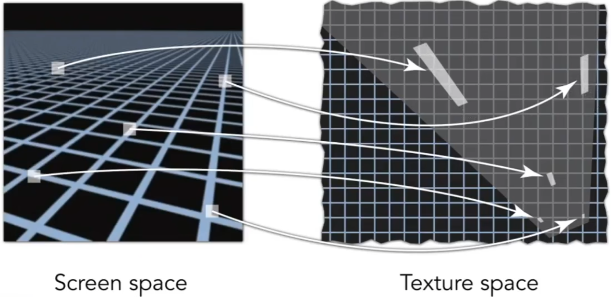

# Texture Mapping

## 0x00 Texture Mapping Basic

### 纹理Texture

任何一个`3D`物体表面实际由`2D`图形组成，因此`3D`物体表面任何一个点和一张`2D`纹理坐标可以形成一一映射的关系

三维空间中最基本的元素为三角形，三角形的三个顶点`ABC`都应该和`2D`纹理坐标形成一一对应的关系




### 纹理坐标Texture Coordinate

#### 纹理坐标的关联

所有的三角形顶点都被分配了一个纹理坐标`(u, v)`

#### 纹理坐标系

纹理坐标的拥有两个坐标轴，横坐标为`u[0,1]`，纵坐标为`v[0,1]`




#### 纹理坐标的复用tilable texture

**一个纹理可以被使用多次。**如果纹理设计优良，则纹理与纹理之间可以无缝衔接，被多次的复用




## 0x01 重心坐标插值Barycentric Coordinates Interpolation与渐变

### 重心坐标Barycentric Coordinates

### 重心坐标的应用

用于进行三角形内部的插值。已知三角形的顶点需要再三角形的内部进行平滑过渡。可以用于纹理坐标`uv`，颜色，法向量的平滑过渡

### 重心坐标的定义

重心坐标位于三角形的内部且仅对当前三角形有效，重心坐标可以被顶点`A, B, C`线性表示


#### 如果点位于三角形`ABC`所在平面

$$
\begin{cases}
(x,y)=\alpha A+\beta B+\gamma C \\
\alpha + \beta + \gamma = 1 \\
\end{cases}
$$


#### 如果点位于三角形`ABC`内部，还需要满足额外的条件

$$
\alpha, \beta, \gamma>0 \\
$$

几个特殊点(三角形的顶点)的重心坐标
$$
点A的重心坐标:(\alpha,\beta,\gamma) = (1,0,0) \\
点B的重心坐标:(\alpha,\beta,\gamma) = (0,1,0) \\
点C的重心坐标:(\alpha,\beta,\gamma) = (0,0,1) \\
$$


### 重心坐标的推广

推广公式，如果是三角形内部的任意一个点的坐标是可以通过面积比例进行计算的


$$
另任一点为M坐标为(x, y)\\
顶点A对应的三角形必须与顶点A不相邻，因此为A_A\\
顶点B对应的三角形必须与顶点A不相邻，因此为A_B\\ 
顶点C对应的三角形必须与顶点A不相邻，因此为A_C\\\\
\because
\begin{cases}
\alpha = \frac{S_\triangle A_A}{S_\triangle ABC} \\
\beta =  \frac{S_\triangle A_B}{S_\triangle ABC}\\
\gamma = 1 - \alpha - \beta \\
\end{cases} 
\quad
S_\triangle ABC =\frac{|\vec{AC}||\vec{AB}|sin{\alpha}}{2}=\frac{|\vec{AC} \times \vec{AB}|}{2} \\

\therefore
\begin{cases}
\alpha = \frac{S_\triangle A_A}{S_\triangle ABC} = \frac{\frac{|\vec{MC} \times \vec{MB}|}{2}}{\frac{|\vec{AC} \times \vec{AB}|}{2}} = \frac{|\vec{MC} \times \vec{MB}|}{|\vec{AC} \times \vec{AB}|}\\
\beta =  \frac{S_\triangle A_B}{S_\triangle ABC} = \frac{\frac{|\vec{MA} \times \vec{MB}|}{2}}{\frac{|\vec{AC} \times \vec{AB}|}{2}} = \frac{|\vec{MA} \times \vec{MB}|}{|\vec{AC} \times \vec{AB}|}\\
\gamma = 1 - \alpha - \beta \\
\end{cases} 
$$


我们可以发现三角形内部存在一个点，使得三个系数相等
$$
\because
\begin{cases}
\alpha = \beta = \gamma \\
\alpha + \beta + \gamma = 1 \\
\end{cases}\\
\therefore
\alpha = \beta = \gamma = \frac{1}{3}
$$


### 重心坐标与深度`Z-buffer`

三维空间中的重心坐标必须再投影之间完成插值运算，因为投影会改变重心坐标的位置


## 0x02 纹理应用

### 纹理贴图的映射过程

1. 遍历采样点：计算当前采样点在目前三角形中的插值
2. 得到纹理坐标：将插值系数转换为纹理坐标`(u, v)`
3. 查询纹理的颜色参数：根据纹理坐标`(u, v)`得到对应坐标的颜色
4. 设置`Blinn-Phong`漫反射反射系数`Kd`

$$
假设光源位置为L(L_x, L_y)，着色点Point(P_x,P_y)，K_d代表某种颜色对光能量的反射率\\
L_d =K_d(\frac{I}{\sqrt{(L_x - P_x)^2 + (L_y - P_y)^2}})max(0, \cos(\alpha))
$$


### 纹理贴图的映射伪代码

```c++
//1. 遍历当前的光栅化的像素
for_each([x, y]: rasterized_pixel){
    //2. 根据像素再三角形中的位置，进行重心插值得到重心坐标系数
    //3. 将重心坐标系数映射到对应的纹理坐标
    auto [u, v] = Barycentric(x, y);
    
    textColour = texture.sample(u, v);
    
    //4. Set Kd in Diffuse Blinn-Phong Model
    Kd = textColour;
}
```


## 0x03 纹理贴图放大与缩小会引起的问题

### 纹理贴图过小

#### 纹理贴图的分辨率问题

由于纹理贴图**(黑点)**的分辨率不足多个纹理坐标`(u,v)`**(红点)**经过上下取整后被取到了同一个点，导致纹理的重复进而产生模糊和锯齿的情况


#### 双线性插值bilinear Interpolation

由于纹理坐标`(u, v)`落入非整数点，可以将邻接的四个点(整数)进行双线性插值，从而使得颜色可以平滑的过渡

1. 普通的线性插值`Linear Interpolation(1D)`
   $$
   lerp(x, v_0, v_1) = v_o + x(v_1 - v_0)
   $$

2. 

2. 推广定义到一个二维平面`2D`的线性插值

   
   $$
   计算在水平方向上的插值\\
   t_0 = lerp(s, u_{00}, u_{10})=u_{00} + s(u_{10}-u_{00})\\
   t_1 = lerp(s, u_{01}, u_{11})=u_{01} + s(u_{11}-u_{01})\\\\
   
   \because 
   纹理坐标在u_{00}-u_{10}分界上的插值为t_0;\ 在u_{01}-u_{11}分界上的插值为t_1 \\
   \therefore
   可以得到纹理坐标竖直方向上的插值:
   y = lerp(t, t_0, t_1) = t_0 + t(t_1 - t_0)\\\\
   最终结果为: f(x,y) =  
   $$
   

#### 双三次插值Bicubic

取周围的16个邻接点进行双三次插值，效果好于双线性插值，但是性能下降


### 纹理贴图过大

#### 纹理走样Antialiasing

当纹理过大时，根据透视投影的进大远小规则，在远处一个像素具备高频性并覆盖大量纹理细节，只有通过更高频的采用方法才可以防止走样

如果不进行采样，则会造成欠采样，导致摩尔纹以及锯齿；**但是使用超采样并不现实，因为使用大量采样点必然造成性能的下降，代价增高**


#### 引入范围查询Range-Query

将对点的查询(采样)转换为对于范围的查询，**避免可能引起走样的采样问题**，引入某种可以对某一个区域立即取得平均值的方法(算法)


## 0x04 范围查询Mipmap

### 预计算Mipmap

提前预计算纹理信息，每一层相比上一层的分辨率减少一半，一共含有对分辨率进行`log2`层的纹理，**但是仅允许进行快速近似对于正方向的范围查询**

#### `Mipmap`的层级预生成


#### `Mipmap`的层级金字塔


$$
L为正方形的长(宽)\\
可以得到层级和分辨率之间的对应公式:D = log_{2}(L)
$$


### Mipmap的层级的计算

#### 通过像素点找到获取纹理坐标数据

通过像素点`A(x1, y1)`以及其相邻`3`个像素点`B(x2, y2)`所映射的纹理坐标之间`(Ua, Va),(Ub, Vb)，...`的关系




#### 计算最长边`L`从而得到层级`D`

近似计算纹理坐标之间`(Ua, Va),(Ub, Vb)，...`之间所形成**最大的边**

***注意这里的最长边算法**，该算法可以有很多种的实现方法，不仅仅局限在当前的微分方法*


$$
\because
D = log_{2}(L)\\
L = max(
        \sqrt{(\frac{du}{dx})^2+(\frac{dv}{dx})^2},
        \sqrt{(\frac{du}{dy})^2+(\frac{dv}{dy})^2}
	)
\\
$$


### Mipmap的插值算法Trilinear Interpolation

#### Mipmap的插值算法的用途

解决计算出的层级不是一个整数的情况，需要在连接边缘处进行平滑过渡


#### Mipmap的插值算法(**三线过滤**)



1. 如果当前计算的`D`不是一个整数，则可以通过上下取整的方法得到上下整数层

   ```c++
   auto upper = std::ceil(D);
   auto lower = std::floor(D);
   ```

   

2. 在层数`D`以及层数`D+1`层上分别进行双线性插值，得到运算结果
   $$
   计算D层的双线性插值\\
   t_{D}0 = lerp(s_D, u_{D}{00}, u_{D}{10})=u_{D}{00} + s_D(u_{D}{10}-u_{D}{00})\\
   t_{D}1 = lerp(s_D, u_{D}{01}, u_{D}{11})=u_{D}{01} + s_D(u_{D}{11}-u_{D}{01})\\
   y_{D} = lerp(t_D, t_{D}0, t_{D}1) = t_{D}0 + t_D(t_{D}1- t_{D}0)\\
   得到(x,y)对应的色彩参数:f_{D}(x,y_{D}) \\\\
   
   计算D+1层的双线性插值\\
   t_{D+1}0 = lerp(s_{D+1}, u_{D+1}{00}, u_{D+1}{10})=u_{D+1}{00} + s_{D+1}(u_{D+1}{10}-u_{D+1}{00})\\
   t_{D+1}1 = lerp(s_{D+1}, u_{D+1}{01}, u_{D+1}{11})=u_{D+1}{01} + s_{D+1}(u_{D+1}{11}-u_{D+1}{01})\\
   y_{D+1} = lerp(t_{D+1}, t_{D+1}0, t_{D+1}1) = t_{D+1}0 + t_{D+1}(t_{D+1}1- t_{D+1}0)\\
   
   得到(x,y)对应的色彩参数:f_{D+1}(x,y_{D+1}) \\\\
   $$
   

3. 在`D`和`D+1`层上的双线性插值的基础上再次进行线性插值
   $$
   已知:当前的非整数层号H = log_{2}(L)\\
   通过1D线性插值公式可以得到:lerp(H - D, f_{D}(x,y_{D}), f_{D+1}(x,y_{D+1})) \\= f_{D}(x,y) + (H - D)(f_{D+1}(x,y_{D+1}) - f_{D}(x,y_{D}))
   $$
   

   

#### Mipmap的插值算法的结果


## 0x05 各向异性过滤Anisotropic Filtering

### 各向异性过滤`Ripmap`的性能

需要的空间容量收敛到原来的`3`倍，需要更大的显存

### 各向异性过滤`Ripmap`概述

**部分的**解决`Mipmap`过度模糊`(over-blur)`现象。`Mipmap`只能计算正方形，但是屏幕上像素映射到纹理上不一定是正方形形状。各向异性过滤支持矩形的范围查询



