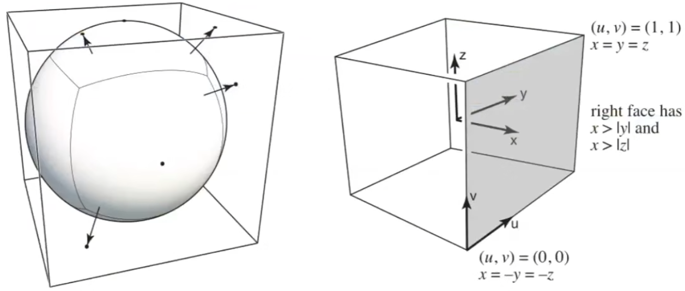
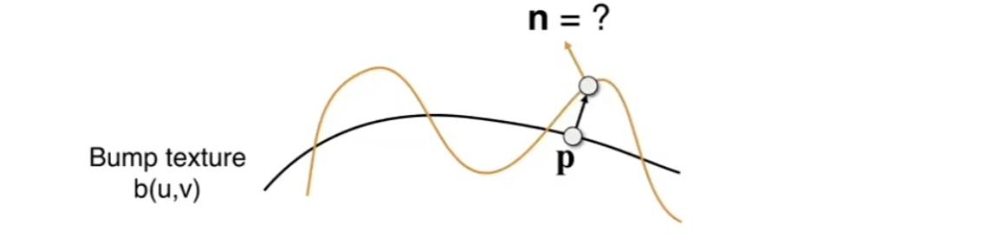

# Texture And Environment Map

## 0x00 Modern Texture

### GPU and Texture

在现代CPU中，纹理的处理需要利用显存和范围查询

### 环境光纹理Environment Map

用于来记录来自不同方向的光照信息

#### 使用球形记录环境光Spherical Environment Map

以纹理贴图的形式来表示环境光，并且将环境光记录在一个球体上，**但是展开后靠近祭奠的部分会产生图像的扭曲**

#### 使用立方体记录环境光Cube Map

不再将光照信息存储在球体上，而是将光照信息写入到立方体上，经过立方体展开后可以得到`6`张图

但是，相比使用球体记录光照位置，立方体记录的信息更难与判断某个具体角度对应的光照。**需要先判断展开后的面，然后计算角度**

### 凹凸/法线贴图

#### 凹凸/法线贴图的原理

定义一个复杂的纹理但不改变实际的三角形顶点，人为的通过凹凸贴图，将原本的点`P`给抬升/下沉到`P'`从而引发法线的变化，影响着色从而欺骗人眼

让人觉得存在凹凸，**但是，模型并没有发生改变。****但是，在进行阴影计算的时候，凹凸/法线贴图会漏出马脚，因为渲染的图像的阴影并没有高度变化**

#### 凹凸贴图3D法线的计算

1. 原始法线方向朝向为`n(p)=(0, 0, 1)`，法线贴图存在`(u, v)`
   $$
   另原始的法线方向为n(p)=(0, 0, 1)且p=f(u, v), 经过移动得到新的函数表达式h(p)\\
   $$

   

2. 计算高度场`h(p)`在`u`和`v`上的偏导数
   $$
   \frac{\partial h}{\partial u} = c_1[h(u+1, v)-h(u, v)] \\
   \frac{\partial h}{\partial v} = c_2[h(u, v + 1)-h(u, v)]\\
   $$

   

3. 基于偏导数构造𝑢方向**单位**切向量
   $$
   u方向向量:\vec{u}=(1, 0, \frac{\partial h}{\partial u}) \\
   $$

   `1` 是在`𝑢`方向上的单位变化

   `0`是在`𝑣`上的单位变化

   `dh/du`只在`𝑢`方向上的高度变化量

   

4. 基于偏导数构造v方向**单位**切向量
   $$
   v方向向量:\vec{v}=(0, 1, \frac{\partial h}{\partial v}) \\
   $$

   `0`是在`𝑢`上的单位变化

   `1` 是在`𝑣`方向上的单位变化

   `dh/dv`只在`𝑣`方向上的高度变化量

   

5. 计算新的法线方向，通过叉乘计算
   $$
   n'(p)=\vec{u} \times \vec{v} = 
   \begin{bmatrix}
   \vec{\dot i}& \vec{\dot j}&\vec{\dot k}\\ 
   1 & 0 & \frac{\partial h}{\partial u} \\
   0 & 1 & \frac{\partial h}{\partial v} \\
   \end{bmatrix} = 
   ( -\frac{\partial h}{\partial u}, -\frac{\partial h}{\partial v}, 1)
   $$

   

6. 归一化新的法线
   $$
   n'(p)
   =\frac{n'(p)}{|n'(p)|}
   =\frac{( -\frac{\partial h}{\partial u}, -\frac{\partial h}{\partial v}, 1)}
   {\sqrt{1 + (-\frac{\partial h}{\partial u})^2 + (-\frac{\partial h}{\partial v})^2}}
   $$

### 位移贴图Displacement mapping

位移贴图会真正移动顶点的位置，会真正的改变几何形态，但是需要模型足够细致

#### 动态曲面细分(DirectX)

一开始不需要足够高精度的模型，根据需要再进行模型的细分

## 0x01 3D Texture

### 3D体积渲染Volume Rendering

### 基于解析式的纹理 3D Procedural Noise

#### 3D柏林噪声Perlin noise

