# Geometry

## 0x00 几何体的表示Represent Geometry

几何体非常困难和复杂，需要根据需要选择表示方法

### 隐式几何体Implicit Geometry

#### 隐式几何体的通用表达

满足一定特定关系的点，并不给出实际的点集合
$$
球面:x^2+y^2+z^2=1=>x^2+y^2+z^2-1=0
$$

因此，更为广泛的定义需要满足
$$
f(x, y, z)=0
$$

#### 隐式几何体的几何意义

隐式几何体很容易判断点是否位于几何体的内外或者表面上，**但是很难找到所有满足解析式的点的位置坐标**
$$
inoutside\_or\_on(x) = \begin{cases}
x<0 \quad 在内部\\
x=0 \quad 在表面\\
x>0 \quad 在外部
\end{cases}
$$

#### 隐式几何体的表达方式

1. 数学解析式`Algebraic Surfaces`：**非常不直观**

2. 构造实体集合`CSG(Constructive Solid Geometry)`：利用布尔和几何运算，通过基础图像合成复杂图形

   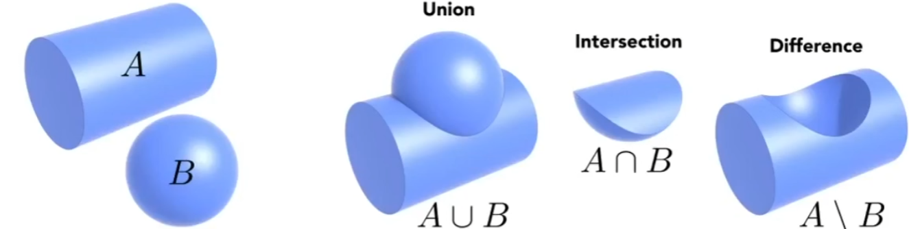
   $$
   A ∪ B; A ∩ B
   $$

   

3. 分形几何`Fractals`：自己的一个部分和自己相似，类似计算机科学中的递归(例：雪花)

4. 距离函数`Distance Functions(DF)`

   对于任意几何不直接描述其表面，而是描述空间中任一点到所要表述的几何形体上任意一点所需要的最小距离(可正可负)，因此用有符号距离函数`SDF`表示

   可以将两个物体之间的距离函数`DF1`和`DF2`进行融合`Blend`
   $$
   f(x) = Blend(SDF_1, SDF_2)
   $$
   
   
   其中当`f(x) = 0`时，则对应的位置则为表面
   $$
   f(x)=0
   $$
   
   
   

### 显式几何体Explicit Geometry

#### 参数映射几何意义

通过参数映射把`(u, v)`进行遍历就可以知道空间中的形状，**但是判断点是否在几何体的内外或者表面上就困难了**

#### 参数映射的通用方法

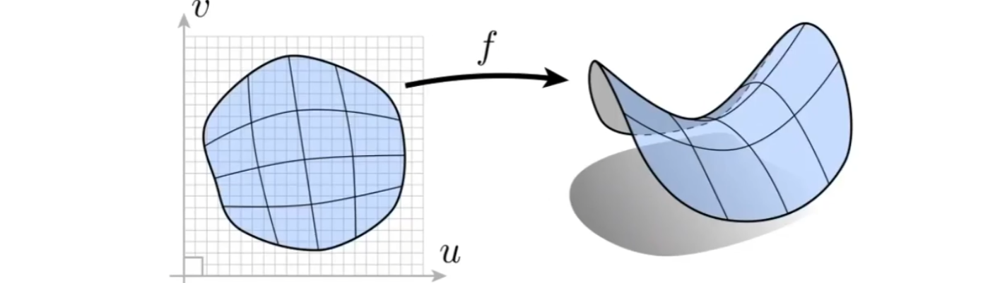
$$
f:R^2→R^3;(u,v)→(x,y,z)
$$

#### 显式几何体的表达方式

1. 点云`Point Cloud`：由稠密/稀疏离散的点组成，一般经常会被转化为三角形面

2. 贝塞尔曲线`Bezier Curves`：存在参数映射

3. 多变形面`Polygons Mesh`：使用三角形和四边形描述复杂的物体

   一般情况下，使用`wavefront object file(.obj)`格式，使用文本文件描述顶点，法线，纹理坐标和他们的连接关系(组成面的点)

   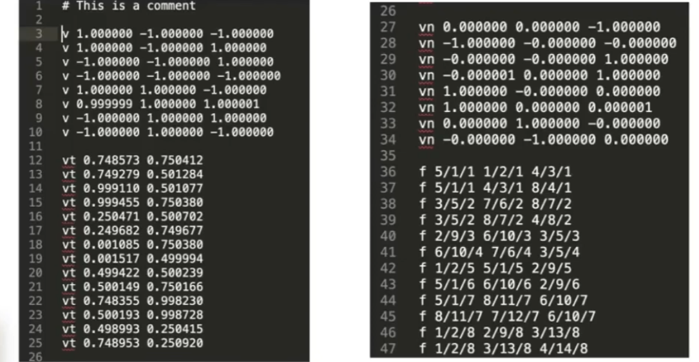

   

## 0x01 贝塞尔曲线Bezier Curves

利用一系列的控制点来定义光滑曲线，但是曲线并不一定经过所有的控制点

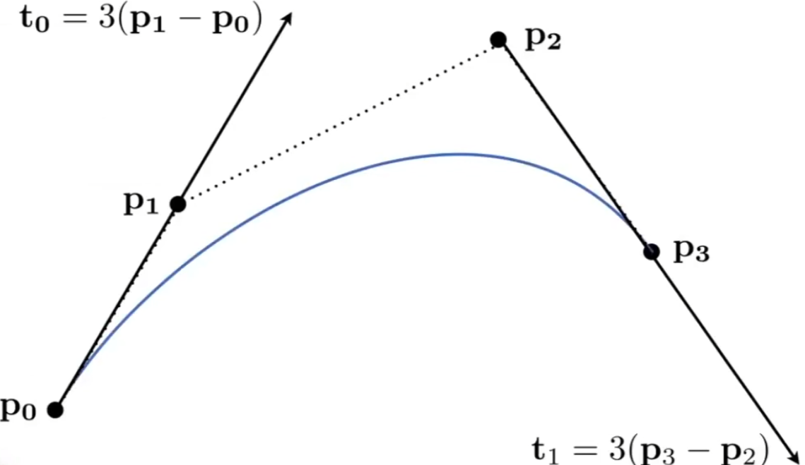

### 贝塞尔曲线的属性

1. 必须经过起始点和终止点

2. 如果存在`4`个及以上控制点数量，起始点和终止点的切线可以指示贝塞尔曲线的方向

3. **仿射变换下**，对已经得出的控制点进行仿射变换，得出的贝塞尔曲线相同

4. 绘制的贝塞尔曲线必须在控制点形成的凸包(`Convex Hull`)内，能够包围给定的几何形体的最小的凸多边形，为凸包

   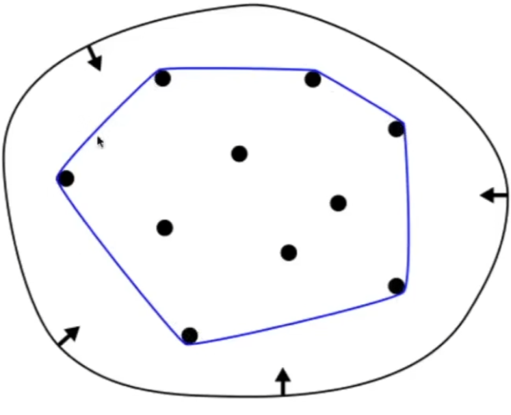

   
   
   贝塞尔曲线上的任何一个点，必然位于控制点所形成的凸包内部

### 白塞尔曲线的定义

#### D卡斯托机算法de Casteljau Algorithm

1. 初始条件：选择时间作为线性插值参数`t`**(此处使用`t = 0.5`为例)**。如果存在`n`个控制点则存在`n-1`条边

   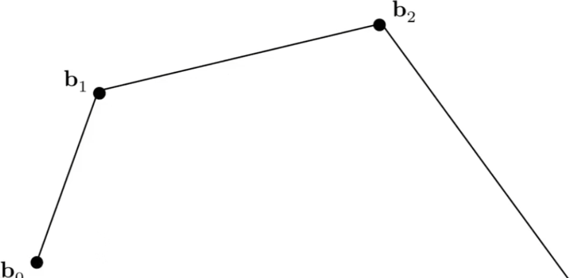
   $$
   存在点:b_0,b_1,b_2,b_3\\
   存在边：b_0b_1,b_1b_2,b_2b_3
   $$
   

2. 在`n-1`条边上进行线性插值，找到**新的满足插值条件的`n-1`个点**后再次连线生成`n-2`条边，问题规模减小

   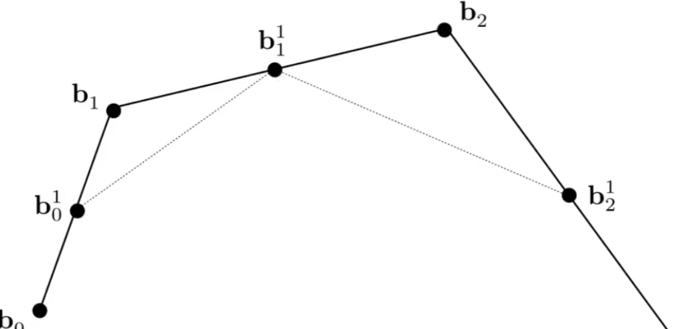
   $$
   贝塞尔曲线线性插值代数公式的计算:\\
   b_{0}^1(t) = (1-t)b_0 + tb_1\\
   b_{1}^1(t) = (1-t)b_1 + tb_2\\
   b_{2}^1(t) = (1-t)b_2 + tb_3\\\\
   找到满足插值条件的新点:b_{0}^1,b_{1}^1,b_{2}^1\\
   将新点连成新段：b_{0}^1b_{1}^1,b_{1}^1b_{2}^1
   $$
   

3. 重复以上的连线过程，直到存在`2`个点，`1`条边的情况后，再次找到**新的满足插值条件的最后`1`个点**

   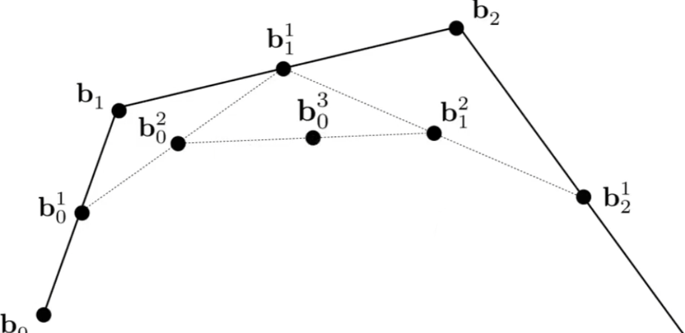
   $$
   贝塞尔曲线线性插值代数公式的计算:\\
   b_{0}^3(t) = (1-t)b_{0}^2 + tb_{1}^2\\\\
   最终点:b_{0}^3\\
   $$
   

4. 根据三个点生成曲线：根据起始，终止，和最终点生成贝塞尔曲线

   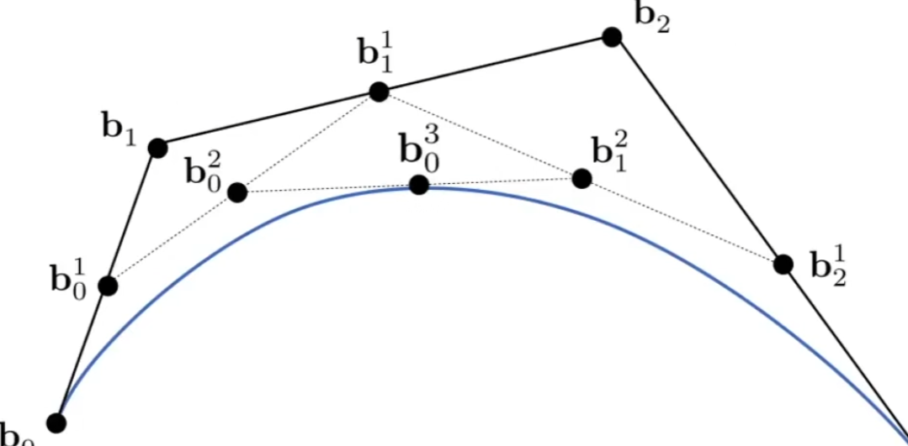

   

#### 伯恩斯坦多项式(二项分布)`(Bernstein polynomial)`

使用伯恩斯坦多项式(二项分布)`(Bernstein polynomial)`来描述贝塞尔曲线中的最后一个点是`n`个控制点的组合值
$$
二项分布公式B_{i}^n (t) 
= \begin{bmatrix} n \\ i \end{bmatrix}
  t^i(1-t)^{n-i}\\
$$

伯恩斯坦多项式的加和等于`1`且图形存在对称

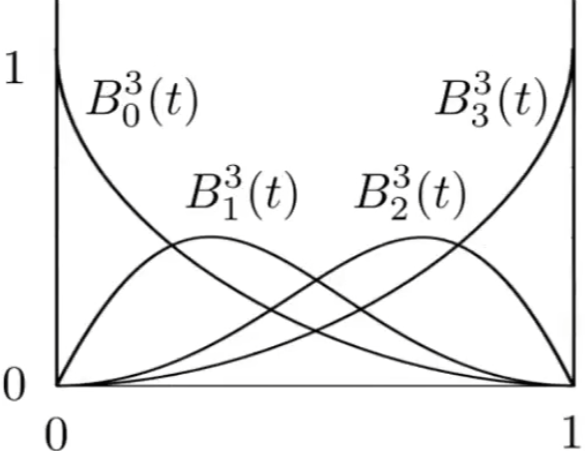

#### 贝塞尔曲线的最终结论

使用伯恩斯坦多项式来描述贝塞尔曲线中的最后一个点是`n`个控制点的组合值
$$
\because
二项分布公式B_{i}^n (t) 
= \begin{bmatrix} n \\ i \end{bmatrix}
  t^i(1-t)^{n-i}\\

\therefore
b^n(t)=b_{0}^n(t)=\sum_{j=0}^{n}b_{j}B_{j}^n(t)
$$

### 逐段定义的贝塞尔曲线Piecewise Bezier Curves

#### Piecewise Cubic Bezier

每`4`个控制点可以定义一条`3`次贝塞尔曲线

#### Piecewise Cubic Bezier Continuity

给定两个逐段定义的贝塞尔曲线，每段曲线由4个控制点构成

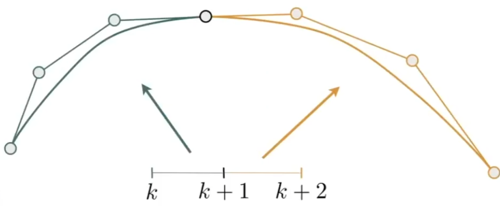
$$
a:[k,k+1]→IR^N\\
b:[k+1, k+2]→IR^N
$$

1. C0连续：第一段的终止点等于第二段的起始点，即数值上连续，则两个曲线在几何上连续
   $$
   a_n = b_0
   $$

   

2. C1连续(一阶导数连续)：第一段终止点和第二段起始点切线连续

   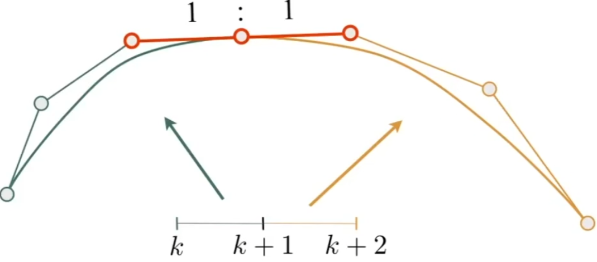

   $$
   两个控制点离连接点的距离相同，共线且方向相反
   a_n = b_0 = \frac{1}{2}(a_{n+1}+b_1)
   $$
   

3. 其他(曲率连续)

   

## 0x02 样条Splines

一个穿过给定的控制点且满足一定连续性的可控曲线

### 基函数样条Basis-Splines(及其复杂)

贝塞尔曲线如何改动一处控制点，则其他的点都会发生变化。因此基函数样条对其进行扩充，支持控制点的局部性

#### 基函数

用伯恩斯坦多项式，用时间`t`下的项对不同的控制点进行加权平均

## 0x03 非均匀有理闭样条NURBS(略)

## 0x04 贝塞尔曲面Bezier Surfaces

贝塞尔曲面也属于显式几何体，因为其可以用含有`(U,V)`的参数映射的方式进行展示

### 如何得到贝塞尔曲面

#### Bicubic Bezier Surface Path

通过`4x4`个控制点就可以得到贝塞尔曲面

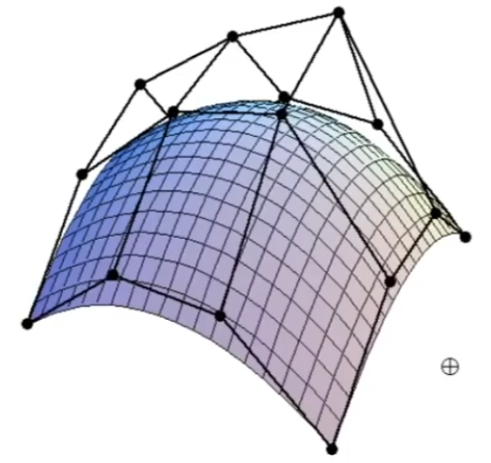

#### D卡斯托机算法de Casteljau Algorithm

使用一个定义域为`[0,1][0,1]`的`(u,v)`来表示贝塞尔曲面的平面坐标

1. 首先生成`4`个贝塞尔曲线，这些曲线垂直于`u`方向与`V`方向平行

2. 在这些曲线的基础上，使用`u`得到位于这些贝塞尔曲线上的`4`个点作为控制点，再次生成一条贝塞尔曲线

   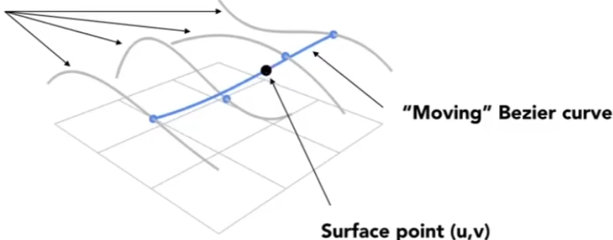

