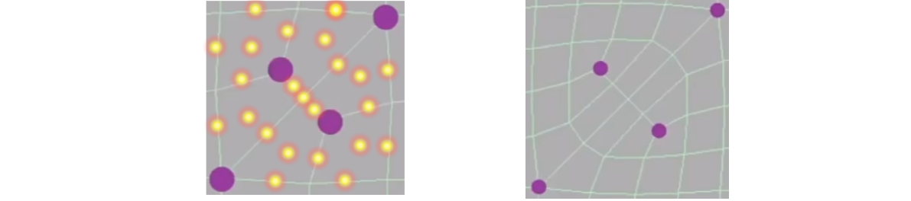

# Mesh Operations & Geometry Processing

## 0x00 网格细分Mesh subdivision

### 网格细分与位移贴图Displacement Map

相比法线贴图，位移贴图更为的真实，但是位移贴图需要大量的三角形

### Loop Subdivision(并不是循环细分)

#### `Loop Subdivision`的使用前提

`Loop Subdivision`分隔的必须是一个三角形网格

#### 三角形的风格方法

通过连接原始三角形`ABC`的三个中点，在边`AB, BC, CA`上分别生成新点`D', E', F'`。连接边`D'E',E'F',F'D'`可以使得原始三角形`ABC`生成`4`个子三角形

#### 新顶点的计算权重

新顶点必然在位于在边上且**边不属于边界**，新顶点被三角形所共享，利用插值算法使其可以平滑过渡

​	新增加的顶点受离的更近的`A`和`B`点的影响更大，因此权重更大，
$$
新顶点数值:\frac{3}{8}(A+B)+\frac{1}{8}(C+D)
$$

#### 老顶点的计算权重

为了更新老顶点，一部分权重用于保留自己原始的位置，另一部分权重计算其受邻接点的影响

1. 引入图论顶点的度
   $$
   根据图论的顶点的度=>老顶点存在n个度\\
   $$
   
2. 老顶点权重公式
   $$
   已知:u为权重\\
   老顶点的权重公式:(1 - nu) * original\_pos + u * adjacant\_pos\_sum
   $$
   

### *Catmull-Clark Subdivision(General Mesh)

`Catmull-Clark Subdivision`可以用于四边形的细分

#### Catmull-Clark 概念定义

1. 四边形面`quad face`：四边形面

2. 非四边形面`Non-quad face`：三角形就是非四边形面

3. 奇异点`Extraordinary vertex`：**在图论中，顶点的度不为4**

   

#### Catmull-Clark 细分过程

1. 增加顶点数量：在任意的边上取中点，在每一个面上取中点(重心坐标)，将这些中点相连，目前有了**4个奇异点**

   **每一个非四边形面都会引入一个奇异点，在进行`Catmull-Clark `细分之后，所有的非四边形面全部消失**

   |             概念             |   数量   |
   | :--------------------------: | :------: |
   |     四边形面`quad face`      |          |
   |  非四边形面`Non-quad face`   | `2 -> 0` |
   | 奇异点`Extraordinary vertex` | `2 -> 4` |

   

   再次进行中点细分之后，**奇异点的数量保持在原来的数量，没有发生改变**

   

#### Catmull-Clark 顶点更新规则

1. 点在面里面`Face Point`

   
   $$
   f = \frac{v_1 + v_2 + v_3 + v_4}{4}
   $$

   

   

2. 点在边上且**不是边界情况**`Edge Point`

   
   $$
   e = \frac{v_1 + v_2 + f_1 + f_2}{4}
   $$

   

3. 更新旧的顶点`p(v)`

   
   $$
   v = \frac{f_1+f_2+f_3+f_4+2(m_1+m_2+m_3+m_4)+4p}{16}
   $$

## 0x01 网格化简Mesh simplification

如果网格非常复杂且距离摄像机较远，则可以简化三角形减少性能消耗

### 网格化简与Mipmap

如果模型距离远，则可以选择更高层的`Mipmap`的低精度纹理

### 边坍缩Edge Collapsing

找到一条边，将两个顶点进行融合为一个顶点，导致这条边不再存在

#### 二次误差度量Quadric Error Metrics

引入二次误差度量方法(平方距离)，找到一个点`P`到原来相关联的面距离的平方和的最小值

**但是，被坍缩的边会影响别的边的二次度量误差。**

## 0x02 网格规则化Mesh regularization

将不规则的三角形整形为类似于正三角形，规则化期间不能破坏模型

