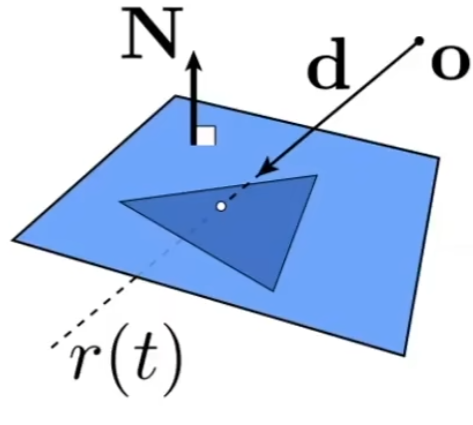

# Ray Tracing

## 0x00 Why Ray tracing

### 光栅化存在的问题

光线追踪可以解决光栅化中的问题，比如光栅化不能很好表现全局的效果，例如：软阴影

以及光线在到达摄像机/眼睛反射/弹射超过两次，例如：毛反射`Glossy Relfection`，间接光照`Indirect Illumination`

### 光线追踪

光线追踪比光栅化很精准但非常慢，适合离线渲染，例如：电影

## 0x01 Basic Ray Tracing Algorithm

### 光线投射Ray Casting

#### Light Rays

1. 光线沿直线传播
2. 光线不太会发生碰撞
3. 光线从光源发射在场景中经过多次弹射，最后进入摄像机且该光路支持光路可逆

#### Ray Casting hypnosis 

1. 摄像机必须是一个点
2. 光源必须是点光源
3. 场景中的物体必须发射完美反射或者折射

#### 光线投射基本过程

1. 发射射线：从摄像机为原点，发射多个射线(光线)穿过成像平面的每一个像素直到和物体相交或者没有相交
2. 阴影检测：如果某个射线和物体相交，则将相交点和光源进行连线，判断该点对光源是否也是可见的


### Pinhole Camera Model

当前的`Pinhole Camera Model`仅仅考虑了光线弹射一次的计算

#### 生成射线Generating Eye Rays

一个从摄像机发出的光线，该光线穿过成像平面的某个像素，最终到达实际的场景


**但是，`Eye rays`可能被其他的物体所遮挡。**因此，我们仅需要记录最近的交点


#### 像素着色Shading Pixels

1. 得到法线的位置：当得到第一个交点的位置之后。就可以直到该点的法线方向
2. 使用`Shadow Ray`检测阴影：从交点向光源进行连线，判断是否有阻碍物导致交点位于阴影
3. 利用着色模型进行着色`(Blinn Phong Model)`：计算着色数据并写入像素


## 0x02 Recursive(Whitted-style) Ray Tracing

支持进行光线的多次弹射(折射/反射)的计算，该过程通过递归进行计算

### 生成射线Generating Eye Rays

#### 发射主射线Primary Ray

从摄像机发出的光线，该光线穿过成像平面的某个像素，最终到达实际的场景。**但是，`Eye rays`可能被其他的物体所遮挡。**因此，我们仅需要记录最近的交点

#### 一次弹射之后的射线Secondary Rays

在一次弹射之后的所有光线都可以是`Secondary Rays`


### 考虑玻璃材质

#### 光的反射Reflected Ray


#### 光的折射Refracted Ray

光从不同密度介质的物体中穿过时会产生折射现象。当进入玻璃时会发生一次折射，出玻璃的时候还会折射，一共两次折射


### 像素着色Shading Pixels

#### 着色值的累加

由于存在多个交点，因此会产生多个与光源的连线，因此会产生多个着色值(可能被遮挡)


## 0x03 光线与表面的交点计算Ray-Surface Intersection

### 射线方程Ray Equation

#### 射线定义

射线有起点和一个方向向量进行定义


#### 射线公式

$$
另起始位置为O，运动方向为\vec{d}，射线随着时间t进行延长\\
 Ray(t)=\vec{o}+t\vec{d}
$$


### 平面方程Plane Equation

#### 平面定义

一个平面可以被一个法线和另一个点(三角形顶点)进行定义


#### 平面公式

$$
法线必然垂直于平面因此必然垂直于平面内的任意一个射线，因此需要寻找一个点p，满足该关系\\
(p-p')\vec{N}=0
$$


### 光线与隐式表面的交点

$$
已知:\begin{cases}
射线公式Ray(t)=\vec{o}+t\vec{d}\\
隐式表面:f(p)=0 
\end{cases}=>f(\vec{o}+t\vec{d})=0\\\\

求解t参数
$$


#### 光线与球体的交点

光线与球体相交于球面的`P`点，该点满足到球心的距离等于球体的半径


$$
已知:\begin{cases}
射线公式Ray(t)=\vec{o}+t\vec{d}\\
Sphere:(P-C)^2-R^2=0
\end{cases}\\\\
因为射线和球面汇聚于P点，因此将射线公式带入方程P=o+t\vec{d}\\
得到:(\vec{o} + t\vec{d}-c)^2-R^2=0\\\\
\because
(\vec{o} + t\vec{d}-c)^2-R^2=0\\
\therefore
\begin{cases}
a = \vec{d} . \vec{d} \\
b = 2(\vec{o} - c). \vec{d}\\
c= (\vec{o} - c)^2 - R^2
\end{cases}\\\\

根据二次函数的性质，当\sqrt{b^2-4ac}>0时函数有实际意义
$$

```c++
bool SoftRasterizer::Sphere::intersect(const Ray &ray, float &tNear) {
  auto L = ray.origin - vert[0].position;
  auto a = glm::dot(ray.direction, ray.direction);
  auto b = 2.f * glm::dot(ray.direction, L);
  auto c = glm::dot(L, L) - square;

  auto res = b * b - 4.f * a * c;
  if (res < 0)  return false;
  if (!res) { // res == 0
    tNear = -0.5f * b / a;
  } else {
    float q = -0.5f * (b + std::copysign(std::sqrt(res), b));					// Calculate q for better numerical stability
    auto x0 = q / a;
    auto x1 = c / q;

    // Select the smallest positive root
    tNear = (x0 > 0 && x1 > 0) ? std::min(x0, x1) : (x0 > 0 ? x0 : x1);			 // Select the smallest positive root
    if (tNear <= 0) {
      return false; 	// No valid intersection
    }
  }
  return true;
}
```


### 光线与显式表面的交点

#### 光线与三角形的交点Ray Intersection with Triangle Mesh

将光线与三角形的交点的**问题进行简化**



1. 检测光线和平面(三角形所在平面)的交点
   $$
   已知:\begin{cases}
   射线公式Ray(t)=\vec{o}+t\vec{d}\\
   Plane:(p-p')\vec{N}=0
   \end{cases}\\\\
   When \ p = Ray(t)\\
   \because
   (\vec{o}+t\vec{d}-p')\vec{N}=0\\
   \therefore
   t = \frac{(p'-\vec{o})\vec{N}}{d\vec{N}}
   且为了使得函数有实际意义，因此t>0
   $$
   
2. 检测交点是否位于三角形的内部


#### 光线与三角形的交点Moller Trumbore Algorithm

相比上一种算法，可以更为快速的计算交点。**如果交点位于三角形内部，则可以通过将三角形的交点转化为重心坐标的描述**
$$
已知:
射线公式Ray(t)=\vec{o}+t\vec{d}\\
联立重心坐标,得到:
\begin{cases}
     \vec{o}+t\vec{d}
    =(1-b_1-b_2)\vec{P_0}+b_1\vec{P_1}+b_2\vec{P_2} \\ 
    t > 0 \\
    b_1,b_2>0
\end{cases}
$$

```c++
std::tuple<float,float,float> SoftRasterizer::Triangle::getIntersect(Ray &ray) {
  glm::vec3 normal = getFaceNormal();
  // back face culling
    
  if (glm::dot(normal, ray.direction) <= 0)  return {};

  // Caculate Edge Vectors
  glm::vec3 e1 = vert[1].position - vert[0].position;
  glm::vec3 e2 = vert[2].position - vert[0].position;

  // light and surface is parallel or not?
  glm::vec3 pvec = glm::cross(ray.direction, e2);
  float det = glm::dot(e1, pvec);
  if (std::abs(det) < std::numeric_limits<float>::epsilon()) return {};

  // barycentric coordinates
  double det_inv = 1.f / det;
  glm::vec3 tvec = ray.origin - vert[0].position;
  float u = glm::dot(tvec, pvec) * det_inv;
  if (u < 0 || std::abs(u - 1.0f) < std::numeric_limits<float>::epsilon())  return {};

  glm::vec3 qvec = glm::cross(tvec, e1);
  float v = glm::dot(ray.direction, qvec) * det_inv;
  if (v < 0 || (u + v) > 1)  return {};

  // calculate the intersect time
  float t0 = glm::dot(e2, qvec) * det_inv;
  if (t0 < 0)  return {};
    
  return {1.f-u-v,u,v};
}
```


## 0x04 优化运算效率 Accelerating Ray-Surface Intersection

### Why Accelerate Naive Algorithm

普通的算法**太慢了**，利用包围盒(`Bounding  Volumes`)简化复杂的三角形面关系，简化复杂和不规则表面的运算，如：
$$
naive=pixels \times \ objects \times bounces
$$


### AABB盒与Bounding Volumes

#### Bounding Volumes的概念

用一个简单的形状(正/长方形)近似一个复杂的物体。如果一个光线`Ray`与包围盒没有交点，则更不可能与盒子中的物体相交


#### Pairs of slabs

在三维空间中，长方体由三个不同的对面`(slabs)`形成的交集，**在工程中常用轴对齐包围盒`Axis Aligned Bounding Box(AABB)`，长方体的轴和坐标轴平行**


#### 为什么AABB盒采用轴平行

如果是采用普适光线与三角形的交点则需要更多的计算量


$$
t = \frac{(p'-\vec{o})\vec{N}}{d\vec{N}}
$$


简化轴之后，则可以省略掉N的复杂法线计算


$$
计算X轴的分量:t = \frac{p'_x-o_x}{d_x}
$$


#### Ray-intrsection With AABB(2D)

判定光线和`2D`盒子的交点，二维平面中存在两个对面


$$
考虑X平面以及对面:
\begin{cases}
光线会在T_{xmin}时刻和X_0平面产生交点\\
光线会在T_{xmax}时刻和X_0对面(X_1)产生交点
\end{cases}\\\\

考虑Y平面以及对面:
\begin{cases}
光线会在射线的反向延长线上和Y_0存在交点，时刻为T_{ymin}，且该值可能为0\\
光线会在T_{ymax}时刻和Y_0对面(Y_1)产生交点
\end{cases}\\\\
$$


**现在考虑光线何时进入和出去的盒子**

需要满足最晚进入和最早出去的规则


$$
最晚进入:T_{min} = max(T_{xmin}, T_{ymin})\\
最早出去:T_{max} = min(T_{xmax}, T_{ymax})
$$


#### Ray-intersection With AABB(3D)

1. 规定光线在盒子中的状态

   光线在进入了**所有**的对面的时候时才满足光线进入盒子，则**最晚进入某个对面**

   光线只要离开**任意**的对面时代表离开盒子，则**最早离开对面**
   $$
   进入盒子:T_{enter} = max(T_{xmin}, T_{ymin}, T_{zmin})\\
   离开盒子:T_{exit} = min(T_{xmax}, T_{ymax}, T_{zmax})
   $$

2. `AABB`交点以及在盒子内部判定

   当光线在盒子里面停留一定的时间，则光线必定和盒子有所相交
   $$
   \begin{cases} 
   t_{enter} < t_{exit}\\
   t_{exit} >=0
   \end{cases}
   $$

3. 光线离开盒子的时间小于0：**如果光线离开盒子的时间小于0，则代表盒子在光线的背后不可能存在交点**

4. 光线进入盒子的光线小于0：光源本身就在盒子中，则光线一定位于盒子中

   ```c++
     bool intersect(const Ray &ray) {
   
       const glm::vec3 origin = ray.origin;
       const glm::vec3 dir = ray.direction;
   
       /* Multiply is faster that Division
        * Use a large value to handle division by zero for rays parallel to an axis */
       const glm::vec3 inv_dir =
           glm::vec3(ray.direction.x != 0 ? 1.0f / ray.direction.x : std::numeric_limits<float>::max(),
                     ray.direction.y != 0 ? 1.0f / ray.direction.y : std::numeric_limits<float>::max(),
                     ray.direction.z != 0 ? 1.0f / ray.direction.z : std::numeric_limits<float>::max());
   
       auto x_min = min.x, x_max = max.x;
       auto y_min = min.y, y_max = max.y;
       auto z_min = min.z, z_max = max.z;
   
       /* Origin + t * direction = Dst
        * t = (Dst - Origin) / direction =  (Dst - Origin) * inv_direction */
       auto x_min_t = (x_min - origin.x) * inv_dir.x,
            x_max_t = (x_max - origin.x) * inv_dir.x;
       auto y_min_t = (y_min - origin.y) * inv_dir.y,
            y_max_t = (y_max - origin.y) * inv_dir.y;
       auto z_min_t = (z_min - origin.z) * inv_dir.z,
            z_max_t = (z_max - origin.z) * inv_dir.z;
   
       // Swap the t_min and t_max values if necessary to ensure correct ordering
       if (x_min_t > x_max_t) std::swap(x_min_t, x_max_t);
       if (y_min_t > y_max_t) std::swap(y_min_t, y_max_t);
       if (z_min_t > z_max_t) std::swap(z_min_t, z_max_t);
   
       auto entering = Tools::max(x_min_t, y_min_t, z_min_t);
       auto leaving = Tools::min(x_max_t, y_max_t, z_max_t);
   
       // Use a small epsilon to account for floating - point precision errors
       return (entering < leaving + std::numeric_limits<float>::epsilon() &&
               leaving >= std::numeric_limits<float>::epsilon());
     }
   ```

   


