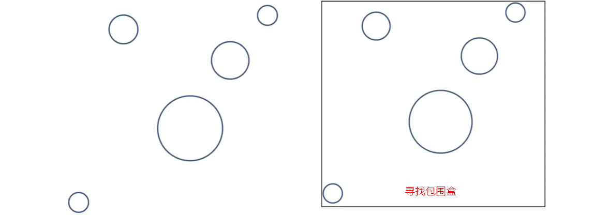
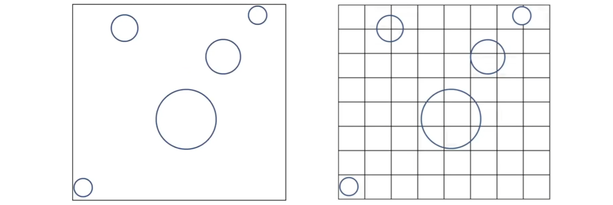
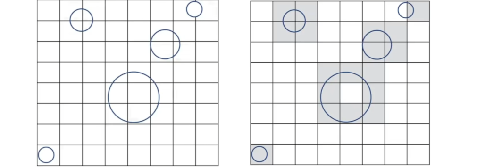
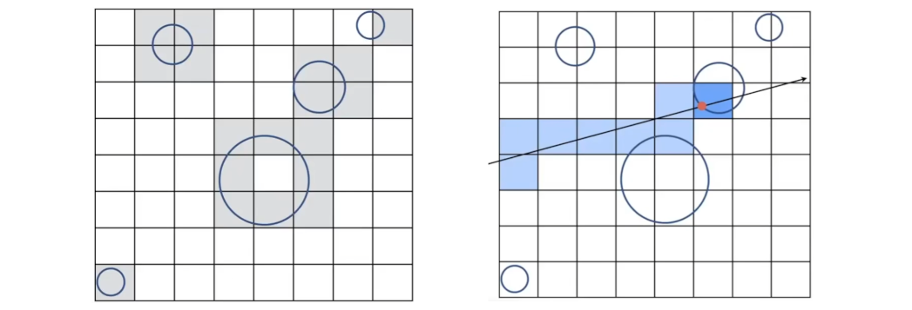
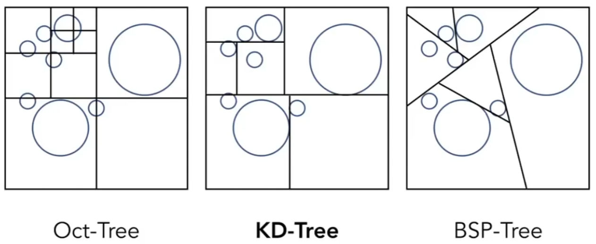
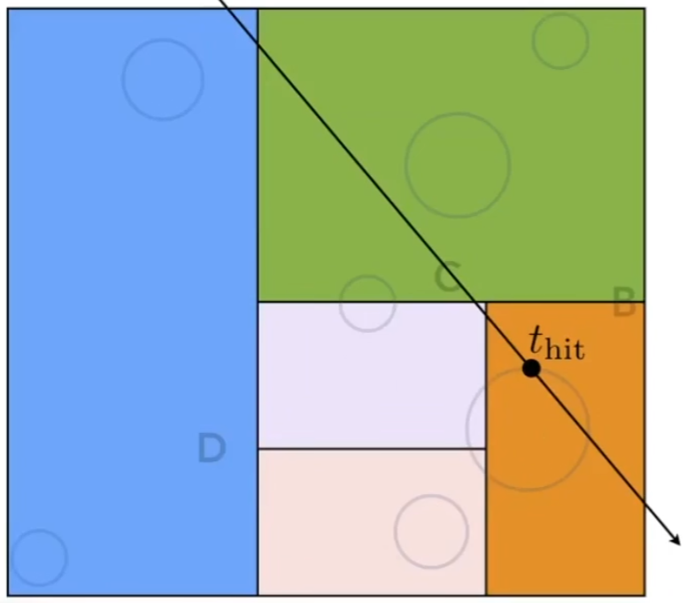
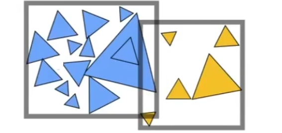

# AABB Accelerate Ray Tracing

## 0x00 Uniform Spatial Partitions(Grids)

适用于物体在场景中的分布比较均匀。否则光线需要穿过大量的网格才能找到一个物体，造成运算资源浪费

### Find Bounding Box(AABB)

现在找到场景，并找到场景的包围盒




### Create Grid

创建网格用于初始化计算的过程

#### 网格解析度

将包围盒划分出**均等**二维网格，同时需要满足网格的大小不能太大也不能太小




### Find overlapping cells

判断二维网格和实际物体之间的交集，即：寻找与**物体表面**相交的盒子




### Ray-Scene Intersection

#### 求交点的方法

从点光源发出射线，利用算法检测所有与射线相交的网格并判断网格中是否存在物体，**从而避免与场景内所有的物体求交造成的性能损失**

#### `bresenham`算法

该问题涉及到如何对一条直线进行光栅化(`bresenham`)的算法




## 0x01 空间划分Spatial Partitions

### 基本数据结构



1. `KD-Tree`

2. `BSP-Tree`：每一次在空间中选择某个方向。**但是在三维空间更为复杂难以计算**

3. 八叉树`Oct-tree(3D)`：将包围盒的每个坐标轴都切分一半

   **但是八叉树的分支容量在高维度的情况下，以2的指数级上升**
   $$
   \begin{cases}
   对于平面XoY:切分x和y每个各一半，因此一共4（子）块。继续进行递归，每个子块继续切分直到其中有足够少的(3个)子块则停止\\
   对于空间XYZ:则每个分量各一半，因此产生8个子块。
   \end{cases}
   $$
   
   
   

### KD-Tree(Not Recommend!)

KD-Tree的建立并不简单，需要考虑三角形与盒子本身的交点

#### When to Create KD-Tree

需要在进行光线追踪结构之前，建立`KD-Tree`数据结构

#### KD-Tree Data Structure

1. 划分方式：使用`x,y,z`轴进行划分，**水平和竖直划分交替循环进行，保证空间划分均匀。**例：在`2D`平面中，第一次水平，第二次竖直，第三次水平...

   类似二叉树的情况，每次**仅沿着某一个轴**划分两个区域。

2. 存储方法：所有的物体相交的情况全部存储在叶子节点中，**不要存储在中间节点中**

   一个物体可能出现在多个叶子节点中，因此可能会被反复的进行运算

   

#### KD-Tree Traversing

使用层次遍历对于`KD-Tree`进行遍历，其中如果光线与某个包围盒没有交点则可以无视分支，实现二分查找




## 0x02 Bounding Volume Hierarchy(BVH)

用于解决传统`KD-Tree`的一个物体可能出现在多个叶子节点中的问题，但是问题是，BVH生成的三角形包围盒可能出现相交的情况

### Bounding Volume Hierarchy Intro

将对场景/空间的划分转化为对于物体的划分

### Building Bounding Volume Hierarchy

#### Finding a Bounding Box

#### Split/Subdivide Objects to subsets **Recursively**




1. 选择某一个维度去划分：永远沿着最长轴进行划分且需要找到第n/2的三角形，可以通过快速选择算法`O(n)`
2. 划分结束条件：以数量作为递归停止条件

```c++
std::nth_element();
```

```c++
unique_ptr<SoftRasterizer::BVHBuildNode> SoftRasterizer::BVHAcceleration::recursive(concurrent_vector<SoftRasterizer::Object *> objs){
  auto node = std::make_unique<SoftRasterizer::BVHBuildNode>();

  Bounds3 box;
  for (const auto &obj : objs) box = BoundsUnion(box, obj->getBounds());
  /*I'm the Leaf Node*/
  if (objs.size() == 1) {
    node->left = node->right = nullptr;
    node->box = (*objs.begin())->getBounds();
    node->obj = std::shared_ptr<Object>(*objs.begin(), [](auto T) {});
    return node;
  }
  /*I am The Root Node*/
  else if (objs.size() == 2) {
    node->left = std::make_unique<BVHBuildNode>();
    node->right = std::make_unique<BVHBuildNode>();
    node->left->obj = std::shared_ptr<Object>(objs[0], [](auto) {});
    node->right->obj = std::shared_ptr<Object>(objs[1], [](auto) {});
    node->left->box = objs[0]->getBounds();
    node->right->box = objs[1]->getBounds();
  }
  /*Other Condition*/
  else {
    Bounds3 centric;	// Calculate centroids and partition objects along the longest axis
    for (const auto &obj : objs) centric = BoundsUnion(centric, obj->getBounds().centroid());

    std::sort(objs.begin(), objs.end(),[dim = centric.maxExtent()](auto f1, auto f2) {
                return f1->getBounds().centroid()[dim] <f2->getBounds().centroid()[dim];
    });

    /*Seperate The vector in half, by using the longest axis*/
    auto middle = objs.size() / 2;
    node->left = recursive(tbb::concurrent_vector<Object *>(objs.begin(), objs.begin() + middle));
    node->right = recursive(tbb::concurrent_vector<Object *>(objs.begin() + middle, objs.end()));
  }
  node->box = BoundsUnion(node->left->box, node->right->box);
  return node;
}

```


### BVH Traversal

```c++
SoftRasterizer::Intersection SoftRasterizer::BVHAcceleration::intersection(BVHBuildNode *node, Ray &ray) const {
  if (!node) return {};
  if (!node->box.intersect(ray))  return {};	  //BoundingBox Test, Optimize Calculation

  /*Every Obj is on leaf node!*/
  if (node->left == nullptr && node->right == nullptr) {
    if (node->obj) {
      return node->obj->getIntersect(ray);	// Return intersection if object exists
    }
    return {}; // Return empty intersection if no object in leaf node
  }

  // Check left and right child nodes recursively
  Intersection left = intersection(node->left.get(), ray);
  Intersection right = intersection(node->right.get(), ray);

  // Determine which intersection is closer
  if (left.intersected && right.intersected) 
    return left.intersect_time < right.intersect_time ? left : right;
  // If one of them is not intersected, return the one that is
  else if (left.intersected && !right.intersected)  return left;
  else if (!left.intersected && right.intersected)  return right;
  return {};	  // No Intersect At ALL
}
```

