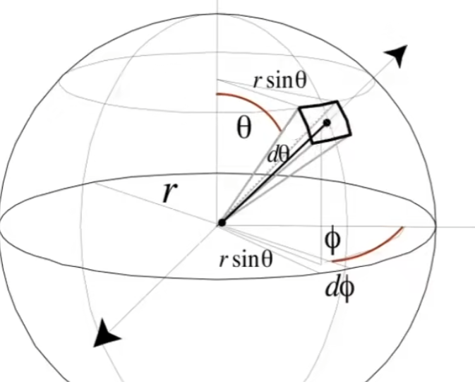
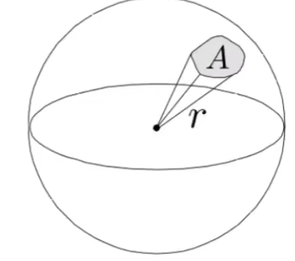
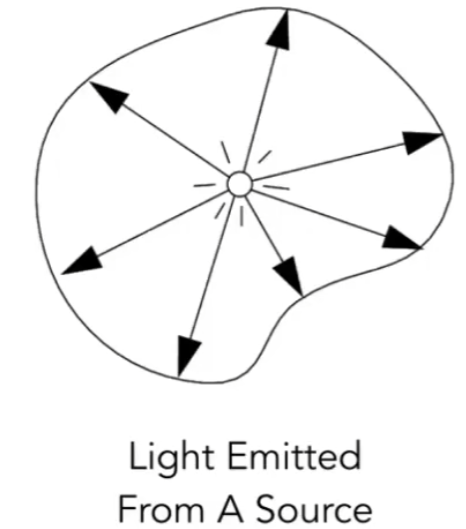
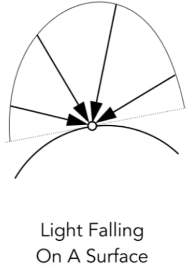
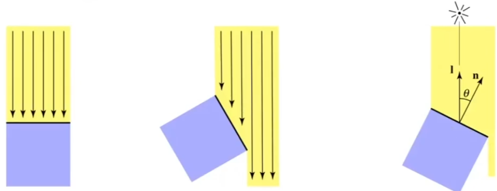
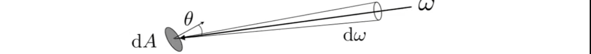
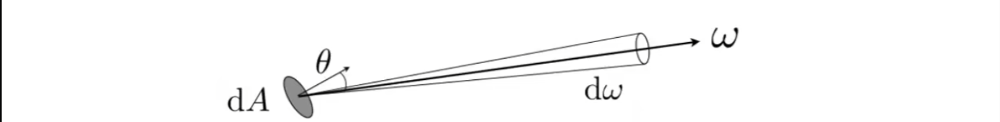
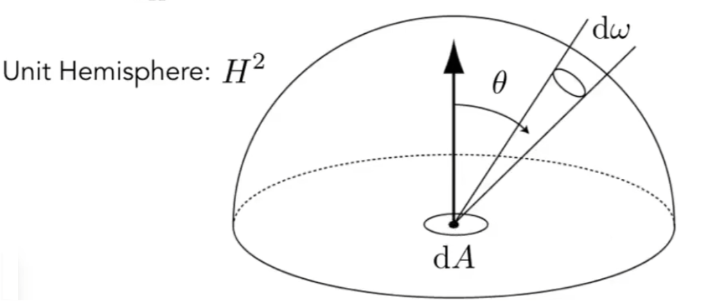

# 辐射度量学Radiometry

辐射度量学用于正确的计算光照

## 0x00 立体角Solid Angle

### 角`Angle`

 ratio of subtended **arc length** on **circle** to radius
$$
\theta=\frac{l}{r}
$$

### 立体角`Solid Angle`

ratio of subtended **area** on **sphere** to radius squared

#### 推导球体上的单位面积

任意空间中的一个方向都可以被投影到球面坐标系下，θ为上方向任意方向夹角，Φ为绕上方向的旋转角，则可以确定在空间中的方向

$$
\because
dA = (rd\theta)(rsin\theta d \phi)=r^2 sin \theta \ d\theta \ d\phi\\
\therefore
d\omega = \frac{dA}{r^2}=sin \theta \ d\theta \ d\phi\
$$

#### 从单位面积推导立体角

可以看出，在θ靠近极点以及赤道的时候数值是不同的，必然导致立体角的变化。**因此立体角对于球面变化不是均匀的**

$$
Ω=\frac{A}{r^2}
$$

## 0x01 Radiant Energy and Flux(Power)

### Radiant Energy

energy of electromagnetic radiation. It's measure in **joule**
$$
Q[J=joule]
$$

### 光通量Radiant flux

energy emitted, reflected, transmitted, received per unit time(单位时间内通过的光总量)
$$
\phi = \frac{dQ}{dt}[W=Watt]
$$

## 0x02光强Radiant Intensity

### Radiant Intensity Defination

The **radiant intensity** is the power **per unit solid angle** emitted by a **point light source**(点光源的单位立体角光通量)

### Radiant Intensity Calculation

$$
I(\omega)=\frac{d\phi}{d\omega}\\
[\frac{W}{sr}=\frac{lm}{sr}=candela]
$$

## 0x03 辉/辐照度Radiant irradiance(E)

### Radiant irradiance Defination

The irradiance is the **total power** received **per(perpendicular/projected) unit area** incident on a surface point(单位面积上的辐射通量)

### Radiant irradiance Calculation

$$
E(x)=\frac{d\phi(x)}{dA}\\
[\frac{W}{m^2}]=[\frac{lm}{m^2}=lux]
$$

### 辉/辐照度Radiant irradiance与Lambert光照模型

由于是作用于投影面积，因此需要重新计算光线投影在表面上的面积，因此更新公式

$$
E=\frac{\phi}{A}\cos(\theta)
$$

### 辉/辐照度在球体上的衰减Radiant irradiance Falloff On Sphere

**光强Intensify并不会随着距离的增加而产生改变，会恒定不变**
$$
已知表面积公式为:S=4\pi r^2\\
因此当r=1时，E=\frac{\phi}{4\pi}\\
当\exist r>1,E'=\frac{\phi}{4\pi r^2}\\\\

\because
\begin{cases}
E=\frac{\phi}{4\pi}\\
E'=\frac{\phi}{4\pi r^2}
\end{cases}\\
\therefore
光线辐照度衰减:E'=\frac{E}{r^2}
$$

## 0x04 辐亮度Radiant Radiance(L)

### Radiant Radiance Defination

#### Concept Recall

1. 辉/辐照度Radiant irradiance的微分：单位面积上的辐射通量
   $$
   E(p)=\frac{d\phi}{dA}
   $$

   

2. 光强Radiant Intensity的微分：点光源的单位立体角光通量，**从某个确定的方向上再辐射能量(该方向由立体角确定)**
   $$
   I(\omega)=\frac{d\phi}{d\omega}\\
   $$

#### Radiant Radiance Def

The radiance is the **directional power** emiitted, reflected, transmitted or received by a surface, **per unit solid angle, per projected unit area**(光或其他电磁波在某个方向上的强度的一个物理量。用于量化单位立体角内、单位面积上、单位时间内发出的辐射能量的多少)

### Radiant Radiance Calculation Methods

#### 入射辐亮度Incident Radiance

Incident Radiance is the irradiance **per unit solid angle** arriving at the surface

描述单位立体角上的辉/辐照度：**光从某一个方向(单位立体角)入射并到达某一个面的能量**
$$
L(p, w) 
=\frac{d\frac{d\phi}{dA}}{d\omega}
=\frac{1}{cos\theta}\frac{dE(p)}{d\omega}
$$

#### 出射辐亮度Exiting Radiance

Exiting Radiance is the intensity **per unit projected area** leaving the surface

描述单位面积上的光强：点光源向周围的某个单位面积上所能投射的辐射通量
$$
L(p, w) 
= \frac{1}{cos\theta}\frac{d\frac{d\phi}{d\omega}}{dA}
=\frac{1}{cos\theta}\frac{dI(p, \phi)}{dA}
$$

#### Radiant Radiance Result

$$
L(p, \omega)
=
\frac{dE(p)}{d\omega \cos(\theta)}
=
\frac{d\phi(p, \omega)}{d\omega}
\frac{d\phi(p, \omega)}{dAcos(\theta)}
=
\frac{d^2\phi(p, \omega)}{d\omega \ dAcos(\theta)}
= \frac{1}{cos\theta}\frac{d^2\phi(p, \omega)}{d\omega \ dA}
$$

### 辉/辐照度和辐亮度的区别The differences of Irradiance and Radiance

#### 概念区分

1. 辉/辐照度`Irradiance(E)`：面积微元`dA`所能接收到**来自四面八方的*全部*能量**

2. 辐亮度`Radiance(L)`：面积微元`dA`所能接收到来自`dω`方向的能量

   

#### 从辐亮度L转化辉/辐照度E

$$
\because
dE(p, \omega) = cos\theta \ L_i(p, \omega) d\omega
\\
\therefore
E(p) 
= \int_{H^2} \, L_i(p, \omega) cos\theta \ d\omega
$$

