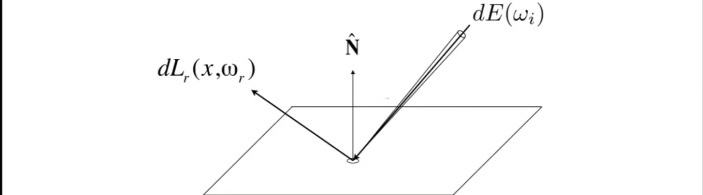
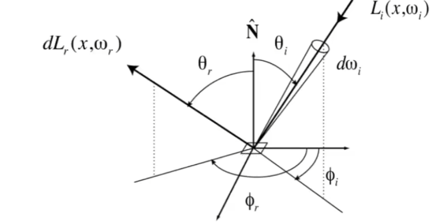
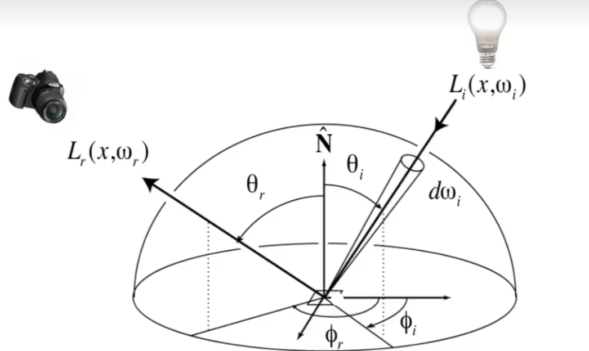
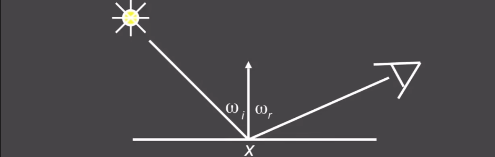
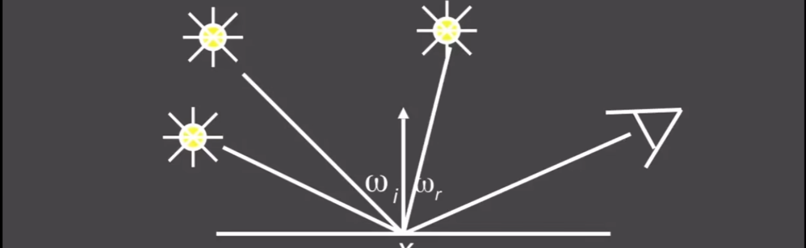
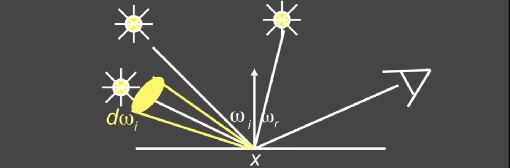

#  双向反射分布函数Bidirectional Reflectance Distribution Function(BRDF)

## 0x00 Bidirectional Reflectance Distribution Function(BRDF)

### 反射Reflection

#### 反射的过程分析

1. 光线射入表面并转化为能量：辐亮度`Radiant Radiance`从携带能量`E`从立体角`ωi`射入并投影到某个表面单位面积`dA`

2. 能量被反射到某个出射方向`ωr`

   

#### 入射光线的总强度计算

入射光线可能由多个辐亮度`L`合成为辐照度`E`，因此给出公式的微元定义

$$
dE(\omega_i) = cos\theta_i \ L_i(\omega_i) d\omega_i\\
$$

### BRDF方程

用于描述一个光线和物体之间的作用关系，因此物体的材质对光线有直接影响

#### BRDF方程定义

根据入射的光线的参数，衡量多少的光被反射到了各个出射方向`ωr`

#### BRDF方程的能量分配比例

计算某一个出射角度占据某一个入射角度**总能量**的一个比例

$$
\because 辐照度微元公式:
dE(\omega_i) = cos\theta_i \ L_i(\omega_i) d\omega_i\\
\therefore
F_r(\omega_i->\omega_r)
= \frac{dL_r(\omega_r)}{dE_i(\omega_i)}
= \frac{dL_r(\omega_r)}{L_i(\omega_r) cos\theta_i \ d\omega_i} >=0
$$

### 反射方程The Reflection Equation

#### The Reflection Equation Calculation

计算某一个着色点的某一个出射角度(摄像机的`look at`射线)在**任意入射角度(四面八方的光照)**的情况下，得到着色点最终的着色情况

1. 辐亮度`Radiant Radiance(L)`：**光从某一个方向(单位立体角)入射并到达某一个面`dA`的能量**

   

   $$
   L(p, \omega_i) 
   =\frac{d\frac{d\phi}{dA}}{d\omega_i}
   =\frac{1}{cos\theta_i}\frac{dE(p)}{d\omega_i}
   =\frac{d^2\phi}{dA \ cos\theta_i \ d\omega_i}
   \\\\
   当考虑面dA=1时，则可以得到 辉/辐照度Radiant \ irradiance(E)\\
   E 
   = dA \int_{H^2}L(p, \omega_i)  cos\theta_i \ \ d\omega_i 
   = \int_{H^2}L(p, \omega_i)  cos\theta_i \ \ d\omega_i
   $$

   

2. 从某个方向看某个着色点

   通过面积`dA`上总的辉/辐照度和BRDF能量分布计算在摄像机的`look at`向量中的着色数值

   

   $$
   \because
   存在BRDF能量分布系数:F_r(\omega_i->\omega_r)\\
   \therefore
   
   L_r(p, \omega_r) 
   = \int_{H^2}F_r(\omega_i->\omega_r) \ L_i(p, \omega_i) cos\theta_i \ d\omega_i
   = F_r(\omega_i->\omega_r)E
   $$

#### The Reflection Equation Challenges

反射方程具有递归定义的特性，经过反射后的辐亮度`Radiance`还会作为积分输入到其他的反射方程中

$$
L_r(p, \omega_r) = \int_{H^2}F_r(\omega_i->\omega_r) \ L_i(p, \omega_i) cos\theta_i \ d\omega_i
$$

#### BRDF的属性

1. 非负性

   

   $$
   F_r(\omega_i->\omega_r) >=0
   $$

   

   

2. 线性`Linearity`：参考`Blinn-Phong`的结果可以有漫反射+环境光+高光进行合成

3. 可逆性：交换入射和出射的方向，`BRDF`等价

   

   $$
   F_r(\omega_i->\omega_r) = F_r(\omega_r->\omega_i) 
   $$

   

4. 能量守恒`Energy conservation`

   

   $$
    \forall\omega_r \int_{H^2}F_r(\omega_i->\omega_r) \ L_i(p, \omega_i) cos\theta_i \ d\omega_i <=1
   $$

## 0x01 渲染方程The Rendering Equation

### 渲染方程The Rendering Equation需要考虑自发光的情况

在反射方程的基础上，再次累加自发光的特性

### 渲染方程的计算The Rendering Equation Calculation

#### 描述自发光的物体Emission

$$
L_e(p, \omega_o)
$$

#### 得到最终渲染方程

包含自发光物体以及来自其他物体的反射

$$
\because
\begin{cases}
Reflection Equation:L_i(p, \omega_i) = \int_{H^2}F_r(\omega_i->\omega_o) \ L_i(p, \omega_i) cos\theta_i \ d\omega_i \\
夹角参数:\cos\theta =\vec{n}\ \vec{\omega_i}
\end{cases}\\\\

\therefore
L_o(p, \omega_o) 
= L_e(p, \omega_o) + L_i(p, \omega_i)\\
= L_e(p, \omega_o) + \int_{H^2}F_r(\omega_i->\omega_o) \ L_i(p, \omega_i) \ cos\theta_i \ d\omega_i \\
= L_e(p, \omega_o) + \int_{H^2}F_r(\omega_i->\omega_o) \ L_i(p, \omega_i) \ \vec{n}\ \vec{\omega_i} \ d\omega_i\\\\

如果考虑入射光线和法线的夹角具备物理意义，即不为钝角\\
L_o(p, \omega_o) 
= L_e(p, \omega_o) + \int_{H^2}F_r(\omega_i->\omega_o) \ L_i(p, \omega_i) \ max(0, \vec{n}\ \vec{\omega_i}) \ d\omega_i \\
= L_e(p, \omega_o) + \int_{H^2}F_r(p, \omega_i, \omega_o) \ L_i(p, \omega_i) \ max(0, \vec{n}\ \vec{\omega_i}) \ d\omega_i
$$

### 渲染方程的分析

#### 仅存在一个点光源

$$
L_r(x, \omega_r) = L_e(x, \omega_r) + F_r(x, \omega_i, \omega_r) \ L_i(x, \omega_i) \ max(0, \vec{n}\ \vec{\omega_i})
$$

#### 存在n个点光源

$$
L_r(x, \omega_r) = L_e(x, \omega_r) + \sum F_r(x, \omega_i, \omega_r) \ L_i(x, \omega_i) \ max(0, \vec{n}\ \vec{\omega_i})
$$

#### 如果光源是一个面

$$
L_r(x, \omega_r) = L_e(x, \omega_r) + \int_{Ω+} F_r(x, \omega_i, \omega_r) \ L_i(x, \omega_i) \ cos \theta_i \ d\omega_i
$$

### 渲染方程的线性算子方程

#### 如果光源是来自其他物体的反射

由于光的反射方向为从`x`点到其他位置角度为`ω`；当光从其他的点发射到`x`点，则角度为`-ω`

$$
L_r(x, \omega_r) = L_e(x, \omega_r) + \int_{Ω} L_r(x', -\omega_i)  \ F_r(x, \omega_i, \omega_r) \ cos \theta_i \ d\omega_i
$$

当物体的材质以及`BRDF`已知，则可以简化该方程

$$
L(u) = e(u) + \int L(v) K(u, v)dv
$$

#### 使用数学算子简化方程

主要需要简化含有积分的部分

$$
已知:L(u) = e(u) + \int L(v) K(u, v)dv\\
利用算子K(u,v)dv，简化得:L=E+KL\\\\
L=E+KL\\
L-KL=EL-KL=E\\
(E-K)L=E\\
(E-K)^{-1}(E-K)L=(E-K)^{-1}E
$$

用于解算L得参数，算子具备类似泰勒展开得特性，**最后收敛于某种亮度**

$$
L=(E-K)^{-1}E\\
=(E+K+K^2+K^3+...)E\\
=E+KE+K^2E+K^3E+...
$$

因此可以将最终看到得着色结果分解为

1. **直接**看到得光源`E`：第0次弹射
2. 光源辐射得能量经过一次反射得到**直接**光照`KE`
3. 光源辐射得能量经过二次反射得到**间接**光照`K^2E`
4. 光源辐射得能量经过N次反射得到**间接**光照`K^3E`

## 0x02 全局光照Global illumination

全局光照是直接和间接光照得到得集合

### 光栅化与全局光照

光栅化只能处理第`0,1`次弹射得光照