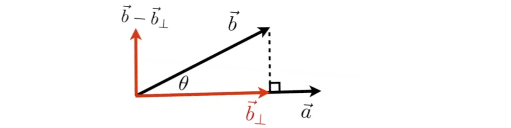
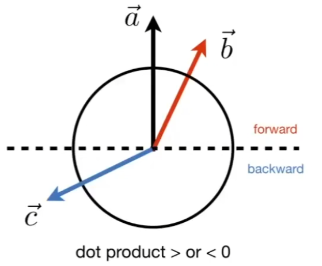
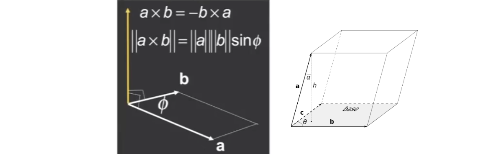
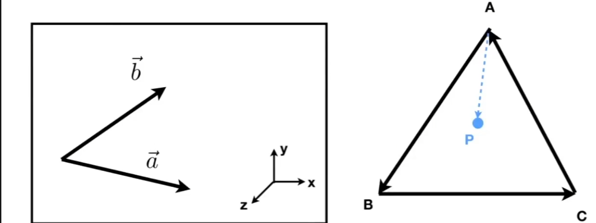

#  Linear Algebra

## 0x00 Basic Mathematics/Physics/Aesthetics? Required

`Linear Algebra`, `Calculus`, `Statistics`, `Optics`, `Mechanics`

## 0x01 向/矢量(Vector)

### 向/矢量的表示方法

向量具有方向和长度，没有绝对的起始位置

$$
\vec{AB}=B(x2, y2) - A(x1, y1) 
$$

## 0x02 向/矢量的归一化/单位向量(Vector Normalization)

### 向量长度的表示(Magnitude of vector)

$$
||\vec{AB}|| = \sqrt{(x_2 - x_1)^2 + (y_2 - y_1)^2}
$$

### 单位向量(unit vector)

单位向量的**大小为1**，用于**表示向量的方向**，可以在后续用于计算法线的方位角
$$
\hat{AB} =  \frac{\vec{AB}}{||\vec{AB}||} = \frac{(x2, y2) - (x1, y1)}{\sqrt{(x_2 - x_1)^2 + (y_2 - y_1)^2}}
$$

但是在实际的计算中，**为了防止长度为0零，矢量无法进行归一化为单位向量**，因此会加上超小数字(`1e-8`)防止分母为0
$$
\vec{v} = (x, y, z)
$$

$$
\hat{v} = \frac{\vec{v}}{||\vec{v}||} = \left( 
\frac{x}{{\sqrt{}x^2 + y^2 + z^2 + 1e{-}8}}, 
\frac{y}{\sqrt{x^2 + y^2 + z^2 + 1e{-}8}}, 
\frac{z}{\sqrt{x^2 + y^2 + z^2 + 1e{-}8}} 
\right)
$$

## 0x03 向量的乘法(Vector Multiplication)

### 点乘(Dot/Scalar Product)

#### a. 点乘的基本用法

$$
\vec{a}\cdot\vec{b} = |a| |b| cosθ
$$

$$
\vec{a}=\begin{bmatrix} a_1 \\a_2 \\a_3 \end{bmatrix} \vec{b}=\begin{bmatrix} b_1 \\b_2 \\b_3 \end{bmatrix} \\
\vec{a} \cdot \vec{b} = \vec{a}^{-1} \cdot \vec{b}= 
\begin{bmatrix} a_1 & a_2 & a_3 \end{bmatrix}
\begin{bmatrix} b_1 \\ b_2 \\ b_3 \end{bmatrix}
= a_1 b_1 + a_2 b_2 + a_3 b_3 \\
$$

#### 推广点乘的定义

$$
\vec{a} \cdot \vec{b} = 
\begin{bmatrix} a_1 & a_2 & a_3 & \dots & a_n \end{bmatrix}
\begin{bmatrix} b_1 \\ b_2 \\ b_3 \\ \vdots \\ b_n \end{bmatrix}
= \sum_{i=1}^{n} a_i b_i
$$

#### 在两个向量均为单位向量时，**在图形学中，用于计算两个向量的夹角的余弦**

$$
\vec{a}\cdot\vec{b} = cosθ
$$

#### b. 投影与分解

1. 点乘与向量投影

   点乘可以计算向量a在b上的投影，该投影必须和b是同向的，用于表示两个矢量在方向上的重合度

$$
\text{Proj}_{\vec{b}} \vec{a} = \frac{\vec{a} \cdot \vec{b}}{\|\vec{b}\|^2} \vec{b}
$$

$$
\text{Proj}_{\vec{b}} \vec{a} = k\hat{b} \\
k = \frac{\text{Proj}_{\vec{b}} \vec{a}}{\hat{b}}=||\text{Proj}_{\vec{b}} \vec{a}||= ||\vec{a}|| cosθ
$$

2. 点乘与向量分解

   在已经获得向量b在a上的投影之后，可以通过**施密特正交化(Schmdit)**得到垂直于投影的向量

#### c. 测量向量方向信息

向量的点乘可以说明向量之间方向性或者是否接近，代表方向基本一致/相反/垂直

| 点乘结果  |       描述       |
| :-------: | :--------------: |
|   大于0   |   方向基本一致   |
|   小于0   |     方向相反     |
| **等于0** | 两个向量之间垂直 |

$$
\vec{a} \cdot \vec{b} > 0 \\
\vec{a} \cdot \vec{c} < 0 \\
\vec{b} \cdot \vec{c} < 0
$$

### 叉乘（Cross Product）

**向量的叉乘用于通过2D坐标创建3D的直角坐标系**

#### 叉乘的基础

叉积用于计算出一个向量同时垂直于两个已知的向量a和b，即**垂直于向量a和b所构成的平面**

$$
\vec{A} \times \vec{B} = |\vec{A}| |\vec{B}| \sin \theta
$$

$$
\vec{x} \times \vec{y} = +\vec{z} \\
\vec{y} \times \vec{x} = -\vec{z} \\
\vec{y} \times \vec{z} = +\vec{x} \\
\vec{z} \times \vec{y} = -\vec{x} \\
\vec{z} \times \vec{x} = +\vec{y} \\
\vec{x} \times \vec{z} = -\vec{y}
$$

#### 叉乘的性质

新的向量的方向由**右手螺旋定则**进行确定，不同的方向导致向量方向改变，因此向量的叉积**不满足交换率**
$$
\vec{a} \times \vec{b} = -\vec{b} \times \vec{a} \\
\vec{a} \times \vec{a} = -\vec{0}
$$

#### 叉乘与矩阵计算

$$
\vec{a} \times \vec{b} 
= \begin{bmatrix}
y_az_b - y_bz_a \\
z_ax_b - x_az_b \\
x_ay_b - y_ax_b
\end{bmatrix} = 
\text{adj}(A)b
=\begin{bmatrix}
0 & -z_a &  - y_a \\
z_a & 0 & -x_a \\
-y_a & x_a & 0
\end{bmatrix} 
\begin{bmatrix}
x_b & y_b & z_b
\end{bmatrix}
$$

#### 叉乘的图形学应用

1. 判断向量的左与右

2. 判断点`P`是否在三角形`ABC`内/外

   **该判断非常重要，用于进行光栅化的判断，即判断三角形覆盖了那些像素**

   首先规定三角形的顺序，默认`A->B->C`，然后假设`P`点分别在`AB, BC, CA`的内侧并进行叉乘运算
   $$
   \vec{a} = \vec{AB} \times \vec{AP} \\
   \vec{b} = \vec{BC} \times \vec{BP} \\
   \vec{c} = \vec{CA} \times \vec{CP} \\
   $$
   

## 0x04 矩阵(Matrix)

### 单位矩阵(对角阵)

只有对角线上由非0的元素且全部为1，而且矩阵必须是一个方阵满足`(nxn)`
$$
E=I_{3x3}=\begin{bmatrix}
1 & 0 & 0 \\
0 & 1 & 0 \\
0 & 0 & 1 \\
\end{bmatrix}
$$

### 矩阵的逆

#### 矩阵的逆的性质

$$
AA^{-1} = A^{-1}A=I=E \\ 
(AB)^{-1} = B^{-1}A^{-1}
$$

### 矩阵乘法(Matrix Multiplication)

#### 矩阵乘法的计算

$$
C_{ij} = \sum_{k=1}^{n} A_{ik} \cdot B_{kj} \\
$$

$$
A = 
\begin{bmatrix}
1 & 2 & 3 \\
4 & 5 & 6
\end{bmatrix}
\quad
B = 
\begin{bmatrix}
7  & 8  & 9  & 10 \\
11 & 12 & 13 & 14 \\
15 & 16 & 17 & 18
\end{bmatrix}
$$

$$
C = A \cdot B = 
\begin{bmatrix}
(1)(7) + (2)(11) + (3)(15) & (1)(8) + (2)(12) + (3)(16) & \dots & (1)(10) + (2)(14) + (3)(18) \\
(4)(7) + (5)(11) + (6)(15) & (4)(8) + (5)(12) + (6)(16) & \dots & (4)(10) + (5)(14) + (6)(18)
\end{bmatrix}=
\begin{bmatrix}
74 & 80 & 86 & 92 \\
173 & 188 & 203 & 218
\end{bmatrix}
$$

#### 矩阵乘法的性质

$$
(AB)C=A(BC) \\
A(B + C) = AB + AC \\
(A + B)C = AC + BC
$$

### 矩阵的转置(Transpose of Matrix)

#### 矩阵转置的计算

$$
A = 
\begin{bmatrix}
1 & 2 & 3 \\
4 & 5 & 6
\end{bmatrix}\\
A^T=\begin{bmatrix}
1 & 4 \\
2 & 5 \\
3 & 6 \\
\end{bmatrix}
$$

#### 矩阵转置的性质

$$
(AB)^T = B^TA^T
$$

