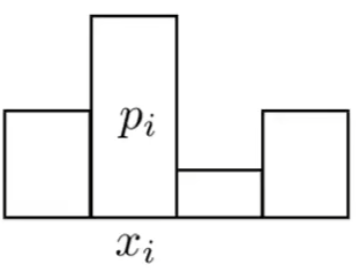
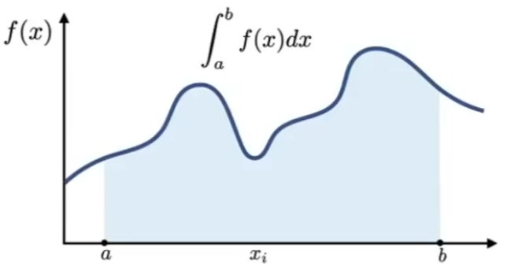
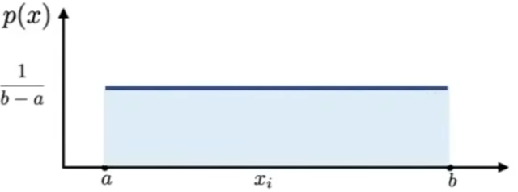
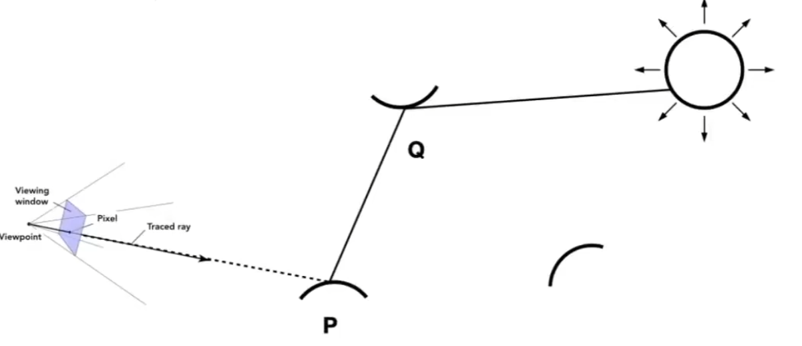
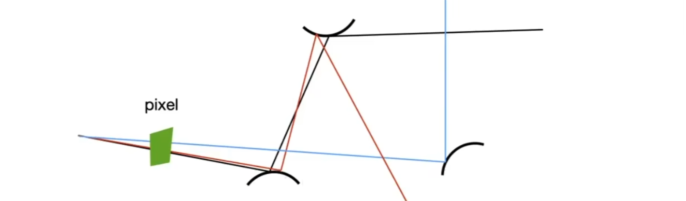
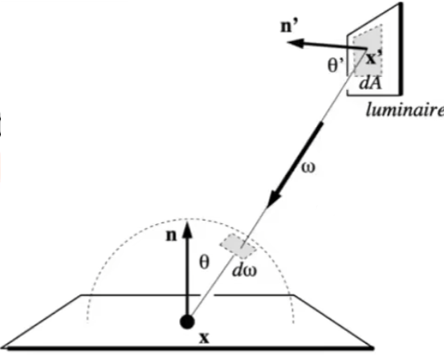

# 蒙特卡洛路径积分Monte Carlo Integration

## 0x00 Probabilities

### 随机变量Random variables

#### 基本概念

$$
X:随机变量，表示数值的分布\\
X~p(x):概率密度函数(Probability \ Density \ Functions)，描述一个随机过程选择数值的概率 
$$


#### 概率的性质

$$
\sum_{i=1}^np_i=1(p_i>=0)
$$


### 数学期望Expected Value

#### 离散情况的数学期望

不断的去取随机变量，并计算这些数值的**平均**


$$
E(x)=\sum_{i=1}^nx_ip_i
$$


#### 连续情况的数学期望

有一个可以去连续的值的随机变量，该变量`X`的概率密度函数为`p(x)`

1. 连续情况的性质
   $$
   \int p(x)dx = 1且p(x)>=0
   $$
   
2. 连续情况的数学期望公式
   $$
   E(x)=\int xp(x)dx
   $$
   
3. 随机变量`X`的一个函数`f(x)`通用也是一个随机变量
   $$
   \because
   \begin{cases}
   X-p(x)\\
   Y=f(x)
   \end{cases}\\\\
   \therefore
   E(Y)=E(f(x)) =\int f(x)p(x)dx
   $$
   


## 0x01 蒙特卡洛积分Monte Carlo Integration

蒙特卡罗积分用于处理无法写出解析式的方程，最后产生数值

### 蒙特卡洛积分与黎曼积分的不同

相比牛顿莱布尼茨以及黎曼积分方法，蒙特卡洛积分采用随机采样的方法计算

试图用一个标准长方形去近似一个不规则形状，将面积累加并求平均

### 蒙特卡洛积分的定义

1. 先定义黎曼定积分

   
   $$
   \int_a^bf(x)dx
   $$

   

2. 引入随机变量
   $$
   X_i-p(x)
   $$


### Monte Cailo Estimator

#### 均匀的采样Uniform Random Variable

当从积分下限`a`向上限`b`**均匀的采样**，因此概率密度函数的数值必须是一个常数`C`


$$
X_i-p(x)=C\\\\
\because概率密度函数是一个常数且概率之和为1\\
\therefore
\int_a^bp(x)dx=\int_a^bCdx=1
\\=>C=\frac{1}{b-a}
$$


#### 非均匀的采样

本质原理为将所有的`X=Xi`采样点纵坐标`f(Xi)`和长`b-a`进行计算，得到`Xi`个矩形的面积，最后累加所有的矩形面积最后求平均

将公式进行推广到不均匀的概率密度函数：
$$
已知:f(x)以及积分上下界之间的采样概率密度函数p(x)\\
当概率p(x)不均与时，采样结果就需要除以概率密度，来消除不平均的影响，因此:
选择随机采样数值X_i，计算\frac{f(X_i)}{p(X_i)}的平均值\\\\


\int_a^b f(x)dx = \frac{1}{N}\sum_{i=1}^N\frac{f(X_i)}{p(X_i)}
$$


## 0x02 渲染方程Rendering Equation

解算渲染方程Rendering Equation

### 渲染方程的结构

渲染方式是一个含有积分且函数递归定义的函数
$$
L_o(p, \omega_o) = L_e(p, \omega_r) 
                  + \int_{Ω+} F_r(p, \omega_i, \omega_o) \ L_i(p, \omega_i) \ (\vec{n} \ \vec{\omega_i}) \ d\omega_i
$$


### 仅考虑直接光照的蒙特卡洛积分

#### 简化问题

为了简化问题，因此假设**当前的面`dA`本身不发光**且**目前只考虑直接光照**
$$
简化后的方程:L_o(p, \omega_o) =  \int_{Ω+} F_r(p, \omega_i, \omega_o) \ L_i(p, \omega_i) \ (\vec{n} \ \vec{\omega_i}) \ d\omega_i
$$


#### 使用均匀采样

采样方法`p(ωi)`涉及到如何对于半球积分域`Ω`进行采样，此处建议使用**均匀采样**
$$
已知在单位半球上区域Ω进行积分，半球表面积为S=\frac{1}{2}4\pi r^2=2\pi，因此均匀采样为\frac{1}{2\pi}\\

\because
\begin{cases}
蒙特卡洛积分:\int_a^b f(x)dx = \frac{1}{N}\sum_{i=1}^N\frac{f(X_i)}{p(X_i)}\\
半球均匀采样:p(\omega_i)=\frac{1}{2\pi}\\
f(x)=F_r(p, \omega_i, \omega_o) \ L_i(p, \omega_i) \ (\vec{n} \ \vec{\omega_i})
\end{cases}\\\\
L_o(p, \omega_o)
=  \int_{Ω+} F_r(p, \omega_i, \omega_o) \ L_i(p, \omega_i) \ (\vec{n} \ \vec{\omega_i}) \ d\omega_i \\
= \frac{1}{N}\sum_{i=1}^N\frac{f(x)}{p(\omega_i)} = \frac{1}{N}\sum_{i=1}^N\frac{F_r(p, \omega_i, \omega_o) \ L_i(p, \omega_i) \ (\vec{n} \ \vec{\omega_i})}{p(\omega_i)}
$$


#### 伪代码实现

```c++
constexpr static float PI = 3.1415926f; 
shade(Point, ωo){
    Lo = 0.0f;
    //从 P 点向半球上发射 N 根任意的光线射线用于随机采样，并将光线的立体角进行记录
    ωi = choose N directions Randomly;
    //遍历所有发出的光线
    for_each(ω:ωi){
        //从点Point触发，以立体角ω生成一条射线
        auto ray = generate_ray(Point, ω);
        //如果射线可以打到光源，则计算蒙特拉罗积分
        if(is_intersect(ray, light)){
            //实现球面均匀采样的蒙特卡罗积分
            Lo = (1 / N) * Li * Fr * dot(n, ω) / (1 / 2 * PI);
        }
    }
    return Lo;
}
```


### 考虑其他物体的间接光照

#### 支持全局光照



#### 伪代码实现

```c++
constexpr static float PI = 3.1415926f; 
shade(Point, ωo){
    Lo = 0.0f;
    //从 P 点向半球上发射 N 根任意的光线射线用于随机采样，并将光线的立体角进行记录
    auto[] ωi = choose N directions Randomly;
    //遍历所有发出的光线
    for_each(ω : ωi){
        //从点Point触发，以立体角ω生成一条射线
        auto ray = generate_ray(Point, ω);
        //如果射线可以打到光源，则计算蒙特拉罗积分
        if(is_light(ray, light))
        {
            //实现球面均匀采样的蒙特卡罗积分
            Lo = (1 / N) * Li * Fr * dot(n, ω) / (1 / 2 * PI);
        }
        //如果射线达到了物体，则计算来自物体的反射
        else if(is_object(ray))
        {
            auto Q = calc_object_intersect(ray);
            //因为规定光线从点向外辐射为正方向，因此由object_point向点Point辐射为负数
            Lo = (1 / N) * shade(Q, -ω)  * Fr * dot(n, ω) / (1 / 2 * PI);
        }
    }
    return Lo;
}
```


#### 递归性能问题

1. 指数爆炸的问题Explosion of rays

   由于在代码中生成了`N`根光线，因此在进行进行递归计算时每一个光线还会再次生成N根光线，造成**指数爆炸**
   $$
   N^{bounces}\\
   但是，当N=1的时候，N^{bounces}=1\\\\
   $$

   ```c++
   constexpr static float PI = 3.1415926f; 
   shade(Point, ωo){
       Lo = 0.0f;
       //从 P 点向半球上发射 1 根任意的光线射线用于随机采样，并将光线的立体角进行记录
       auto ω = choose 1 directions Randomly;
   
       auto ray = generate_ray(Point, ω);
       //如果射线可以打到光源，则计算蒙特拉罗积分
       if(is_light(ray, light)){
           Lo = Li * Fr * dot(n, ω) / (1 / 2 * PI);
       }
       //如果射线达到了物体，则计算来自物体的反射
       else if(is_object(ray)){
           auto Q = calc_object_intersect(ray);
           //因为规定光线从点向外辐射为正方向，因此由object_point向点Point辐射为负数
           Lo = shade(Q, -ω)  * Fr * dot(n, ω) / (1 / 2 * PI);
       }
       return Lo;
   }
   ```


2. 递归的终止条件

   在现实中，光线的弹射是无限的。但是在计算机中光线的弹射并不能直接限制在某一个数值上，否则会导致光损失能量

   引入俄罗斯轮盘赌`Russian Roulette(RR)`


## 0x03 路径追踪Path Tracing

当使用`N=1`的时候来进行蒙特卡洛积分，则为路径追踪

### 解决递归终止条件

#### 俄罗斯轮盘赌Russian Roulette(RR)与概率

1. 安全状态： `0 < P < 1`

2. 非安全状态：`1 - P`

   

#### 俄罗斯轮盘赌Russian Roulette与终止条件

设置一个概率P(`0 < P < 1`)并将着色结果`Lo`除以概率
$$
\frac{L_o}{P}
$$


当概率为`1-P`时，不要发射射线，因此结果为`0`

最终可以得到数学期望
$$
E = P*\frac{L_o}{P} + (1-P)*0= L_o
$$


#### 伪代码实现终止递归

```c++
#include<random>

//设置Russian Roulette的概率参数
constexpr static float P_RR = 0.4f; 
constexpr static float PI = 3.1415926f; 

//生成0-1概率范围内的随机数值
std::random_device rnd;
std::mt19937 mt(rnd());
std::uniform_real_distribution<float> unf(0.0f, 1.0f);

auto shade(Point, ωo){
    //生成随机概率并判断概率比值
    if(unf(mt) > P_RR){
        return 0.0f;
    }
    
    Lo = 0.0f;
    //从 P 点向半球上发射 1 根任意的光线射线用于随机采样，并将光线的立体角进行记录
    auto ω = uniformly choose 1 directions Randomly;

    auto ray = generate_ray(Point, ω);
    //如果射线可以打到光源，则计算蒙特拉罗积分
    if(is_light(ray, light)){
        Lo = Li * Fr * dot(n, ω) / (1 / 2 * PI) / P_RR;
    }
    //如果射线达到了物体，则计算来自物体的反射
    else if(is_object(ray)){
        auto Q = calc_object_intersect(ray);
        //因为规定光线从点向外辐射为正方向，因此由Q向点Point辐射为负数
        //根据最后返回结果除以概率
        Lo = shade(Q, -ω)  * Fr * dot(n, ω) / (1 / 2 * PI) / P_RR;
    }
    return Lo;
}
```


### Ray Generation



为了解决`N=1`时采样率过低造成的噪声问题，因此进行**多次路径追踪**求得**每个像素**的平均辐亮度

```c++
auto ray_generation(camPos, one_pixel){
    //当前one_pixel的平均辐亮度
    cur_pixel_radiance = 0.0f;
    //在像素上取N个均匀的位置
    auto []samples = choose N uniformly sample position in one_pixel;
    
    for(sample: samples){
        //从摄像机位置向像素上的细分点发射射线
        camera_to_sample = generate_ray(camPos, sample);
        
        //如果光线和场景存在交点
        if(is_scene(ray)){
            //计算交点坐标
            auto scene_pos = intersect_at(ray);
            
            //计算累加的平均辐亮度
            cur_pixel_radiance += (1 / N) * shade(scene_pos, -camera_to_sample);
        }
    }
    return cur_pixel_radiance;
}
```


## 0x04 对光源采样Sampling The Light

着色点会均匀的向球面发出多个射线，但是如果**当光源很小**的时候，则**需要发射很多条射线**才能采样到光源，造成**浪费**

### 蒙特卡洛与光源采样

蒙特卡洛可以实现对于光源的完全采样，可以**直接对光源进行采样**



#### 光源的采样概率

假设光源的采样是均匀的，满足
$$
\int p(A) \ dA = 1 => p(A)   = \frac{1}{A}
$$


#### 寻找光源表面`A`和单位立体角`ω`的关系

只需要将`dω`转化为对`dA`的积分，实现积分换元

1. 计算`dA`在`dω`方向得投影，计算角度
   $$
   dAcos\theta'
   $$
   
2. 根据立体角得定义可以得到光源在着色点得立体角
   $$
   d\omega = \frac{dAcos\theta'}{||\vec{x'}-\vec{x}||^2}
   $$


#### 将渲染方程转化为在光源表面`dA`的积分

利用换元积分将着色点得立体角转化为光源表面`dA`
$$
\because
已知渲染方程和立体角和表面得转换关系
\begin{cases}
L_o(p, \omega_o)
=  \int_{Ω+} F_r(p, \omega_i, \omega_o) \ L_i(p, \omega_i) \ (\vec{n} \ \vec{\omega_i}) \ d\omega_i \\
d\omega = \frac{dAcos\theta'}{||\vec{x'}-\vec{x}||^2}
\end{cases}\\\\

L_o(p, \omega_o)
= \int_{Ω+} F_r(p, \omega_i, \omega_o) \ L_i(p, \omega_i) \ (\vec{n} \ \vec{\omega_i}) \ d\omega_i \\
= \int_{Ω+} F_r(p, \omega_i, \omega_o) \ L_i(p, \omega_i) \ (\vec{n} \ \vec{\omega_i}) \ d \frac{dAcos\theta'}{||\vec{x'}-\vec{x}||^2} \\\\
cos\theta'和||\vec{x'}-\vec{x}||^2属于常数\\

\therefore
L_o(p, \omega_o)
= \int_{Ω+} F_r(p, \omega_i, \omega_o) \ L_i(p, \omega_i) \ (\vec{n} \ \vec{\omega_i}) \ d \frac{dAcos\theta'}{||\vec{x'}-\vec{x}||^2} \\
= \int_{A} F_r(p, \omega_i, \omega_o) \ L_i(p, \omega_i) \ (\vec{n} \ \vec{\omega_i}) \frac{cos\theta'}{||\vec{x'}-\vec{x}||^2} dA
$$


再次利用蒙特卡罗积分
$$
\because
\begin{cases}
蒙特卡洛积分:\int_a^b f(x)dx = \frac{1}{N}\sum_{i=1}^N\frac{f(X_i)}{p(X_i)}\\
半球均匀采样:p(A)=\frac{1}{A}\\
f(x)= F_r(p, \omega_i, \omega_o) \ L_i(p, \omega_i) \ (\vec{n} \ \vec{\omega_i}) \frac{cos\theta'}{||\vec{x'}-\vec{x}||^2} 
\end{cases}\\\\
\therefore
L_o(p, \omega_o)
= \frac{1}{N}\sum_{i=1}^N\frac{F_r(p, \omega_i, \omega_o) \ L_i(p, \omega_i) \ (\vec{n} \ \vec{\omega_i}) \frac{cos\theta'}{||\vec{x'}-\vec{x}||^2} }{\frac{1}{A}}
$$


#### 考虑到对光源采样的路径追踪Path Tracing

1. 光来自于直接光源：使用在光源表面`dA`的渲染方程且**不需要使用**俄罗斯轮盘赌Russian Roulette

2. 光来自于非光源的间接光线：使用一般的渲染方程且**需要使用**俄罗斯轮盘赌Russian Roulette

   **且，当间接光源打到光源时，直接返回0即可，因为直接光源已经被计算一次了**

   ```c++
   #include<random>
   
   //设置Russian Roulette的概率参数
   constexpr static float P_RR = 0.4f; 
   constexpr static float PI = 3.1415926f; 
   
   //生成0-1概率范围内的随机数值
   std::random_device rnd;
   std::mt19937 mt(rnd());
   std::uniform_real_distribution<float> unf(0.0f, 1.0f);
   
   //计算Point点的直接光照
   auto direct_light_source(Point){
       auto x' =  uniformly choose 1 light on dA;
       //生成光线的射线
       auto ray = x' - Point;
       //射线上存在物体阻碍则直接返回
       if(is_object(ray)){
           return 0.0f;
       }
       return Li * Fr * dot(n, ω) * cosθ' * / pow(||x' - Point||, 2) / P(A);    
   }
   
   //计算Point点来自其他物体的间接光照
   auto indirect_light_source(Point, ωo);{
        Lindirect = 0.0f;
        //生成随机概率并判断概率比值
       if(unf(mt) > P_RR){
           return 0.0f;
       }
       
       //从 P 点向半球上发射 1 根任意的光线射线用于随机采样，并将光线的立体角进行记录
       auto ω = uniformly choose 1 directions Randomly;
       
        //如果射线达到了一个物体
       if(is_object(ray)){
           //计算重合信息
           auto Q = calc_object_intersect(ray);
           
           //如果射线达到了一个光源
            if(is_light(Q)){
            	return 0.0f;
            }
           
           //因为规定光线从点向外辐射为正方向，因此由Q向点Point辐射为负数
           //根据最后返回结果除以概率
           Lindirect = shade(Q, -ω)  * Fr * dot(n, ω) / (1 / 2 * PI) / P_RR;
       }
       return Lindirect;
   }
   
   //计算光来自于直接光源和间接光源之和
   auto shade(Point, ωo){
       return direct_light_source(Point) + indirect_light_source(Point, ωo);
   }
   ```

   
