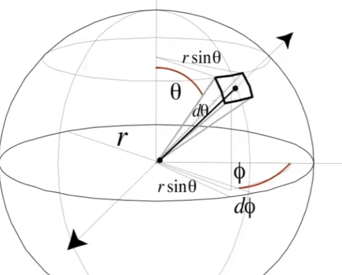

# Appearance of Materials

## 0x00 Material

`3D`网格模型通过为不同的部分指定不同的材质

### 什么决定了Material

#### 双向反射分布函数`BRDF`

通过双向反射分布函数`BRDF`决定了材质

#### 影响物体着色的方程


$$
\because 
\begin{cases}
BRDF方程的能量分配比例:
F_r(Point, \ \omega_i, \ \omega_r)
= \frac{dL_r(\omega_r)}{dE_i(\omega_i)}
= \frac{dL_r(\omega_r)}{L_i(\omega_r) cos\theta_i \ d\omega_i}\\
渲染方程
L_o(Point \ , \omega_o) 
= L_e(Point \ , \omega_o) + \int_{H^2}F_r(Point \ , \omega_i, \omega_o) \ L_i(Point \ , \omega_i) \ max(0, \vec{n}\ \vec{\omega_i}) \ d\omega_i
\end{cases}
$$


### 常见的反射模型

#### 100%漫反射模型(Lambert)

当前的物体不会自发光，因此简化渲染方程。同时入射的辐亮度也是一个常数


$$
L_o(Point \ , \omega_o) 
= \int_{H^2}F_r(Point \ , \omega_i, \omega_o) \ L_i(Point \ , \omega_i) \ max(0, \vec{n}\ \vec{\omega_i}) \ d\omega_i \\
=  L_i(Point \ , \omega_i) \ \int_{H^2}F_r(Point \ , \omega_i, \omega_o) \ max(0, \vec{n}\ \vec{\omega_i}) \ d\omega_i
$$


光线被均等的反射到了其他的所有方向，因此`BRDF`反射分布函数是一个常数


$$
F_r(Point, \ \omega_i, \ \omega_r) = C
$$


最终简化渲染方程




$$
L_o(Point \ , \omega_o) 
=  L_i(Point \ , \omega_i) \ \int_{H^2}F_r(Point \ , \omega_i, \omega_o) \ max(0, \vec{n}\ \vec{\omega_i}) \ d\omega_i \\
= F_r(Point, \ \omega_i, \ \omega_r) \ L_i(Point \ , \omega_i) \ \int_{H^2} max(0, \vec{n}\ \vec{\omega_i}) \ d\omega_i \\
=  F_r(Point, \ \omega_i, \ \omega_r) \ L_i(Point \ , \omega_i) \ \int_{H^2} cos\theta_i \ d\omega_i \\
= F_rL_i \int_0^{2\pi}\int_{0}^{\frac{\pi}{2}} sin \theta \ cos\theta_i\ d\theta \ d\phi\ \\
= \pi F_rL_i\\\\

\because
\begin{cases}
渲染方程:L_o  = \pi F_rL_i \\
能量守恒，入射Radiance=出射Radiance:L_o = L_i
\end{cases}\\\\

\therefore
F_r = \frac{L_o}{\pi L_i} = \frac{1}{\pi}
$$


推广公式，可以得到含有反射率的漫反射材质`Albedo`


$$
F_r = \frac{L_o}{\pi L_i} = \frac{\rho}{\pi}
$$


#### 抛光金属材质Glossy Material


### 反射与折射

#### 玻璃以及水的材质Ideal Reflected/refractive material

即有反射又有折射的出现

####  折射Specular Refraction


$$
\because
\eta_i \ sin\theta_i = \eta_t \ sin\theta_t\\
\therefore
cos \theta_t
= \sqrt{1 - sin^2\theta_t} \\
= \sqrt{1 - ({\frac{\eta_i}{\eta_t})^2}sin^2\theta_i} \\
= \sqrt{1 - ({\frac{\eta_i}{\eta_t})^2}(1 - cos^2\theta_i)} \\\\
当1 - ({\frac{\eta_i}{\eta_t})^2}(1 - cos^2\theta_i) <0时，则折射没有意义\\
所以仅当\frac{\eta_i}{\eta_t} <=1时，折射才有意义;否则发射全反射现象(Total \ Internal \ Reflection)
$$


#### 菲涅耳项Fresnel Reflection

反射的角度决定了多少的能量会被反射

**菲涅耳项与导电性质有关**

1. 如果是绝缘体：如果光和物体法线垂直，则反射率越高；反之，穿透率高
2. 如果是导体(金属)：反射率都高，无论方向；导体的折射率是一个复数

#### 完美反射Perfect Specular Reflection

入射光线和出射光线的角分线必然是法线`n`，且根据平行四边形法则，入射和出射光线可以合成法线


$$
\because
\vec{\omega_i} + \vec{\omega_o} =2cos\theta \ \vec{n} = 2 (\vec{\omega_i} \ \vec{n}) \ \vec{n} \\ 
\therefore
\vec{\omega_o} = 2 (\vec{\omega_i} \ \vec{n}) \ \vec{n}  - \vec{\omega_i}
$$


## 0x01 微表面模型Microfacet Theory

假设物体的表面时粗糙的，但是**从远处看**表面则近似为**粗糙的平面材质**; 从近处看则可以看到**几何**，同时对表面进行微元处理并形成镜面反射`Specular`

### 微表面模型的应用

可以表示金属，皮革，木制材料，等等

### 微表面模型的法线分布BRDF

#### 微表面的法线分布

1. 如果微表面的法线几乎宏观朝上：则生成**抛光金属材质**进行镜面反射
2. 如果微表面的法线方向各部相同，分布广，法线之间离中心远：则生成漫反射模型

#### 微表面的半程向量`h`


将微表面近似为镜面反射，计算**有多少微表面中的法线**可以将入射光反射到出射光的方向

#### 微表面的掠射角度`Grasing Angle`

当光和物体表面几何平行时，容易产生表面遮蔽。

#### 微表面的法线BRDF

1. 法线分布：表示法线在给定方向上的分布数值`D(h)`

2. 菲涅尔项：总共有多少能量被反射`F(i, h)`

3. `Shadowing Masking Term`：微表面之间存在互相遮挡，尤其是当光以和法线垂直`G(i,o,h)`，防止边界特别亮的情况

   

$$
F_r(Point, \ \omega_i, \ \omega_o) = 
\frac{D(h) \ F(i,h) \ G(i,o,h)}
{4 (\vec{n} \ \vec{i})(\vec{n} \ \vec{o})}
$$


### 双向各项同性材质

微表面并不存在方向性，法线分布是均匀的

#### 双向各项同性与BRDF

如果满足各项同性，`BRDF`只和相对方位角有关，因此`BRDF`可以将`4D`降维`3D`
$$
F_r(\theta_i, \phi_i; \theta_r, \phi_r) = F_r(\theta_i, \theta_r, |\phi_r - \phi_i|)
$$


### 双向各项异性材质

比如现实中的炒菜锅的锅底，拉丝金属，尼龙`Nylon`等等

#### 双向各项异性与微表面

法线分布均有明显的分布性质

#### 双向各项异性与BRDF

如果将模型在方向角`Φ`上旋转，当得到的`BRDF`不同则为双向各项异性


$$
F_r(\theta_i, \phi_i; \theta_r, \phi_r) \not = F_r(\theta_i, \theta_r, \phi_r - \phi_i)
$$


## 0x02 BRDF的测量

通过物理测量菲涅尔项得到更为精准的`BRDF`

### Image-based BRDF Measurement

#### Gonioreflectometer(Spherical Gantry) & Control Algo


```c++
for_each(out){
    //移动光源到指定的角度out
    auto [out_ω, out_φ] = move_light(out);
    for_each(in){
        //移动传感器
        auto [in_ω, in_φ] = move_sensor(in);
        
        //获取参数4D
        res[out_ω][out_φ][in_ω][in_φ] = get_param();
    }
}
```


#### Problem

数据降维：如果BRDF为各向同性，则可以将数据降维为相对方位角


### BRDF数据的表示和存储

#### (神经网络)压缩

#### MERL BRDF DB

测量各项同性材质的`BRDF`参数

