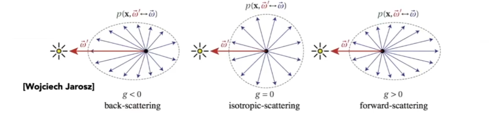

# Advanced Topics in Rendering

## 0x00  蒙特卡洛估计Monte Carlo Estimators

### 蒙特卡洛无(有)偏估计(Un)biased Monte Carlo Estimators

### 蒙特卡洛无偏估计Unbiased Monte Carlo Estimators

蒙特卡洛估计结果的数学期望再无论多少个样本数量下都是正确的

### 蒙特卡洛有偏估计biased Monte Carlo Estimators

估计的数学期望和样本数量有关，但是当样本数量无穷多时，则期望值会收敛

## 0x01  Advanced Light Transport

### 无偏光线传播Unbiased Light Transport Methods

#### 双向路径追踪`Bidirectional path tracing(BDPT)`

利用光路可逆，从相机发射射线到光源；同时从光源发射射线；计算射线的交点

适合的光线传播集中在光源的情况，**但是，实现非常复杂且运行速度慢**

#### `Metropolis light transport(MLT)`

利用马尔科夫链`Markov`根据当前样本生成一个类似的下一个样本

在一个`path`周围生成多个其他的路径，直到将所有的路径生成

**适合复杂的场景，MLT方法很难计算收敛**

### 有偏光线传播Biased Light Transport Methods

如果最终得到的渲染结果呈现模糊，则是有偏光线传播；但是当样本数量足够多时，则图像可以收敛于不模糊的结果，则为一致

#### 光子映射`Photon mapping`

1. 从光源出发：光源辐射光线/子，如果碰到物体则反射和折射，直到到达`Diffuse`表面

2. 从摄像机出发：从摄像机发射，如果碰到物体则反射和折射，直到到达`Diffuse`表面

   

   

3. 计算局部的密度估计`local density estimation`

   根据着色点局部的光子的分布，如果越集中则更亮；如果越分散则暗

   

$$
Local \ Density \ Estimation: \frac{d N}{ d A} \not = \frac{\triangle N}{ \triangle A}
$$

在进行密度估计时，在微小的面积`dA`计算光子数量，但是光子的数量并不是无限的，因此密度的估计并不准确，除非`dA`趋近于`▲A`

**适合渲染聚焦的场景，以及折射-漫反射-折射的场景Specular-Diffuse-Specular(SDS)**

#### `Vertex connection and merging(VCM)`

结合`BDPT`和`Photon mapping`，如果光线之间满足光子局部共面，则利用光子映射将两者的贡献结合在一起

### 实时辐射度算法Instant Radiosity(IR)

在光线传播中并不会非常明确的区分光线的来源途径，可以是直接也可以间接

#### 虚拟光源`Virtual Point Light(VPL)`

从光源发出光线且光线会打到某些位置上，形成新的虚拟光源`VPLs`

#### 渲染方法

当摄像机看向某个着色点时，则用多个`VPLs`充当直接光源去照亮着色点

**但是，VPL不能用于处理Glossy物体**

## 0x02 外观建模Advanced Appearance Modeling

外观则为材质，材质则为`BRDF`

### 非表面模型Non-surface Model

#### 散射介质`Participating Media`

定义在空间中的模型，例如：体积雾，体积云层

当光在行进过程中会发生若干事情，可以将光线吸收`Absorption`或者(随机)散射

光线可以被从各个不同的方向反射，反射方向由相位函数`Phase Function`定义

#### 人毛发`Human Hair Appearance`

问题可以近似为，光线到达圆柱体上`Kajiya-Kay Model`的散射，会散射出一个圆锥以及高光(`Diffuse + specular`)

真实的**单根**头发模型`Marschner Model`，类似于柱体状的玻璃容器

1. 考虑了光线会被反射R
2. 有的光线穿透头发发生两次折射(TT)
3. 有的光线穿透头发T后与头发内壁发生反射R又发生穿透离开头发T(TRT)

#### 动物毛发`Animal Fure`

相比人类毛发，动物毛发中存在髓质，因此为双重的圆柱模型

1. 考虑了光线会被反射R

2. 有的光线穿透头发发生两次折射(TT)

3. 有的光线穿透头发T后与头发内壁发生反射R又发生穿透离开头发T(TRT)

4. 有的光线穿透头发T后与**髓质Medulla**发生散射(TTs)

5. 有的光线穿透头发T后与**髓质Medulla**发生散射后与头发内壁发生反射R又发生穿透离开头发T(TRTs)

   

#### 颗粒状模型Granular Material 

### 表面模型Surface Models

#### 透光材质`Translucent Material`

光线从某点进入物体，经过多次散射后再次出物体，因此为次表面散射

#### 次表面散射`Subsurface Scattering`

$$
BRDF方程:L_o(p, \omega_o) = \int_{H^2}F_r(p, \omega_i, \omega_o) \ L_i(p, \omega_i) \ max(0, \vec{n}\ \vec{\omega_i}) \ d\omega_i
$$

在`BRDF`概念**(光线作用域一个表面的点上)**的基础上进行延申，变为增加了`BSSRDF`**(光线从任一点进入物体，从任意一点出物体)**

$$
已知:
\begin{cases}
x_i,x_o光线的入口和出口的点坐标\\
\omega_i, \omega_o光线的进入和出去方向\\
S(x_i, \omega_i, x_o, \omega_o)
\end{cases}\\\\
BSSRDF的光线和其他光线在表面的位置以及入射方向均有关，因此
BSSRDF方程:\\L(x_o, \omega_o)=
\int_{A}\int_{H^2}S(x_i, \omega_i, x_o, \omega_o) \ L_i(p, \omega_i) \ max(0, \vec{n}\ \vec{\omega_i}) \ d\omega_i \ dA
$$

#### 布料Cloth

由一系列缠绕的纤维得到一股`Ply`布料，一股`Ply`布料可以形成一个线`Yarn`，一个线`Yarn`可以生成完整布料`Woven, Knitted`

### 程序化生成Procedural Appearance

在没有材质的情况下生成物体的纹理

#### 噪声函数

用于生成地形，以及水面

