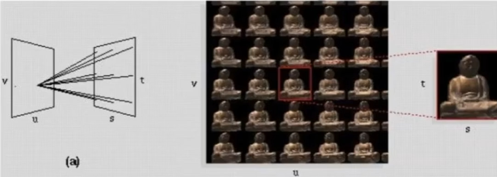

# Camera, Lenses, Light Fields

## 0x00 Camera

### 针孔摄像机Pinhole Camera

在进行光线追踪是采用的是针孔摄像机的模型，因此在不同的位置不会出现模糊，即景深的效果

#### 视场Field Of View(FOV)

可以看到的范围，在实践中，通常使用**等效35mm胶片**作为传感器的大小h

$$
FOV=2arctan(\frac{h}{2f})
$$

#### 快门Physical Shutter

当快门的时间更长的时候，物体会产生位移，会造成**(高速)**运动的物体模糊`Motion Blur`

如果快门时间不变，物体运动速度越快，则模糊程度更严重

**但是当物体运动速度过快时，快门的打开过程`Rolling Shutter`则会造成图像的扭曲**

#### 曝光Exposure(H)

`Irradiance`由光圈`Aperture`进行控制

$$
已知:
\begin{cases}
Exposure \ Time(由快慢速度Shutter \ Speed控制):T\\
Irradiance:E
\end{cases}
=>
H = T \times E
$$

曝光等级`Exposure Level`:`F-Number(F-Stop)`

如果快门时间减少了了，则光圈需要增大，放入更多的光线

#### 增益Gain(ISO)

简单的在最终结果上进行线性信号放大，**但是同样也放大了噪声**

### 摄像机传感器Camera Sensors

#### Why Not Sensor Without Lenses

**传感器只能用于记录辉/辐照度`Radiant irradiance`**，传感器会将各个方向的光于某一点

## 0x01 薄透镜Thin Lens Approximation

### The Thin Lens Equation

平行光水平入射透镜，会被折射为过焦点的射线；过焦点的光会被变为平行光射出；过中心的光的方向不会改变

$$
已知:\begin{cases}
物距Z_o\\
像距Z_i
\end{cases}
=>
\begin{cases}
\frac{h_o}{z_o-f} = \frac{h_i}{f}\\
\frac{h_o}{f} = \frac{h_i}{z_i-f}
\end{cases}
=>
\frac{z_o-f}{f} = \frac{f}{z_i-f}
\\\\
\frac{1}{f}=\frac{1}{Z_o}+\frac{1}{Z_i}
$$

### Defocus Blur

#### Circle Of Confusion(CoC)

物体远离聚焦平面`Focal Plane`且成像平面和实际聚焦成像的位置不同，由于光线不会碰撞则继续传播，一个点被变为一个线/面`(3D)`，则会产生模糊

$$
已知：光圈Aperture\\
\because 相似三角形\\
\therefore
\frac{C}{A} = \frac{d'}{z_i}=\frac{|z_s-z_i|}{z_i}=> C = A\frac{|z_s-z_i|}{z_i}
$$

#### F-Number(F-stop)

使用焦距除以光圈的直径

#### Ray Tracing for Defocus Blur(Thin Lens)

1. 选择透镜的参数：确定成像平面的大小，棱镜的焦距和光圈大小
2. 选择物体在`Z-buffer`的深度：物体相对于棱镜的距离参数`Zo`，在`Zo`的基础上，根据推导计算`Zi`
3. **渲染**：遍历所有的像素`X'`，从`X'`发射射线`X'X''`到透镜平面，使用`Thin Lens Equation`可以得知在物体平面上的`X'''`

## 0x02 景深Depth Of Field

在实际的场景中有一段深度，在经过透镜后在成像平面附近的形成一定区域，这段区域内`CoC`都是足够小的

如果当`CoC`小于等于像素的大小时，则成像的结果都是锐利的；否则为模糊的

#### Depth Of Field Fomula

$$
DOF=D_F-D_N
$$

$$
\because
\begin{cases}
\frac{C}{A} = \frac{d_N-d_S}{d_N}\\
\frac{C}{A} = \frac{d_S-d_F}{d_F}\\
\frac{1}{D_F} + \frac{1}{d_F} = \frac{1}{f}\\
\frac{1}{D_S} + \frac{1}{d_S} = \frac{1}{f}\\
\frac{1}{D_N} + \frac{1}{d_N} = \frac{1}{f}\\
\end{cases}\\\\
\therefore
\begin{cases}
D_N = \frac{D_Sf^2}{f^2-NC(D_S-f)}\\
D_F = \frac{D_Sf^2}{f^2+NC(D_S-f)}
\end{cases}
$$

## 0x03 光场Light Fields/Lumigraph

物体表面不同的位置向各个不同位置的发光情况（光强）

### 全光函数The Plenoptic Function

在场景中的位置固定，可以在任意的时间向任意方向发射射线，且光有不同的波长信息可以看到彩色的世界
$$
P(\theta, \phi, \lambda,t)
$$
如果位置不固定的情况下，可以再次优化方程
$$
P(\theta, \phi, \lambda,t, V_X, V_Y, V_Z)
$$

### 光场Light Fields

光场是一个`4D`的函数，可以给出任意观测方向看到的结果。**但是观测点得在包围盒之外**

#### 光场的参数化

存在两个平面，在平面上各取一个点`(u,v), (s,t)`，将两个点进行连线则可以找到光线

#### Lumigraph

1. 相机矩阵`Camera Array`：很多摄像机从固定点拍摄整个`(s,t)`平面，类似**针孔摄像机**

   

   

2. `Integral Imaging`: 从不同方向看一个同一个物体，可以将一个像素上的` irradiance`展开为不同方向上的光的`Radiance`

   

   

   
   
   将来自于各个不同方向的光，**分解（分光）**到不同的位置（传感器上）
   
   

### 光场照相机Light Field Camera

将来自不同方向的光进行记录，一个像素原本被记录的` irradiance`被拆分为各个方向的参数

在多个光线中选择其中一个方向的光线，则可以得到原始的照片。如果改变光线的方向，还可以移动摄像机的位置

