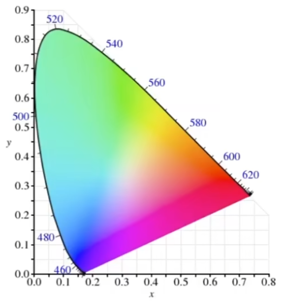
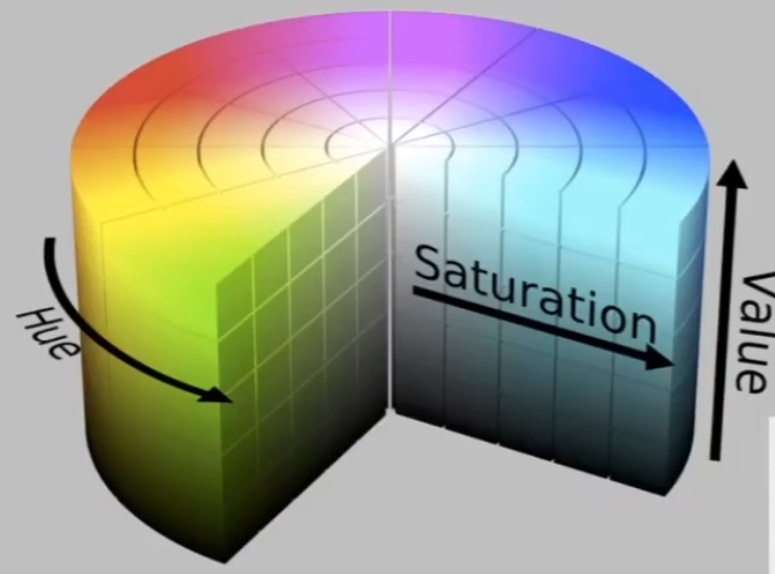

# Physical Basis Of Color

## 0x00 Fundamental Components Of Light

### 光谱Spectrum of Light

光具有不同的波长，在通过三棱镜时拥有不同的折射率

#### 谱功率密度Spectral Power Distribution(SPD)

不同波长的光，则拥有不同的功率；且不同波长的光的叠加为线性叠加

### 颜色Color

#### Biological Basis of Color

颜色只和人的感知有关，不同的光的波长并不是颜色

#### Color Reproduction(Additive Color)

1. 原始颜色
   $$
   S_R(\lambda), S_G(\lambda), S_B(\lambda)
   $$
   

2. 调整颜色的亮度系数

   
   $$
   RS_R(\lambda)+GS_G(\lambda),+BS_B(\lambda)
   $$
   

#### CIR RGB Color Matching Function

根据多个光`RGB`匹配一个单色的光谱

#### CIE XYZ

该标准由人为定义，**而不是实验得出的数据**

以`X,Y,Z`中的`Y`为亮度`Luminance`为不变量，可以得到一张经过归一化的色度图`Chromaticity`

$$
\begin{cases}
x = \frac{X}{X+Y+Z}\\
y = \frac{Y}{X+Y+Z}\\
z = \frac{Z}{X+Y+Z}
\end{cases}
$$

### 色彩空间Standard Color Spaces

#### 色域Gamut

#### Standardized RGB(sRGB)

#### HSV Color Space(色调Hue-饱和度Saturation-Value)

#### CIELAB Space

白色和黑色；红色和绿色；黄色和蓝色形成互补
$$
L*a*b*
$$

#### 检色系统CMYK(Subtractive Color Space)

