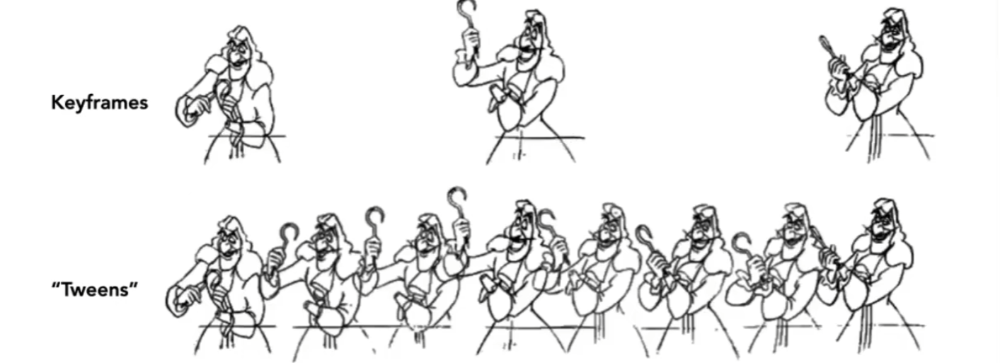

# Animation And Simulation

## 0x00 Computer Animation

将`3D`模型延伸到时间的维度上，需要一定的连贯性和顺序性

### 关键帧Keyframe Animation

只指定关键帧，其他的中间帧可以被自动化的生成

#### 中间帧插值Keyframe Interpolation

一般情况下线性差值并不够好；有时候在动画中会在用非线性的差值，例如：样条`Splines`，贝塞尔曲线

## 0x01 质点弹簧系统Mass Spring System

一系列相互连接的质点和弹簧

### Simple Spring

一个理想弹簧**(弹簧的长度为0)**连接着两个质点`A`和`B`
$$
f_{a->b}=k_s(\vec{b} - \vec{a})\\
f_{b->a}=-f_{a->b}
$$

### Non-Zero Length String

含有长度`l`的弹簧系统，需要通过归一化的向量确认受力的方向。**但是，没有考虑阻尼的问题，弹簧会无限的振动**
$$
已知:弹簧的长度为l\\
f_{a->b}=k_s\frac{\vec{b} - \vec{a}}{||\vec{b} - \vec{a}||}(||b-a|| - l)
$$

#### 导数的表示Dot Notion for Derivatives

如果x为点的位移，则如何进行速度和加速度的表示
$$
已知:x\\
\dot{x}=v\\
\dot{}\dot{x} = a
$$

### Energy Loss

#### Damping Force

引入阻力`f`。且阻力与物体运动方向相反。**但是，该弹簧系统并没有考虑到内部阻尼以及相对运动的问题**
$$
f = -k_d \dot{b}
$$

#### Internal Damping For Spring

需要考虑两个质点之间的相对速度，该相对速度通过对于位移的一阶导数得到

等价于归一化的方向向量和相对速度向量进行点乘，**等于将相对速度在方向向量ab上分解**，最终得到一个标量
$$
f_{b}=k_d\frac{\vec{b} - \vec{a}}{||\vec{b} - \vec{a}||}(\dot{b}-\dot{a})\frac{\vec{b} - \vec{a}}{||\vec{b} - \vec{a}||}
$$

## 0x02 粒子系统Particle System

将每个微小的质点定义一系列受到的力，但是需要使用大量的质点

### Particle System Forces

引力，电磁力，粘滞力，空气阻力，碰撞等等

### Simulated Flocking As An ODE

定义个体与群体之间的关系

## 0x03 运动学Kinematics

### 正向运动学Forward Kinematics

通过关节的角度位置，从而确定点所在的位置

#### Articulated Skeleton

#### Joint Types

1. Pin(1D)
2. Ball(2D)

### 反向运动学Inverse Kinematics

固定点的位置，结算关节的角度位置

#### N-Link(IK) Problem

可以利用梯度下降优化运算，而不是反向计算三角函数

#### 骨骼绑定Rigging

对于形状的控制或者添加相应的动作

#### 动画融合Blend Shapes

依然需要利用插值进行计算，但是需要插值的是控制点以及周围的影响的区域

## 0x04 动作捕捉Motion Capture

对真人进行动作捕捉（需要引入若干个控制点），将动作导出到虚拟人物上

### Motion Capture Equipment 

#### Optical Motion Capture

use  8+ IR illumination cameras`(240Hz) 

#### Magnetic Motion Capture

#### Mechanical Motion Capture

#### 

