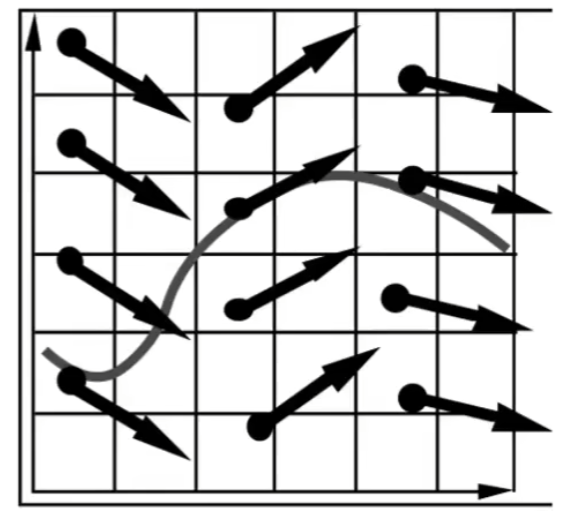

# Simulation

## 0x00 Single Particle Simulation

### Velocity Vector Field

模拟某一个粒子在某速度场中运动，速度场是一个关于位移和时间的函数

$$
v(x,t)
$$

#### 常微分Ordinary Differential Equation(ODE)

计算粒子在时间上的位移，利用常微分方程进行解算。如果，在存在其他的变量则为偏微分方程`partial derivatives`
$$
\dot{x}=\frac{dx}{dt}=v(x,t)
$$

#### 欧拉方法Euler‘s Method/Forward Euler

可以将时间细分，不断的将时间拆分为步长▲

$$
x^{t+\triangle t} = x^t + \triangle t \dot{x}^t = x^t + \triangle t v(x,t)\\
\dot{x}^{t+\triangle t} = \dot{x}^t + \triangle t \ \dot{}\dot{x}^t
$$

**但是，该公式误差大，如果▲t不够细分，则会计算结果不精确；该公式并不稳定(diverge)，由于信号的正反馈导致最终结果大幅偏离原本的目标**

### 解决不稳定性Combating Instability

#### 中点Midpoint Method

在欧拉方法的基础上，取得原始运动方向的中点；第二次利用中点的速度，再次进行欧拉计算
$$
取得中点:x_{mid} = x(t) + \frac{\triangle t v(x(t),t)}{2}\\
利用中点位移的速度，再次计算欧拉:x(t+\triangle t) = x(t) + \triangle t v(x_{mid} ,y)\\
$$

利用中点方法修正原始的欧拉，可以得到局部二次的模型
$$
\because
\begin{cases}
x^{t+\triangle t} 
= x^t + \frac{\triangle t}{2}(\dot{x}^t+\dot{x}^{t+\triangle t}) \\
\dot{x}^{t+\triangle t} = \dot{x}^t + \triangle t \ \dot{}\dot{x}^t
\end{cases}\\
\therefore
x^{t+\triangle t} = x^t +  \triangle t\dot{x}^t + \frac{(\triangle t)^2}{2}\dot{}\dot{x}^t
$$

#### Adaptive Step Size

1. 利用欧拉方法以`▲t`为步长进行一次计算：直接得到结果
   $$
   X_T
   $$
   
2. 将▲t再次拆分为一半`▲t/2`，利用欧拉方法计算两次得到
   $$
   X_{\frac{T}{2}}
   $$
   
3. 计算结果之间的误差是否满足某一个阈值
   $$
   ||X_T - X_{\frac{T}{2}}|| <= \epsilon
   $$

#### Implicit Euler Method/Backward Euler

利用下一帧的速度和加速度进行计算，但是隐式欧拉方法难以解算
$$
x^{t+\triangle t} = x^t + \triangle t \dot{x}^{t+\triangle t}\\
\dot{x}^{t+\triangle t} = \dot{x}^t + \triangle t \ \dot{}\dot{x}^{t+\triangle t}
$$

#### Runge-Kutta Families(RK4)

用于解算常微分方法，且用于计算非线性方程
$$
已知:\frac{dy}{dt}=f(t,y), y(t_0)=y_0\\
RK4:
\begin{cases}
y_{n+1} = y_n + \frac{1}{6}h(k_1+2k_2+2k_3+k_4)\\
t_{n+1}=t_n+h
\end{cases}\\\\
k_1 = f(t_n,y_n)\\
k_2 = f(t_n+\frac{h}{2}, y_n+h\frac{k_1}{2})\\
k_3 = f(t_n+\frac{h}{2}, y_n+h\frac{k_2}{2})\\
k_4 = f(t_n,y_n+hk_3)\\
$$

#### Position-Based/Verlet Integration

通过调整不同位置最后一个满足一个约束要求

## 0x01 刚体模拟Rigid Body Simulation

刚体不会产生形变
$$
已知:位移X, 旋转角度\theta, 速度\dot{X}, 角速度\omega,力矩\tau,转动惯量I\\
\frac{d}{dt}
\begin{bmatrix}
X \\ \theta \\ \dot{X} \\ \omega
\end{bmatrix} 
= 
\begin{bmatrix}
\dot{X}\\ \omega \\ \frac{F}{m} \\ \frac{\tau}{I}

\end{bmatrix}
$$

## 0x02 流体模拟Fluid Simulation

### A Simple Position-Based Method

模型假设水是不可压缩的，且密度是不变的；当改变粒子的位置而导致的密度变化，则需要进行修正

### 梯度下降gradient descent

如果需要使得目标和某一个结果相似，则可以将当前的状态向目标方向逼近