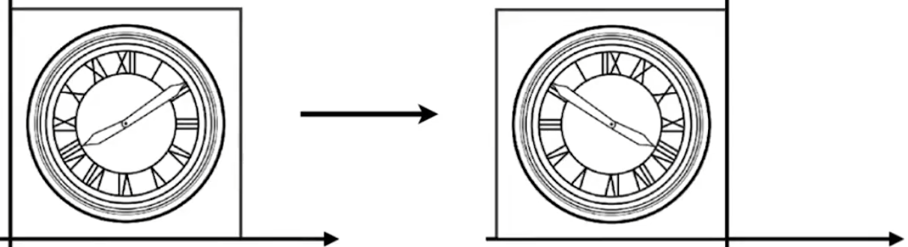

# Transformation

## 0x00 Linear Transforms

### 2D线性变换的一般形式

$$
x' = ax + by \\
y'= cx + dy \\\\
\begin{bmatrix} x' \\ y' \end{bmatrix} = 
\begin{bmatrix} a & b \\ c & d \end{bmatrix} 
\begin{bmatrix}x \\ y \end{bmatrix}
$$

## 0x01 2D Transformations

### 缩放变换(Scale Transformations)

#### 统一缩放矩阵(Uniform Scale Matrix)

图像的横轴和纵轴都均匀的缩小或者放大

$$
x' = sx \\
y'= sy \\\\
\begin{bmatrix} x' \\ y' \end{bmatrix} = 
\begin{bmatrix} s & 0 \\ 0 & s \end{bmatrix} 
\begin{bmatrix}x \\ y \end{bmatrix}
$$

#### 非统一缩放矩阵(Non-Uniform Scale Matrix)

$$
x' = s_xx \\
y'= s_yy \\\\
\begin{bmatrix} x' \\ y' \end{bmatrix} = 
\begin{bmatrix} s_x & 0 \\ 0 & s_y \end{bmatrix} 
\begin{bmatrix}x \\ y \end{bmatrix}
$$

### 镜像变换(Reflection Transformations)

#### 水平的镜像变换(Horizontal Reflection)

$$
x' = -x \\
y'= y \\\\
\begin{bmatrix} x' \\ y' \end{bmatrix} = 
\begin{bmatrix} -1 & 0 \\ 0 & 1 \end{bmatrix} 
\begin{bmatrix}x \\ y \end{bmatrix}
$$

### 剪切变换(Shear Transformations)

剪切变换属于对平面直角坐标系的线性变换，使得矩阵变得不正交且不归一

$$
x' = x + ay \\
y'= y \\\\
\begin{bmatrix} x' \\ y' \end{bmatrix} = 
\begin{bmatrix} 1 & a \\ 0 & 1 \end{bmatrix} 
\begin{bmatrix}x \\ y \end{bmatrix}
$$

### 旋转变换(Rotate Transformations)

#### 默认旋转参数

默认的旋转参数为沿着原点`(0,0)`以逆时针方向进行旋转

#### 旋转的坐标变换

设原始点为`(1，0)`，沿着原点`(0,0)`以逆时针方向旋转`θ`度可以得到坐标`(cosθ, sinθ)`
$$
\begin{bmatrix} cosθ \\ sinθ \end{bmatrix}
= \begin{bmatrix} a & b \\ c & d \end{bmatrix} 
\begin{bmatrix} 1 \\ 0 \end{bmatrix}
$$

$$
cosθ = a + b.0 = a \\
sinθ = c + d.0 = c
$$

设原始点为`(0，1)`，沿着原点`(0,0)`以逆时针方向旋转`θ`度可以得到坐标`(-sinθ, cosθ)`
$$
\begin{bmatrix} -sinθ \\ cosθ \end{bmatrix}
= \begin{bmatrix} a & b \\ c & d \end{bmatrix} 
\begin{bmatrix} 0 \\ 1 \end{bmatrix}
$$

$$
-sinθ = a.0 + b = b \\
cosθ = c.0 + d = d
$$

$$
\begin{bmatrix} x' \\ y' \end{bmatrix} = 
\begin{bmatrix} cosθ & -sinθ \\ sinθ & cosθ \end{bmatrix} 
\begin{bmatrix}x \\ y \end{bmatrix}
$$

## 0x02 齐次坐标(Homogeneous Coordinates)

#### 为什么要引入齐次坐标

为了解决平移变换时导致`Linear Transforms`公式无法进行表示，需要在后方增加常数

**仿射变换`(Affine Transformations)`**
$$
x' = x + t_x \\
y'= y + t_y \\\\
\begin{bmatrix} x' \\ y' \end{bmatrix} = 
\begin{bmatrix} 1 & 0 \\ 0 & 1 \end{bmatrix} 
\begin{bmatrix}x \\ y \end{bmatrix} + 
\begin{bmatrix}t_x \\ t_y \end{bmatrix}
$$

#### 齐次坐标

**平移变换在原来的公式下并不满足线性变换的范畴，因此在2D/3D的基础上引入另一个维度**来统一所有的变换方法

1. 2D点(Point)
   $$
   \begin{bmatrix} x \\ y \\ 1 \end{bmatrix}
   $$
   

2. 2D矢量(Vector)

   **向量具有平移不变性，平移tx或者ty不应该对其产生影响，从而改变其方向**
   $$
   \begin{bmatrix} x \\ y \\ 0 \end{bmatrix}
   $$
   

3. 2D矩阵形式的表示
   $$
   \begin{bmatrix} x' \\ y' \\ w'(1) \end{bmatrix} 
   = \begin{bmatrix} a & b & t_x \\ c & d & t_y \\ 0 & 0 & 1/0 \end{bmatrix} 
   \begin{bmatrix}x \\ y \\ 1 \end{bmatrix} 
   = \begin{bmatrix} ax+by+t_x \\ cx+dy+t_y \\ 1 \end{bmatrix}
   $$
   

4. 3D矩阵形式的表示
   $$
   \begin{bmatrix} x' \\ y' \\ z' \\ w'(1) \end{bmatrix} 
   = \begin{bmatrix} a & b & c & t_x \\ d & e & f & t_y \\ g & h & i & t_z \\ 0 & 0 & 0 & 1/0 \end{bmatrix} 
   \begin{bmatrix}x \\ y \\ z \\ 1 \end{bmatrix} 
   = \begin{bmatrix} ax+by+cz+t_x \\ dx+ey+fz+t_y \\ gx+hy+iz+t_z \\ 1\end{bmatrix}
   $$
   

5. **点Point和点Point的中点计算公式**

   只要w不为0，可以根据向量中的w分量将整个向量进行通分
   $$
   \begin{bmatrix} x \\ y \\ w \end{bmatrix} =>
   \begin{bmatrix} \frac{x}{w} \\ \frac{y}{w} \\ 1 \end{bmatrix}(w\neq0)
   $$

   | valid operation L | w-coordinate L | op   | valid operation R | w-coordinate R | result operation | result w-coordinate |
   | :---------------: | :------------: | ---- | :---------------: | :------------: | :--------------: | :-----------------: |
   |     `vector`      |      `0`       | `+`  |     `vector`      |      `0`       |     `vector`     |         `0`         |
   |      `point`      |      `1`       | `-`  |      `point`      |      `1`       |     `vector`     |         `0`         |
   |      `point`      |      `1`       | `+   |     `vector`      |      `0`       |     `point`      |         `1`         |
   |      `point`      |      `1`       | `+`  |      `point`      |      `?`       |                  |                     |

   因此`point` + `point`为中点的推导方法
   $$
   \begin{bmatrix} x_1 \\ y_1 \\ 1 \end{bmatrix} + \begin{bmatrix} x_2 \\ y_2 \\ 1 \end{bmatrix} 
   = \begin{bmatrix} x_1 + x_2 \\ y_1 + y_2 \\ 2 \end{bmatrix} 
   => \begin{bmatrix}\frac{x_1 +x_2}{2}\\ \frac{y_1 +y_2}{2}\\ 1\end{bmatrix}
   $$

## 0x03 变换的组合Composing Transformations

### 组合变换的数学规则

组合变换的顺序非常重要，如果矩阵的顺序改变，则结果可能被改变

1. 连续对某一个点应用多个仿射变换
   $$
   A_1, A_2, A_3, ...
   $$
   

2. 组合的变换可以由多个矩阵相乘得到组合矩阵
   $$
   A_n(...A_2(A_1(x))) = A_n...A_2A_1 
   \begin{bmatrix} x \\ y \\ 1 \end{bmatrix}
   $$

### 组合变换的计算顺序

$$
执行顺序：先T => R => 最后S \\
矩阵形式 M = SRT
$$

### 组合变换与复杂问题的拆解

#### 将图像环绕任意点C进行旋转

1. 将图像从C点`(a,b)`平移到O原点`(0,0)`
   $$
   \vec{CO}=\begin{bmatrix} -a & 0 \\ 0 & -b \end{bmatrix}
   \begin{bmatrix} x \\y \end{bmatrix} \\\\
   T_{co}=\begin{bmatrix} 1 & 0 & -a \\ 0 & 1 & -b \\ 0 & 0 & 1 \end{bmatrix}
   $$
   

2. 将图像进行旋转变换，通过旋转矩阵
   $$
   R = 
   \begin{bmatrix} cosθ & -sinθ & 0\\ sinθ & cosθ & 0 \\ 0 & 0 & 1\end{bmatrix} 
   $$
   

3. 将图像从O原点`(0,0)`平移到C点`(a,b)`
   $$
   \vec{OC}=\begin{bmatrix} a & 0 \\ 0 & b \end{bmatrix}
   \begin{bmatrix} x \\y \end{bmatrix} \\\\
   T_{oc}=\begin{bmatrix} 1 & 0 & a \\ 0 & 1 & b \\ 0 & 0 & 1 \end{bmatrix}
   $$
   

4. 最终运算结果
   $$
   T_{oc}(R(T_{co}(x))) => T_{oc}RT_{co} 
   \begin{bmatrix} x \\ y \\ 1 \end{bmatrix}
   $$

