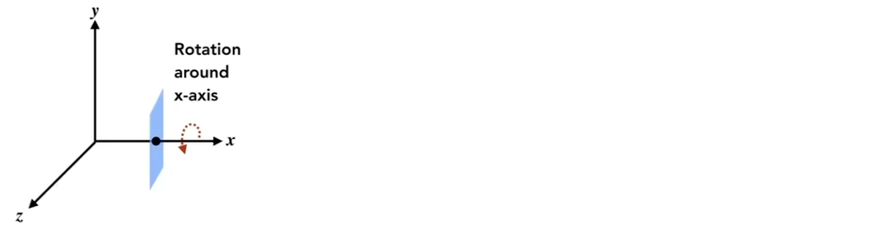
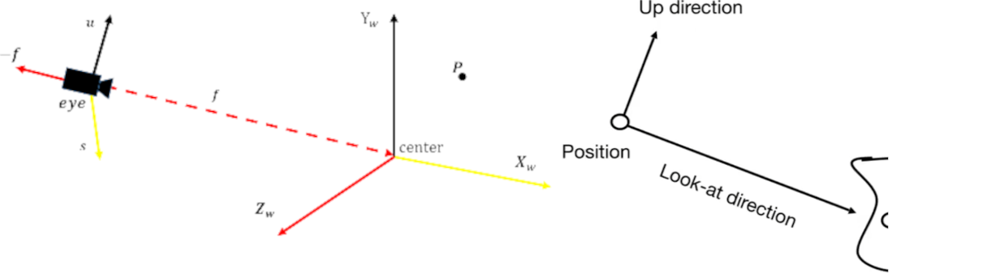

# Viewing Transformation

## 0x00 3D Transformations

### 1. 伸缩变换Scale

$$
S(s_x, s_y, s_z) =\begin{bmatrix} 
s_x & 0 & 0 & 0 \\  
0 & s_y & 0 & 0 \\  
0 & 0 & s_z & 0 \\  
0 & 0 & 0 & 1 
\end{bmatrix}
$$

### 2. 旋转变换Rotate

#### XYZ轴的逆时针旋转

1. X轴的逆时针旋转：需要根据矢量叉乘的方向确定`X`轴的方向，因此旋转方向为`Y->Z`
   $$
   R_x(θ) =\begin{bmatrix} 
   1 & 0 & 0 & t_z \\  
   0 & cosθ & -sinθ & 0 \\  
   0 & sinθ & cosθ & 0 \\  
   0 & 0 & 0 & 1 
   \end{bmatrix}
   $$
   
2. Y轴的逆时针旋转：需要根据矢量叉乘的方向确定`Y`轴的方向，因此旋转方向为`Z->X`
   $$
   R_y(θ) = \begin{bmatrix} 
   cosθ & 0 & sinθ & 0 \\  
   0 & 1 & 0 & 0 \\  
   -sinθ & 0 & cosθ & 0 \\  
   0 & 0 & 0 & 1 
   \end{bmatrix}
   $$
   
3. Z轴的逆时针旋转：需要根据矢量叉乘的方向确定`Z`轴的方向，因此旋转方向为`X->Y`
   $$
   R_z(θ) = \begin{bmatrix} 
   cosθ & -sinθ & 0 & 0 \\  
   sinθ & cosθ & 0 & 0 \\  
   0 & 0 & 1 & 0 \\  
   0 & 0 & 0 & 1 
   \end{bmatrix}
   $$

#### 绕任意轴的旋转Compose 3D Rotaion From Rx, Ry, Rz

1. 绕任意轴的旋转全部可以分解为基础的绕`X,Y,Z`轴的旋转

$$
R_{xyz}(\alpha,\beta,\gamma)=R_x(\alpha)R_y(\beta)R_z(\gamma)
$$

2. 罗戈里格斯旋转定理**Rodrigues Rotation Formula**

   该轴`axis n`必过原点O(0,0)，并在当前轴上旋转θ`角度

$$
R(n, \alpha)=cos(\alpha)E + (1 - cos(\alpha)) nn^T + sin(\alpha)\begin{bmatrix} 
0 & -n_z & n_y \\  
n_z & 0 & -n_x \\  
-n_y & n_x & 0 
\end{bmatrix}
$$

### 3. 平移变换Translation

$$
T(t_x, t_y, t_z) =\begin{bmatrix} 
1 & 0 & 0 & t_z \\  
0 &1 & 0 & t_y \\  
0 & 0 & 1 & t_z \\  
0 & 0 & 0 & 1 
\end{bmatrix}
$$

## 0x01 视图/相机变换View/Camera Transformation

### What is View Transformation

#### 关于MVP变换

$$
执行顺序：先M => V => 最后P \\
矩阵形式 M = PVM
$$

1. 模型变换`Model Transformation`：寻找一个合适的位置，将多个**模型**进行放置
2. 视图变换`View Transformation`：寻找一个位置或者角度，放置**摄像机**
3. 投影变换`Projection Transformation`：将三维空间投影到二维画面上

### Model Transformation

#### 模型/世界矩阵的用途

每一个模型在建模时，一般建模时采用原点进行建模，但是在实际的游戏引擎中，每个模型都要摆放到不同的位置，这就涉及到**对象空间到世界空间的转换**

#### 模型矩阵推导(Model Matrix)

$$
Model_{matrix} = T_{model}R_{model}S_{model}
$$

#### 模型矩阵的结论

$$
World = Model_{matrix} Obj
$$

### View/Camera Transformation

#### 观测矩阵的用途

通过视角矩阵**实现世界空间向视角空间**的转换

#### xxxxxxxxxx #pragma omp parallel for collapse(2)for(std::size_t y = std::floor(min(P0_y, P1_y, P2_y)); y < std::ceil(max(P0_y, P1_y, P2_y)) ; ++y){    for(std::size_t x = std::floor(min(P0_x, P1_x, P2_x)); x < std::ceil(max(P0_x, P1_x, P2_x)) ; ++x){        pixel[x][y] = inside_or_not(triangle, x + 0.5, y + 0.5);    }}c++

根据物理学相对运动的指示可以得知，当相机和物体同时相向运动，则图像是不变的

因此我们采用右手坐标系，我们将摄像机放置在原点`O(0,0,0)`，以`Y`轴为上方向，`Look At -Z`轴

#### 对于观测矩阵的定义

|        摄像机的参数        |      表示       |         解释         |
| :------------------------: | :-------------: | :------------------: |
|  放置位置`position(eye)`   | `e(Xe, Ye, Ze)` |   摄像机放置在哪里   |
|     视线朝向`look-at`      |       `g`       |  摄像机往那个方向看  |
| 上方向旋转轴`up-direction` |       `t`       | 摄像机的上方向旋转轴 |

#### 观测矩阵转换推导(View Matrix)

将处于任意位置`e`，视角朝向为`g`，上方向旋转轴`t`的的照相机移动到原点`O(0,0,0)`，以`Y`轴为上方向，`Look At -Z`轴

为了简化复杂的变换问题，因此先要将`camera`移动到原点再进行旋转操作
$$
R(T(camera))=>R.T\\
V_{view}= R_{view}T_{view}
$$

其中关于平移，则为将摄像机从任意位置`e(Xe, Ye, Ze)`移动到原点`O(0,0,0)`
$$
\vec{OE} = \begin{bmatrix} X_e \\ Y_e \\ Z_e \end{bmatrix} =>
\vec{EO} = \begin{bmatrix} -X_e \\ -Y_e \\ -Z_e \end{bmatrix} =>
T_{view} = \begin{bmatrix} 
1 & 0 & 0 & -X_e \\ 
0 & 1 & 0 & -Y_e \\ 
0 & 0 & 1 & -Z_e \\
0 & 0 & 0 & 1 \\ 
\end{bmatrix}
$$

关于旋转，则需要将`g`旋转到`-Z`轴的方向，`t`旋转到`Y`轴方向。**但是，这样子旋转有点过于复杂了**
$$
Rotate \quad \vec{g} \quad to \quad -\vec{Z} \quad \\
Rotate \quad \vec{t} \quad to \quad \vec{Y} \quad \\
Rotate \quad \vec{g} \times \vec{t} \quad to \quad \vec{X} \quad
$$

**因此，我们应用矩阵的逆的性质**，反向计算将`-Z`轴移动到`g`上即可
$$
Rotate \quad \vec{X}= \begin{bmatrix}1&0&0\end{bmatrix} \quad to \quad \vec{g} \times \vec{t}\\
\quad  \vec{Y}=\begin{bmatrix} 0 & 1 & 0 \end{bmatrix}  \quad to \quad \vec{t} \quad\\
\quad \vec{Z}=\begin{bmatrix} 0 & 0 & 1 \end{bmatrix}  \quad to \quad -\vec{g}
$$

$$

$$

$$
R_{view}^{-1} = 
\begin{bmatrix} 
X_{\vec{g}\times\vec{t}} & X_t & X_{-g}& 0 \\
Y_{\vec{g}\times\vec{t}} & Y_t & Y_{-g}& 0 \\
Z_{\vec{g}\times\vec{t}} & Z_t & Z_{-g}& 0 \\
0 & 0 & 0 & 1
\end{bmatrix}
$$

**由于旋转矩阵满足*正交*矩阵，因此旋转矩阵的逆变就是其的转置**
$$
R_{view} = {R_{view}^{-1}}^{-1} = {R_{view}^{-1}}^T 
= {\begin{bmatrix} 
X_{\vec{g}\times\vec{t}} & X_t & X_{-g}& 0 \\
Y_{\vec{g}\times\vec{t}} & Y_t & Y_{-g}& 0 \\
Z_{\vec{g}\times\vec{t}} & Z_t & Z_{-g}& 0 \\
0 & 0 & 0 & 1
\end{bmatrix}}^T
= {\begin{bmatrix} 
X_{\vec{g}\times\vec{t}} & Y_{\vec{g}\times\vec{t}} &Z_{\vec{g}\times\vec{t}}  & 0 \\
X_t & Y_t & Z_t & 0 \\
 X_{-g}&  Y_{-g} & Z_{-g}& 0 \\
0 & 0 & 0 & 1
\end{bmatrix}}
$$

#### 视图矩阵结论(View Matrix)

$$
\because T_{view} = \begin{bmatrix} 
1 & 0 & 0 & -X_e \\ 
0 & 1 & 0 & -Y_e \\ 
0 & 0 & 1 & -Z_e \\
0 & 0 & 0 & 1 \\ 
\end{bmatrix} 

R_{view} = 
{\begin{bmatrix} 
X_{\vec{g}\times\vec{t}} & Y_{\vec{g}\times\vec{t}} &Z_{\vec{g}\times\vec{t}}  & 0 \\
X_t & Y_t & Z_t & 0 \\
 X_{-g}&  Y_{-g} & Z_{-g}& 0 \\
0 & 0 & 0 & 1
\end{bmatrix}} \\\\

\therefore 
V_{matrix} = R_{view}T_{view} = 
{\begin{bmatrix} 
X_{\vec{g}\times\vec{t}} & Y_{\vec{g}\times\vec{t}} &Z_{\vec{g}\times\vec{t}}  &  -X_e \\
X_t & Y_t & Z_t & -Y_e \\
 X_{-g}&  Y_{-g} & Z_{-g}& -Z_e \\
0 & 0 & 0 & 1
\end{bmatrix}}
$$
