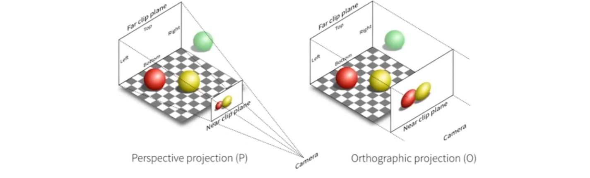
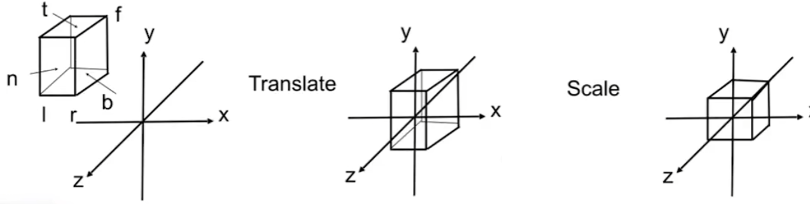
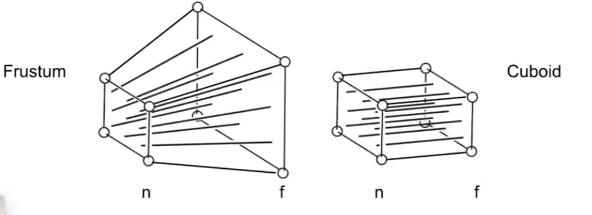
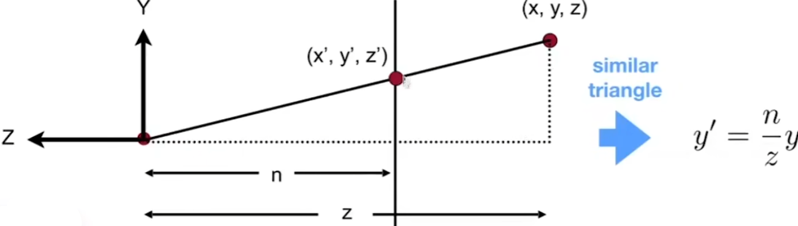
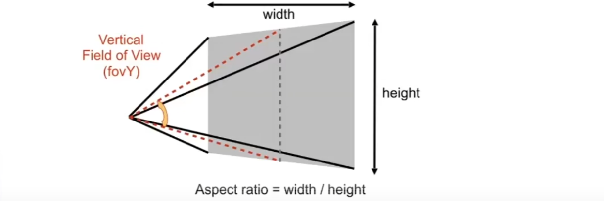
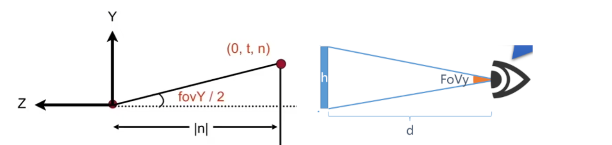

# Projection Transformation

## 0x00 正交投影Orthographic Projection

### 正交投影的简述

正交投影的离得无限远，近和远的平面几乎没有区别，因此不存在进大远小的现象，适用于工程制图

#### 相机位置设定

采用右手坐标系，我们将摄像机放置在原点`O(0,0,0)`，以`Y`轴为上方向，`Look At -Z`轴

#### 正交投影的降维

如果采用当前的相机位置，就可以直接无视或将`Z`坐标进行降维，目前仅剩`XY`坐标

将物体进行平移，旋转，缩放到指定的`XY`到坐标范围`[-1 , 1]`

#### **正交投影的难点**

**如果去除Z轴，则获取物体在Z轴上的前后关系相对复杂，需要进行特殊的处理**

### 正交投影的工程实现

#### 将正交投影的立方体归一化到范围`[-1,1]`

任意位置的立方体的任意坐标参数

**注意**，对于坐标`[far, near]`而言，**`near`更靠近`+Z`数值更大**离摄像机更近，因此**`far < near`**
$$
[left, right][button, top][far, near]
$$
按照`[-1,1]`，通过平移和缩放标准归一化(canonical)到标准立方体，满足：
$$
cube \quad [-1,1]^3
$$

为了简化复杂的变换问题，因此先要将立方体移动到原点再进行旋转操作
$$
R(T(x))=>R.T\\
$$

#### 对于正交投影立方体的平移

由于时需要将任意点`C`移动到原点`O(0,0,0)`，因此平移值均为负数
$$
\because
\vec{OC} =\begin{bmatrix}  
C_x \\
C_y \\
C_z 
\end{bmatrix}\\

\therefore 
\vec{CO} = -\vec{OC} = \begin{bmatrix}  
-C_x \\
-C_y \\
-C_z 
\end{bmatrix}\\
$$

推广公式，假设立方体的中点就是`C`
$$
\therefore 
\vec{CO} = -\vec{OC} = \begin{bmatrix}  
-C_x \\
-C_y \\
-C_z 
\end{bmatrix} =  \begin{bmatrix}  
-\frac{r+l}{2} \\
-\frac{b+t}{2} \\
-\frac{f+n}{2} 
\end{bmatrix}
$$

$$
T_{ortho} = 
\begin{bmatrix}  
1 & 0 & 0 & -\frac{r+l}{2} \\
0 & 1 & 0 & -\frac{b+t}{2} \\
0 & 0 & 1 & -\frac{f+n}{2} \\
0 & 0 & 0 & 1
\end{bmatrix}
$$

#### 对于正交投影立方体的缩放

由于`[-1,1]`覆盖的范围为2，因此需要将当前的长度`L`进行归一，满足：
$$
normal = \frac{2}{l}
$$
将当前的归一化公式推广到矩阵运算
$$
S_{ortho} = 
\begin{bmatrix}  
\frac{2}{l-r} & 0 & 0 & 0 \\
0 & \frac{2}{t-b} & 0 & 0 \\
0 & 0 & \frac{2}{n-f} & 0\\
0 & 0 & 0 & 1
\end{bmatrix}
$$

#### 对于正交投影立方体的变换结论

$$
M_{Ortho} = S_{ortho}T_{ortho} = 
\begin{bmatrix}  
\frac{2}{l-r} & 0 & 0 & 0 \\
0 & \frac{2}{t-b} & 0 & 0 \\
0 & 0 & \frac{2}{n-f} & 0\\
0 & 0 & 0 & 1
\end{bmatrix}
\begin{bmatrix}  
1 & 0 & 0 & -\frac{r+l}{2} \\
0 & 1 & 0 & -\frac{b+t}{2} \\
0 & 0 & 1 & -\frac{f+n}{2} \\
0 & 0 & 0 & 1
\end{bmatrix} 
= \begin{bmatrix}  
\frac{2}{l-r} & 0 & 0 & -\frac{r+l}{2} \\
0 & \frac{2}{t-b} & 0 & -\frac{b+t}{2} \\
0 & 0 & \frac{2}{n-f} & -\frac{f+n}{2}\\
0 & 0 & 0 & 1
\end{bmatrix}
$$

## 0x01 透视投影Projection Projection

### 透视投影的概述

透视投影的摄像机属于一个点，连成在空间中的一个锥体/台`frustum`，存在进大远小的现象

### 透视投影的矩阵计算

远平面的大小和近平面不相等，因此视图将远平面的大小和近平面变的相同

#### 透视投影的基本特性

1. `Z`轴数值恒定不变：

   近平面无论如何操作，`XYZ`轴数值均不变

   远平面的大小会发送变化，但是位于`Z`轴的位置不发生改变

   

2. 中心点不会改变：无论怎样压缩，中心点的位置不会改变

#### 透视投影的计算思路

xxxxxxxxxx #pragma omp parallel for collapse(2)for(std::size_t y = std::floor(min(P0_y, P1_y, P2_y)); y < std::ceil(max(P0_y, P1_y, P2_y)) ; ++y){    for(std::size_t x = std::floor(min(P0_x, P1_x, P2_x)); x < std::ceil(max(P0_x, P1_x, P2_x)) ; ++x){        pixel[x][y] = inside_or_not(triangle, x + 0.5, y + 0.5);    }}c++

使得可以利用已知的`Ortho`公式进行运算
$$
Frustum = Ortho \quad M_{Persp->Ortho}^{(4,4)}  \quad \begin{bmatrix}x&y&z&1\end{bmatrix}^T
$$
这就需要到将远平面转换为与近平面等高的平面，因此可以得到远平面的原始坐标和`Squish`之后的新坐标对应关系。 已知，在没变换之前的点坐标均为`(x,y,z)`

经过变换之后的点坐标和`Z`坐标上的数值相关
$$
x'=\frac{n}{z}x \quad y'=\frac{n}{z}y\\
$$
得到经过变换之后的坐标转换规则，**但是矩阵中仍然存在未知数`Z'`**
$$
\because
\begin{bmatrix} x'\\y'\\z'\\1 \end{bmatrix} = 
\begin{bmatrix} 
\frac{nx}{z}\\
\frac{ny}{z}\\
z\\
1
\end{bmatrix} = 
\begin{bmatrix} nx\\ny\\?\\z\end{bmatrix} (z\not= 0) \\
\therefore
\begin{bmatrix} x'\\y'\\z'\\1 \end{bmatrix} = 
M_{Persp->Ortho}^{(4,4)} \begin{bmatrix} x\\y\\z\\1 \end{bmatrix}  = 
\begin{bmatrix} 
n & 0 & 0 & 0\\
0 & n & 0 & 0\\
? & ? & ? & ?\\
0 & 0 & 1 & 0 
\end{bmatrix}
 \begin{bmatrix} x\\y\\z\\1 \end{bmatrix}
$$
但是由于所有在近平面的点都不会变化，所有在远平面的点哪怕是经过变化之后`Z`也不会变化，因此`Z`是一个常数

在当前的例子之中，带入近平面的`Z`值`=n`进行计算
$$
\because
M_{Persp->Ortho}^{(4,4)} \begin{bmatrix} x\\y\\z\\1 \end{bmatrix} = 
\begin{bmatrix} 
\frac{nx}{z}\\
\frac{ny}{z}\\
?\\
1
\end{bmatrix}\\\\

When \quad z = n \\\\
\therefore
M_{Persp->Ortho}^{(4,4)} \begin{bmatrix} x\\y\\n\\1 \end{bmatrix} = 
\begin{bmatrix} 
\frac{nx}{z}\\
\frac{ny}{z}\\
n\\
1
\end{bmatrix} 
= \begin{bmatrix} nx\\ ny\\ n^2\\n\end{bmatrix}
$$
经历了上述的推导，矩阵`Mpersp->Ortho`的第三行需要等于`N^2`
$$
\because
M_{Persp->Ortho}^{(4,4)} \begin{bmatrix} x\\y\\n\\1 \end{bmatrix}  = 
\begin{bmatrix} 
n & 0 & 0 & 0\\
0 & n & 0 & 0\\
a & b & c & d\\
0 & 0 & 1 & 0 
\end{bmatrix}
\begin{bmatrix} x\\y\\n\\1 \end{bmatrix} 
= \begin{bmatrix} nx\\ ny\\ n^2\\n\end{bmatrix} \\\\

\therefore
ax +by+cn+d=n^2 \\
又\because a=0, b=0 \\
\therefore
cn+d=n^2 \\
$$
同理，如果是带入远平面的`Z`值`=f`进行计算
$$
cf+d=f^2
$$

因此得到`C`和`D`的数值解 ，从而可以推理得到压缩公式
$$
\because
\begin{cases}
cn+d=n^2 \\
cf+d=f^2
\end{cases} =>
\begin{cases}
a = 0\\
b = 0 \\
c = n + f \\
d = -nf
\end{cases} 

\\\therefore 
M_{Persp->Ortho}^{(4,4)}  = 
\begin{bmatrix} 
n & 0 & 0 & 0\\
0 & n & 0 & 0\\
0 & 0 & n + f & -nf\\
0 & 0 & 1 & 0 
\end{bmatrix}
$$

#### 透视投影的最终结论

$$
M_{persp}=M_{Ortho}  M_{Persp->Ortho}^{(4,4)}
$$

### 透视投影的决定因素

#### 近平面的确定和`FovY`以及宽高比相关

需要确定近平面的参数信息，通过使用视场角(垂直)`Fov(y) Field Of View`以及显示器宽高比`ascpect ratio`进行决定

#### 近平面的具体参数计算方法

用于将垂直角度`FovY`转换为近平面的`left, right, button, top`参数

可以通过垂直角度进行推导，由于近平面的对称性，因此只需要一般的垂直角度即可
$$
\because
\tan\frac{fovY}{2}=\frac{top}{|near|}\\
\therefore
\begin{cases} 
top = |near|\times\tan\frac{fovY}{2}\\
button = -top = - |near|\times\tan\frac{fovY}{2}\\
\end{cases}\\\\

\because
ratio=\frac{width}{height}=\frac{right-left}{top-button}=\frac{2right}{2top}=\frac{right}{top}\\
\therefore
\begin{cases} 
right = ratio\times top\\
left = -right =  -ratio\times top
\end{cases}
$$
