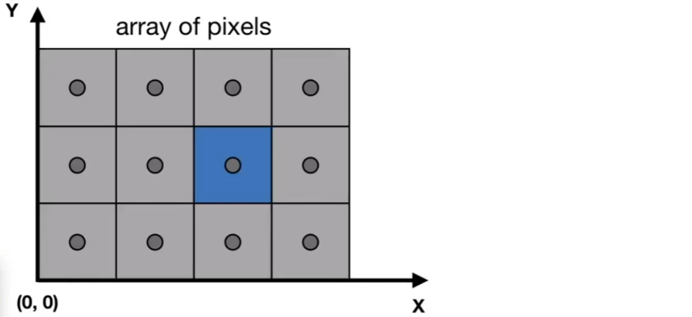
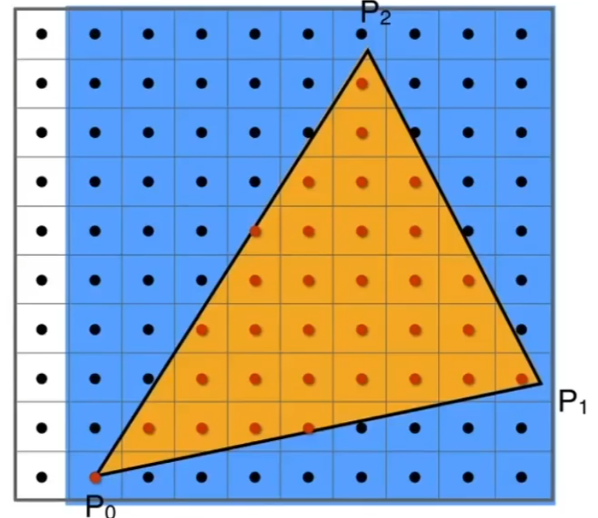

# 光栅化Rasterization

经过了Projection Transformation所有的矩阵都被归一为了正立方体`Canonical Cube`
$$
[-1, 1]^3
$$

## 0x00 Canonical Cube To Screen

### What is a pixel

一个pixel由`RGB`构成，每一个的等级为`0-255`

### Defining Screen Space

#### What is a screen

屏幕空间由多个像素组成的数组且**数组的大小等于当前屏幕的分辨率**

#### 在屏幕中像素的形态分析

1. Pixel具有坐标`(x, y)`的概念：`x`和`y`都是整数
2. Pixel在屏幕中的坐标范围满足`(0,0)->(width - 1, height - 1)`
3. Pixel实际中心点**并不在边缘上且不是整数**，而是在`(x + 0.5, y + 0.5)`




#### 将归一化坐标转化为屏幕空间坐标

$$
[-1 , 1]^2=>[0, width]\times [0, height]
$$

首先`[-1, 1]`的屏幕中心在`(0, 0)`，但是`[width, height]`的屏幕中心为
$$
[\frac{width}{2}, \frac{height}{2}]
$$
因此首先平移到新的屏幕中心，从而并得到新的坐标范围
$$
T_{screen}=\begin{bmatrix} 
1 & 0 & 0 & \frac{width}{2} \\
0 & 1 & 0 & \frac{height}{2} \\
0 & 0 & 1 & 0 \\
0 & 0 & 0 & 1 \\
\end{bmatrix} \\\\

[\frac{width}{2}-1, \frac{width}{2}+1]\times [\frac{height}{2}-1,\frac{height}{2}+1]
$$
将当前的坐标系取值范围进行缩放操作
$$
R_{screen}=\begin{bmatrix} 
\frac{width}{2} & 0 & 0 & 0 \\
0 & \frac{height}{2} & 0 & 0 \\
0 & 0 & 1 & 0 \\
0 & 0 & 0 & 1 \\
\end{bmatrix}
$$
最后得到最终的转换矩阵
$$
View_{screen} =R_{screen}T_{screen}=
\begin{bmatrix} 
\frac{width}{2} & 0 & 0 & 0 \\
0 & \frac{height}{2} & 0 & 0 \\
0 & 0 & 1 & 0 \\
0 & 0 & 0 & 1 \\
\end{bmatrix}
\begin{bmatrix} 
1 & 0 & 0 & \frac{width}{2} \\
0 & 1 & 0 & \frac{height}{2} \\
0 & 0 & 1 & 0 \\
0 & 0 & 0 & 1 \\
\end{bmatrix} = 
\begin{bmatrix} 
\frac{width}{2} & 0 & 0 & \frac{width}{2} \\
0 & \frac{height}{2} & 0 & \frac{height}{2} \\
0 & 0 & 1 & 0 \\
0 & 0 & 0 & 1 \\
\end{bmatrix}
$$


## 0x01 光栅化三角形Rasterizing Triangles Into Pixels

### Why Choose Triganle As Funddamental Shape Primitives?

#### Most Basic Polygon

因为三角形是最简单的多边形，且三角形可以合成其他复杂的多边形

#### Properties

三角形可以确保图形位于同一个平面且三角形的内外非常清晰，以及中心坐标的线性插值算法


### 使用像素去近似一个三角形Pixel Values Approximate a Triangle

#### 采样方法的简介

采样在图形学中是一个非常重要的概念，使用一个函数记录在不同的地方`X`的数值`y`为多少，即`y = F(x)`。**采样本质为将一个函数离散化的过程。**

```c++
for(std::size_t x = 0 x < max ; ++x){
    out[x] = f(x);
}
```


#### 采样方法图形学应用

***在图形学中的采样则是以像素的中心`(x+0.5, y+0.5)`对屏幕空间进行采样的一个过程***，本质上这个过程也是一个函数`inside_or_not(triangle, x, y)`


$$
inside\_or\_not(triangle, x, y) = 
\begin{cases}
true \quad Calculate \quad if \quad Point(x,y) \quad inside \quad triangle \quad Using \quad Three \quad Cross \quad Products!\\ 
false \quad not 
\end{cases}
$$


#### 程序化寻找重合的光栅

所有的寻找过程不存在前后依赖，因此都可以进行并行化处理

1. 遍历屏幕空间像素寻找重合的光栅：效率低

   ```c++
   #pragma omp parallel for collapse(2)
   for(std::size_t y = 0; y < height ; ++y){
   	for(std::size_t x = 0; x < width ; ++x){
           pixel[x][y] = inside_or_not(triangle, x + 0.5, y + 0.5);
   	}
   }
   ```

2. AABB盒优化方法：没必要覆盖所有的分辨率，只需要根据三角形顶点的位置进行优化

   

   ```c++
   #pragma omp parallel for collapse(2)
   for(std::size_t y = std::floor(min(P0_y, P1_y, P2_y)); y < std::ceil(max(P0_y, P1_y, P2_y)) ; ++y){
   	for(std::size_t x = std::floor(min(P0_x, P1_x, P2_x)); x < std::ceil(max(P0_x, P1_x, P2_x)) ; ++x){
           pixel[x][y] = inside_or_not(triangle, x + 0.5, y + 0.5);
   	}
   }
   ```
