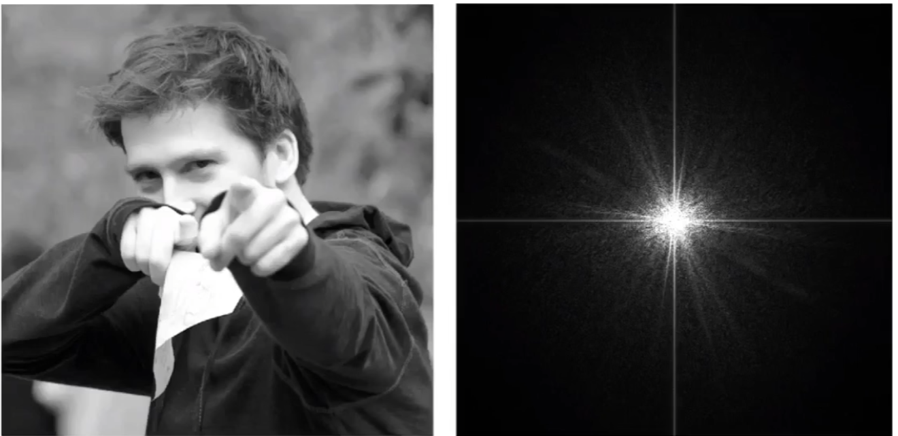
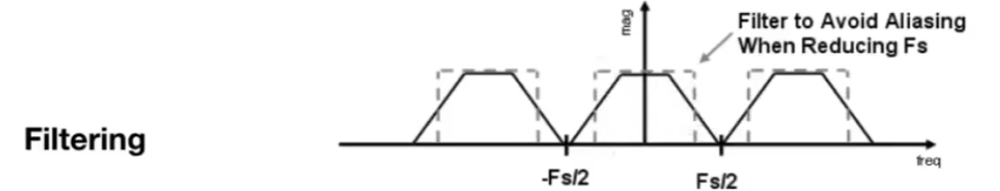

# 反走样Anti-Aliasing

## 0x00 Sampling Theory

### 采样瑕疵Sampling Artifacts(Errors) in Computer Graphics

#### 采样瑕疵的实例

锯齿`(Jaggies)`以及摩尔纹，或者其他...

#### 采样瑕疵的产生因素

**信号变换的速度过快，具有高频率性，但是采样的速度太慢跟不上变化速度**

同样的采样方法采样两种不同频率的信号，得出的结果无法区分，则为瑕疵或者走样

#### 采样瑕疵的解决思路

在采样之前先对于数据进行模糊化`Blurring`或先过滤`Pre-Filtering`

### 采样之前需要进行滤波(Filter then sample)

#### 傅里叶级数展开Fourier Transform与傅里叶变换

1. 傅里叶级数展开Fourier Transform：任何周期函数都可以展开为一系列正弦以及余弦函数的组合，也可以分解为多个不同的频率

$$
f(x)=\frac{A}{2} + \frac{2A\cos(t\phi)}{\pi} - \frac{2A\cos(3t\phi)}{3\pi} + \frac{2A\cos(5t\phi)}{5\pi}
$$

2. 傅里叶变换`FFT`：傅里叶级数展开和傅里叶变换紧密相连，用于将信号从时域变为频域

   **FFT在图形图像领域中满足以下规律，**低频信息集中在中间，而高频信息则在外围(较少)

   

#### 更高的频率需要更快的采样速度

| 信号频率 |                       采样情况                       |
| :------: | :--------------------------------------------------: |
| 低频信号 |            低频信号可以使用较低的采样速度            |
| 高频信号 | 高频信号如果使用低速采样会导致采样不充分，产生欠采样 |

#### 滤波

将特定的频率进行删除，去掉一系列的信号

1. 高通滤波器(**边缘检测**)

   某一个图像的边缘(存在上下边界)相差很多产生剧烈变化，信号变化非常大

   

   

2. 低通滤波器(**模糊**)

   由于刨除高频信号，因此去除边界将边界进行模糊

   

#### 卷积

1. 卷积的概念：滤波是一种平均，同时也是一种卷积

2. 卷积的特性

   滤波器`filter`的滑动窗口和窗口所覆盖的数值进行点乘(**加权平均**)得到数值

   

   
   $$
   1 \times \frac{1}{4} + 3 \times \frac{1}{2} + 5 \times \frac{1}{4} = 3
   $$
   将数值`3`写回到`filter`的滑动窗口**中心值**所对应的信号位置

   

3. 卷积结论：**在时域上卷积等于对频域上的乘积**

   有关于盒子滤波器`Box Filter`：盒子滤波器等价于低通滤波器，用于模糊图像
   $$
   \frac{1}{9}
   \begin{array}{|c|c|c|}
   \hline
   1 & 1 & 1 \\
   \hline
   1 & 1 & 1 \\
   \hline
   1 & 1 & 1 \\
   \hline
   \end{array}
   $$
   当使用更大的`Box Filter`，则会导致图像更加的模糊

#### 回到采样的内容

在需要进行采样的原始信号`Xa（t）`上，乘以一个只在一系列固定位置有值，其他地方为零的函数，最终的得到多个离散的点

满足该特性的函数为：冲激函数`(Impulse Function)`记作`δ(t)`
$$
\int_{-\infty}^{\infty} f(t) \delta(t - t_0) \, dt = f(t_0)
$$

1. `f(t)` ：表示一个连续时间信号或函数。   

2. `δ(t - t0)`：表示位于 ` t = t0` 的冲激函数。   

3. 通过与冲激函数相乘并积分，函数`f(t)`在 `t = t0`处的值被提取出来。

   

采样实际是在重复原始信号的频谱，**但是如果由于采样速度过低且原始信号产生了频谱堆叠/重合**，因此则会发生走样

### 反走样Anti-Aliasing

#### Anti-Aliasing的方法

1. 增加采样率：提升分辨率或者采样更好的传感器

2. 先进行滤波(低通滤波)，后进行采样

   利用低通滤波将图像可能发生频谱堆叠/重合部分的**高频率信号**进行过滤

   

​	因此，经过滤波之后，原先可能会产生堆叠的信号则可能不不会产生堆叠了

​	

​	

#### Anti-Aliasing实际工程应用与模糊方法

1. 利用滤波器：使用**一个像素宽的卷积**作为低通滤波器，将图像进行模糊处理。将原始信号对于像素的覆盖程度，转化为`Pixel`的灰度值
   $$
   \begin{array}{|b|}
   \hline
   1\\
   \hline
   \end{array}
   $$

2. 超采样`Supersamping`(`MSAA`)

   **`MSAA`并不是直接通过提升分辨率直接解决的走样问题，增加的采样点用于近似计算**

   通过更多的采样点，来执行反走样之中的第一步**信号模糊**，根据模糊后的三角形对于采样点的覆盖得到较为精确的覆盖比例

   ~~但是，`MSAA`具有一些计算上的代价~~

   

3. `Fast Approximate AA(FXAA)`：**`FXAA`与采样无关**，直接对生成的图像帧边缘进行图像处理，去除锯齿

4. `Temporal AA(TAA)`：将样本引入到了时间轴上，从上一帧进行获取

5. `Deep Learning Super Samping(DLSS)`：将低分辨率的图恢复为高分辨率，利用**深度学习**补充猜测细节信息(**样本**)

