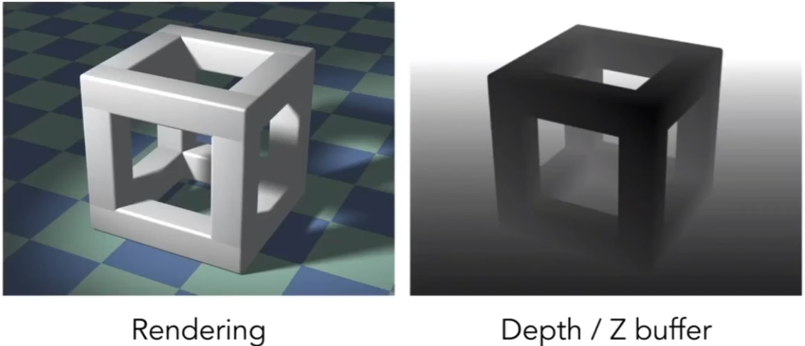
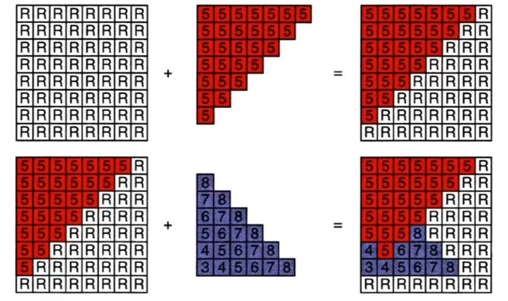

# 深度缓冲 Z-buffer

## 0x00 Z-buffer

### Z-buffer的前置要求

相机放在原点`O(0,0,0)`，我们要求`Z`必须是一个正数，更小的`Z`表示近，更大的`Z`表示越远

### Z-buffer在渲染中的应用

最终生成的渲染成品图中包含

#### 像素颜色`frame buffer`

#### 深度缓存`depth buffer(z-buffer)`

如果深度值小，对应`RGB`的颜色则应该是更加偏向黑色



如果当前像素`Zbuff`存在一个地板(三角形)深度`Zfloor`
$$
Z_{buffer} =Z_{floor}
$$


如果再当前地板上放置另一个物体，如果物体(三角形)的深度`Zentity`小于之前地板的深度
$$
Z_{entity} < Z_{floor}
$$


因此物体需要将地板进行遮蔽，并且更新像素中存储的深度信息
$$
Z_{buffer} =Z_{entity}
$$


从而得到深度信息更新算法，复杂度为`O(n^2)`



```c++
//遍历所有面（上图共两个）
for_each(triangle: triangle_set){
    //遍历所有三角形顶点(每个面有3个顶点)
    for_each({x, y, z}: triangle){
        //通过[x, y]坐标得到像素的Z-buffer，并与去除的顶点比较
        if(Zbuffer[x, y] > z){
            framebuffer[x, y] = RGB;
            Zbuffer[x, y] = z;
        }
    }
}
```


### Z-buffer的复杂度分析

#### Z-buffer的深度测试复杂度

Z-buffer的深度参数和绘制三角形的顺序无关

如果存在n个三角形，则可以使得时间复杂度处于线性范围`O(n)`

#### Z-buffer的深度测试算法

该深度测试算法可以用`GPU`硬件进行实现

