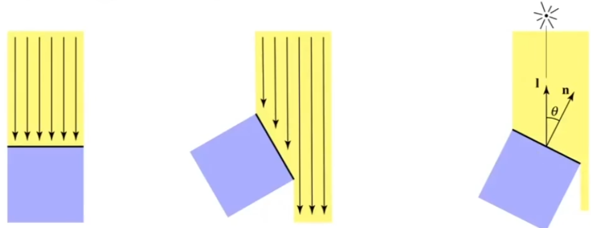

# 着色Shading

## 0x00 Shading Basic

### Shading In Computer Graphics

### 冯氏光照模型Blinn-Phong Relfectance Model

#### 光照模型的基础条件

计算光源朝向摄像机方向的在**某个着色点**上的反射，**所有的这些向量都是单位向量，长度永远为1**

|     输入     | 符号 |                             备注                             |
| :----------: | :--: | :----------------------------------------------------------: |
| 摄像观测方向 | `v`  |                                                              |
|     法线     | `n`  |                                                              |
|   光源方向   | `I`  |                                                              |
|   材质参数   |      | 可能物体表面金属，石膏，可能对光照能量存在不同的吸收率(`color, shininess`) |

## 0x01 三种主要反射模型

对不同的物体应用不同的材质，不同的材质和光源之间的相互左右不同

### 漫反射`Diffuse Reflection`

#### 光线衰减Light Failoff

光源辐射一个球体的场，将光线以能量`E`辐射到各个方向**(不是平行光)**。经过衰减和吸收后，物体表面颜色对于观测者从各个方向来看是相同的

因此**根据能量守恒定理**，在近点`r`上的能量密度要大于在原点`R`上的能量密度
$$
I_{near} = \frac{E}{4\pi r^2} \quad I_{far} =  \frac{E}{4\pi R^2} \\\\
\because
r < R \\
\therefore
I_{near}  > I_{far} 
$$

因此在光线的传播过程中，如果考虑单位面积，则在一个位置上所能接收到的能量强度和距离的平方呈反比

#### Lambert光照模型

1. 光的能量：颜色与光和物体表面形成的夹角有关，导致光线的能量可以发生衰减，从而导致物体的颜色发生变换
2. 光所能照射的面积：`shading point`所能接收到的能量，需要考虑周围单位面积。因此在`Lambert`模型中我们需要确保旋转物体表面不会引起面积的变化

因此可以得到`Lambert Cosine Law`，光照方向和法线之间夹角的余弦和光照能量呈正相关，**当表面法线垂直于光线的时候，光线能量最强**
$$
\cos(\alpha)=\vec{l}\vec{n}
$$
**但是，存在一种情况当cos的数值小于0，则代表光线从物体下方进行的照射，*这种情况并不满足反射的物理意义！***将其从光照模型中忽略
$$
max(0,\cos(\alpha))=max(0,l n)
$$
结合光线衰减公式，可以得到光经过一定的传播距离和接触物体表面积上损耗

#### 得到最终漫反射光强公式`(Diffusely Reflected light)`

$$
假设光源位置为L(L_x, L_y)，着色点Point(P_x,P_y)，K_d代表某种颜色对光能量的反射率\\
L_d =K_d(\frac{I}{\sqrt{(L_x - P_x)^2 + (L_y - P_y)^2}})max(0, \cos(\alpha)) = \\
K_d(\frac{I}{\sqrt{(L_x - P_x)^2 + (L_y - P_y)^2}}) max(0, \vec{l}\vec{n})
$$

#### 将漫反射光强公式推广到整个模型

使用点光源照射一个石膏球体，构成球体的模型有多个面，包含多个`shading points`

球体的每个`shading points`都对应一个法线(这些法线互不平行)，通过计算光照方向和法线的夹角，可以出现**颜色在某点极强**但是**其他部分逐渐衰减**的情况

### 高光`Specular highlights`

#### 为什么会产生高光

要求`shading points`比较光滑，与此同时该平面就具备了镜面反射的特性。当视角方向与镜面反射角度相近时，就可以得到高光

#### 高光在冯氏光照模型Phong下的推导

仅仅通过对于`R`和`V`的点乘计算夹角的余弦值，但是需要额外计算反射路径

#### 高光在局部光照模型Blinn-Phong下的推导

1. 引入半程向量`h`的概念：`Blinn-Phong `模型认为，如果想判断反射线是否靠近视角线，只需要判断半程向量`h`是否靠近法线即可

2. `Blinn-Phong`模型也需要将半程效率归一化

$$
半程向量也必须考虑归一化的问题\\
\vec{h}=\frac{\vec{l}+\vec{v}}{||\vec{l}+\vec{v}||}\\\\
因此可以得到Lambert Cosine Law，光照方向和法线之间夹角的余弦和光照能量呈正相关，当表面法线垂直于光线的时候，光线能量最强\\
\cos(\alpha)=\vec{n}\vec{h}\\\\
但是，存在一种情况当cos的数值小于0，则代表光线从物体下方进行的照射，这种情况并不满足反射的物理意义！将其从光照模型中忽略\\
max(0,\cos(\alpha))=max(0,\vec{n}\vec{h})\\\\
$$

3. 但是存在当前的角度`α`存在一个问题

   目前在角度`α`下，用户所能看到的高光范围过大，因此可以在`cosin`函数之后增加幂次方从而限制高光可见视角

   
   $$
   限制高光范围(在实践中，P一般大于100)\\
   max(0,\cos(\alpha))^p={max(0,\vec{n}\vec{h})}^p
   $$
   
4. 最终得到Blinn-Phong光照公式
   $$
   假设光源位置为L(L_x, L_y)，着色点Point(P_x,P_y)，K_s代表镜面反射系数\\
   L_s =K_s(\frac{I}{\sqrt{(L_x - P_x)^2 + (L_y - P_y)^2}})max(0,\cos(\alpha))^p=\\
   L_s =K_s(\frac{I}{\sqrt{(L_x - P_x)^2 + (L_y - P_y)^2}}){max(0,\vec{n}\vec{h})}^p
   $$
   

### 环境光`Ambient lighting`

环境光是一种间接光线，**任何点接收到来自其他(环境)物体反射光照，得到的数值是一个常量，与观测方向无关**
$$
记作:I_a
$$

相比较于漫反射以及高光的情况，环境光可以将物体背面的部分进行着色，可以得到最终公式
$$
假设K_a代表环境光系数\\
L_a = K_aI_a
$$

## 0x02 局部光照模型Blinn-Phong

### 塑料材质Blinn-Phong

### Blinn-Phong最终公式

$$
L = L_a + L_d + L_s = 
K_aI_a + 
K_d(\frac{I}{\sqrt{(L_x - P_x)^2 + (L_y - P_y)^2}}) max(0, \vec{l}\vec{n}) +
K_s(\frac{I}{\sqrt{(L_x - P_x)^2 + (L_y - P_y)^2}}){max(0,\vec{n}\vec{h})}^p
$$

## 0x03 着色频率Shading Frequencies

### 着色频率的分类

着色频率指的是面/顶点/像素出现的频率。但是当模型足够复杂时，`Face Shading`可能比`Phone Shading`复杂

#### 面`Face`着色Flat Shading

三角形的面就是法线，适合渲染棱角分明的物体(立方体)。但是生成的图像并不平滑，颜色可能发生跳变

#### 顶点`Vertex`着色Gouraud Shading=>shade each vertex

对于三角形的顶点进行着色，适合渲染平滑物体(球体)，颜色会发生连续的变化

由于多个面共用一个顶点，因此顶点的着色可以通过对于多个三角形面的法线进行数值插值的方法进行计算单个顶点法线

$$
假定K_i是当前三角形面的加权平均值\\
可以根据三角形的面积大小进行加权平均从而得到某个顶点的法线:
N_v = \frac{\sum_i{K_iN_i}}{||\sum_i{N_i}||}
$$

#### 逐像素`Pixel`着色Phong Shading

在已知顶点法线的基础上为每个像素计算平滑过渡的法线，通过中心插值定理得到平滑过渡的法线

